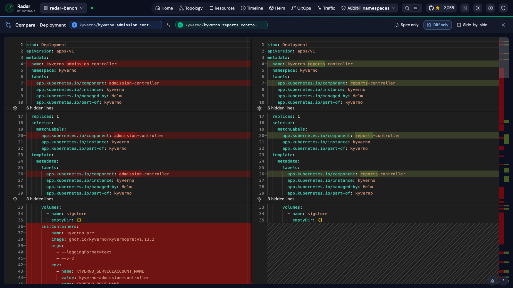
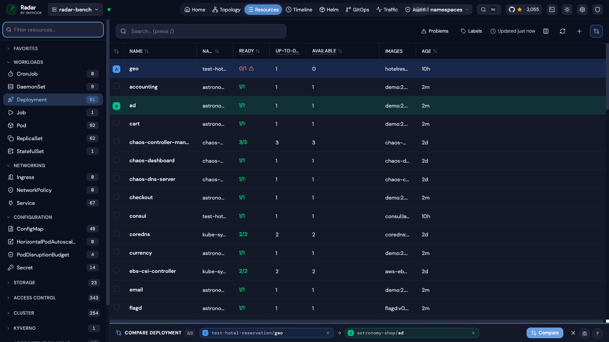
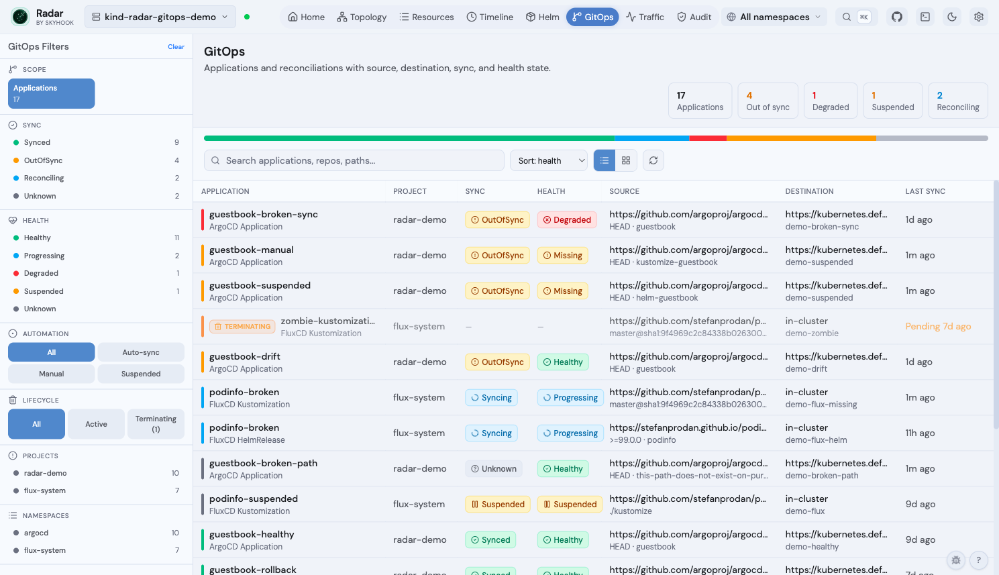

# Radar

<a href="https://www.producthunt.com/products/radar-7?embed=true&utm_source=badge-top-post-badge&utm_medium=badge&utm_campaign=badge-radar-42edb7b0-e388-4fa8-9ba5-4876c2c0d638" target="_blank"></a>

**The missing open-source Kubernetes UI.**
<br>Single binary. No account required. Free forever.

🌐 **[radarhq.io](https://radarhq.io)** · [Docs](https://radarhq.io/docs) · [Releases](https://github.com/skyhook-io/radar/releases)

Topology, resources, Helm, GitOps, traffic, audit, upgrade impact, and MCP context for AI agents — from your laptop or in-cluster.

[](https://github.com/skyhook-io/radar/actions/workflows/ci.yml)
[](https://github.com/skyhook-io/radar/actions/workflows/codeql.yml)
[](https://github.com/skyhook-io/radar/releases/latest)
[](https://github.com/skyhook-io/radar/releases)
[](https://artifacthub.io/packages/helm/skyhook/radar)
[](https://radarhq.io/community/chat)
[](LICENSE)
[](https://go.dev/)

<details>
<summary><b>Table of contents</b></summary>

- [Why Radar?](#why-radar)
- [Installation](#installation)
- [Usage](#usage)
- [Views](#views) — Topology · Resources · Image Filesystem · Timeline · Helm · Compare · TLS · GitOps · Traffic · Cost · Audit · Upgrade impact · RBAC · MCP · Auth
- [Supported Resources](#supported-resources)
- [Keyboard Shortcuts](#keyboard-shortcuts)
- [Security](#security)
- [Development](#development) · [Contributing](#contributing)

</details>

<p align="center">
  
</p>

**Install and run in 30 seconds:**
```bash
curl -fsSL https://get.radarhq.io | sh && kubectl radar
```
[More installation options ↓](#installation)

## Why Radar?

- **Zero install on your cluster** — runs on your laptop, talks to the K8s API directly
- **Single binary** — no dependencies, no agents, no CRDs
- **Fast on big clusters** — tested on tens of thousands of pods, with responsive views and live updates under real cluster churn
- **Private by design** — your cluster data stays on your machine. No account, no agents, no cloud sync, no cluster telemetry
- **Airgapped-friendly** — runs as a single binary against the Kubernetes API and works in locked-down environments with outbound egress blocked
- **Real-time** — watches your cluster via informers, pushes updates to the browser via SSE
- **Works everywhere** — GKE, EKS, AKS, minikube, kind, k3s, or any conformant cluster
- **AI-ready** — built-in [MCP server](docs/mcp.md) lets AI agents inspect, diagnose, and operate your cluster through Radar
- **In-cluster option** — deploy with Helm for shared team access with RBAC-scoped permissions

> "Have Radar deployed at work. As far as Kubernetes dashboards go, this is one of the best." — u/TheRealNetroxen

---

## Installation

**Quick Install:**
```bash
curl -fsSL https://get.radarhq.io | sh
```

**Homebrew:**
```bash
brew install skyhook-io/tap/radar
```

Then run: `kubectl radar`. Quick install, PowerShell, Homebrew, and Scoop also set up the `radar` shorthand. Krew and direct downloads use `kubectl radar` unless you add your own `radar` symlink.

<details>
<summary><b>More install options</b> — Desktop App (macOS/Linux/Windows), Krew, Scoop, In-Cluster Helm</summary>

#### CLI

**Krew (kubectl plugin manager):**
```bash
kubectl krew install radar
```

**Scoop (Windows):**
```powershell
scoop bucket add skyhook https://github.com/skyhook-io/scoop-bucket
scoop install radar
```

**PowerShell (Windows):**
```powershell
irm https://get.radarhq.io/install.ps1 | iex
```

**Direct download** — [GitHub Releases](https://github.com/skyhook-io/radar/releases) for macOS, Linux, or Windows.

#### Desktop App

Native desktop app — no terminal needed.

**Homebrew (macOS):**
```bash
brew install --cask skyhook-io/tap/radar-desktop
```

**Debian/Ubuntu** — download the `.deb` from [GitHub Releases](https://github.com/skyhook-io/radar/releases), then:
```bash
sudo apt install ./radar-desktop_*.deb
```

**Fedora/RHEL** — download the `.rpm` from [GitHub Releases](https://github.com/skyhook-io/radar/releases), then:
```bash
sudo rpm -i radar-desktop_*.rpm
```

**Scoop (Windows):**
```powershell
scoop bucket add skyhook https://github.com/skyhook-io/scoop-bucket
scoop install radar-desktop
```

**Windows (direct download)** — [GitHub Releases](https://github.com/skyhook-io/radar/releases).

#### In-Cluster Deployment

Deploy to your cluster for shared team access:

```bash
helm repo add skyhook https://skyhook-io.github.io/helm-charts
helm install radar skyhook/radar -n radar --create-namespace
```

See the [In-Cluster Deployment Guide](docs/in-cluster.md) for Gateway API and ingress exposure, authentication, and RBAC configuration.

</details>

---

## Usage

```bash
# Opens browser automatically
kubectl radar

# Quick install, PowerShell, Homebrew, and Scoop also set up the bare command
radar
```

To inspect an in-cluster Radar Cloud installation without changing it:

```bash
radar cloud status
radar cloud status --context my-cluster
radar cloud status --context my-cluster --namespace radar --release radar
```

The command reports installation ownership, chart and image, agent readiness,
and Cloud configuration without printing the connection token. Passing both
`--namespace` and `--release` selects an exact installation. Live tunnel status
is reported by Radar Cloud using the token in the referenced Kubernetes Secret.
If the Secret or Hub is unavailable, local installation diagnostics still run.
Interactive terminals use restrained status colors; set `NO_COLOR` (or pipe the
output) for plain text. URLs, tokens, and suggested commands remain unstyled.

**CLI Flags**

The table below covers common startup flags. See the [full CLI reference](https://radarhq.io/docs/configuration/cli); `radar --help` is authoritative for the installed version.

| Flag | Default | Description |
|------|---------|-------------|
| `--kubeconfig` | `~/.kube/config` | Path to primary kubeconfig file |
| `--kubeconfig-dir` | | Comma-separated directories containing additional kubeconfig files |
| `--namespace` | (all) | Initial namespace filter (supports multi-select in the UI; also used as RBAC fallback for namespace-scoped users) |
| `--namespaces` | (all) | Initial namespace filters as a comma-separated list, e.g. `--namespaces ns1,ns2,ns3`. Use this when your identity can list resources in specific namespaces but cannot list namespaces cluster-wide. |
| `--namespace-scope` | `false` | Pin namespaced informer caches to a **single** namespace for large clusters (scoping to multiple namespaces is not supported yet). Requires `--namespace`, a kubeconfig context namespace, or a saved local single-namespace pick. Local mode can rebuild the cache when switching namespaces; auth/cloud mode locks the shared cache to the startup namespace. |
| `--port` | `9280` | Server port |
| `--listen-address` | `127.0.0.1` | HTTP listen address. Use `127.0.0.1` or `localhost` for local-only access; use `0.0.0.0` explicitly for containers, VMs, WSL, or remote/shared access, together with authentication and network controls. |
| `--base-path` | | Serve Radar under a URL prefix such as `/radar`. Use when an ingress forwards a subpath without stripping it — everything, including `/api/health`, moves under the prefix. Not supported with `--cloud-url`. |
| `--no-browser` | `false` | Don't auto-open browser |
| `--browser` | | Browser to use when opening the UI, e.g. `firefox`, `google-chrome`, or `Google Chrome` on macOS |
| `--timeline-storage` | `memory` | Timeline storage backend: `memory` or `sqlite` |
| `--timeline-db` | `~/.radar/timeline.db` | Path to SQLite database (when using sqlite storage) |
| `--timeline-max-size` | `1Gi` | Maximum SQLite DB + WAL size before pruning oldest events (e.g. `800Mi`, `8Gi`; `0` disables) |
| `--history-limit` | `10000` | Maximum events to retain in timeline |
| `--disable-exec` | `false` | Disable terminal and debug shell |
| `--disable-helm-write` | `false` | Disable Helm write operations |
| `--disable-local-terminal` | `false` | Disable the host local terminal |
| `--debug-image` | `busybox:latest` | Image for ephemeral debug containers and node debug pods. If built-in restricted PodSecurity rejects the default pod debug container, Radar retries with a restricted-compatible Linux security context using the target/pod non-root UID, or UID `65532` by default; point at a compatible mirror for air-gapped / private-registry clusters. |
| `--list-page-size` | `0` (off) | Paginate the initial LIST of high-cardinality kinds (Pods, ReplicaSets) at this size. Helps very large clusters that fail to sync; only used when WatchList streaming is unavailable. Try `2000`. |
| `--context-switch-timeout` | `30s` | Maximum time a kubeconfig context switch may take. Widen on high-latency control planes — see [Tuning for slow clusters](#tuning-for-slow-or-high-latency-clusters). Env: `RADAR_CONTEXT_SWITCH_TIMEOUT`. |
| `--first-paint-backstop` | `5m` | Hard upper bound on the initial critical-cache sync wait before Radar falls through to a partial-data render. Env: `RADAR_FIRST_PAINT_BACKSTOP`. |
| `--namespace-list-timeout` | `5s` | Timeout for the cluster-wide namespace LIST used to decide if the user is RBAC-namespace-restricted. A timeout on a slow control plane is misreported in the UI as "Limited list — RBAC". Env: `RADAR_NAMESPACE_LIST_TIMEOUT`. |
| `--max-scope-candidates` | `20` | Cap on the namespace-fallback probe fanout (used by accounts that can list namespaces cluster-wide but not list a specific kind cluster-wide). Raise above `20` for clusters with more than 20 namespaces. Env: `RADAR_MAX_SCOPE_CANDIDATES`. |
| `--prometheus-url` | (auto-discover) | Manual PromQL-compatible query URL, including Prometheus, VictoriaMetrics, Thanos, or Mimir (skips auto-discovery) |
| `--prometheus-header` | | HTTP header sent with every Prometheus request, format `Key=Value` (repeatable). Required for auth-protected backends. |
| `--prometheus-header-from-env` | | HTTP header sent with every Prometheus request, sourced from an environment variable, format `Key=ENV_VAR` (repeatable). |
| `--opencost-currency` | (auto-detect, then USD) | Override the ISO 4217 currency label for OpenCost values. Radar labels values but does not convert them. |
| `--auth-mode` | `none` | Authentication mode: `none`, `proxy`, or `oidc` ([details](docs/authentication.md)) |
| `--no-mcp` | `false` | Disable MCP server for AI tool integration |
| `--mcp-catalog-stdio` | `false` | Start only the MCP catalog over stdio for registry introspection |
| `--version` | | Show version and exit |

See [Configuration Guide](docs/configuration.md) for details on cluster connection precedence, multiple kubeconfig files, and context switching.

### Tuning for slow or high-latency clusters

The default deadlines (30 s context switch, 5 m first-paint backstop, 5 s
namespace LIST, 20 scope candidates) are tuned for healthy clusters reached
over fast, low-latency connections. They are too tight for clusters reached
over SSH tunnels, geographically distant control planes, or accounts subject
to API-server throttling, where they surface as one of three symptoms:

- "Context switch timed out" toasts when the cache eventually does sync
- "Limited list — RBAC doesn't allow listing all namespaces" even though the
  account has cluster-wide list permission (the LIST timed out, not RBAC)
- Kinds silently marked denied because the namespace they live in fell past
  the 20-entry candidate cap

Widen the four flags via CLI or via the matching environment variables
(`RADAR_CONTEXT_SWITCH_TIMEOUT`, `RADAR_FIRST_PAINT_BACKSTOP`,
`RADAR_NAMESPACE_LIST_TIMEOUT`, `RADAR_MAX_SCOPE_CANDIDATES`) — env vars
keep secrets out of `ps` and let in-cluster deployments source the values
from a ConfigMap:

```bash
# CLI
kubectl radar \
  --context-switch-timeout=120s \
  --first-paint-backstop=10m \
  --namespace-list-timeout=30s \
  --max-scope-candidates=200

# Environment (e.g. in a Deployment manifest)
RADAR_CONTEXT_SWITCH_TIMEOUT=120s \
RADAR_FIRST_PAINT_BACKSTOP=10m \
RADAR_NAMESPACE_LIST_TIMEOUT=30s \
RADAR_MAX_SCOPE_CANDIDATES=200 \
  kubectl radar
```

Defaults are preserved when neither the flag nor the env var is set, so
existing deployments are unaffected.

---

## Views

### Topology

Interactive graph showing how your Kubernetes resources are connected in real-time.

<p align="center">
  
  <br><em>Topology View — Visualize resource relationships</em>
</p>

- Two modes: **Resources** (full hierarchy) and **Traffic** (network flow path)
- Group by namespace, app label, or view ungrouped
- Filter by resource kind — click any node for full details
- Auto-layout powered by ELK.js, live updates via SSE

### Resources

Table-based resource browser with smart columns per resource kind.

<p align="center">
  
  <br><em>Resources View — Browse and filter all cluster resources</em>
</p>

- Browse all resource types including CRDs
- Search by name, filter by status or problems (CrashLoopBackOff, ImagePullBackOff, etc.)
- Add custom columns from any label or annotation — sortable, filterable, and resizable
- Click any resource for YAML manifest, related resources, logs, and events
- Set regular or init-container images on Deployments, StatefulSets, DaemonSets, and Argo Rollouts, with live rollout progress in tables, drawers, workload views, and Applications

### Image Filesystem Viewer

Inspect container image filesystems directly from the Pod view — no need to pull images locally or exec into containers.

<p align="center">
  
  <br><em>Image Filesystem Viewer — Browse container image contents</em>
</p>

- Click any container image in a Pod to browse its complete filesystem
- Tree view with file sizes, permissions, and symlink targets
- Search files by name across the entire image
- Download individual files for inspection
- Works with public images (Docker Hub, Quay, GHCR) and private registries (GCR, ECR, ACR) using your cluster's ImagePullSecrets
- Disk-based layer caching for fast repeated access

### Timeline

Unified timeline of Kubernetes events and resource changes.

<p align="center">
  
  <br><em>Timeline View — Track cluster activity in real-time</em>
</p>

- Filter by event type (all or warnings only)
- Resource change diffs showing what changed (replicas, images, etc.)
- Real-time updates as new events occur

### Helm

Manage Helm releases deployed in your cluster — inspect values and rendered manifests, diff revisions, identify failed upgrades and rollback-after-failure patterns, diagnose failed hooks, upgrade, rollback, and uninstall. Radar tracks available chart upgrades (from your configured repos or your own OCI registries) and lets you pick a specific target version. See [Helm Support](docs/helm.md) for the detailed behavior and limits.

<p align="center">
  
  <br><em>Helm View — Manage your Helm deployments</em>
</p>

- View all releases across namespaces with status, chart version, app version, resource health, storage namespace, and Flux ownership
- Inspect values, compare revisions across values/manifests/notes/resources, and view release history
- Surface failed upgrades, stuck pending operations, rollback history, and inferred atomic-style rollbacks
- Correlate failed/running hooks with remaining Job, Pod, Event, and redacted log evidence
- Upgrade, rollback, or uninstall releases directly from the UI

### Compare Resources

Diff any two Kubernetes resources of the same kind side-by-side — like comparing a staging Deployment to its production sibling, or two pods that should be identical but aren't.

<p align="center">
  
  <br><em>Compare View — Side-by-side YAML diff with field-level highlighting</em>
</p>

- **Two entry points**: a `Compare` button in the resource detail drawer, or compare mode in the resource table (toggle, pick two rows, hit Compare)
- **Side-by-side or unified** view, with one-click swap of A ↔ B
- **Diff-only mode** collapses unchanged regions so you only see what differs
- **Spec-only mode** drops `status` fields to focus on intent rather than observed state
- Server-assigned noise (`managedFields`, `resourceVersion`, `kubectl.kubernetes.io/last-applied-configuration`) is stripped automatically so the diff stays signal — flip **Raw metadata** on if you actually want to see it
- Same-namespace candidates are surfaced first in the picker — usually the resource you want to compare against
- Shareable URLs: `/compare?kind=&apiGroup=&a=ns/name&b=ns/name`

<p align="center">
  
  <br><em>Compare mode in the resource table — pick two rows, hit Compare</em>
</p>

### TLS Certificate Management

View TLS certificate details and expiry dates across all namespaces — catch expiring certificates before they cause outages.

- Parses TLS secrets to show certificate subject, issuer, and validity period
- Dashboard-level certificate expiry overview
- Available from the resource detail view for any TLS-type Secret

### GitOps

Monitor, diagnose, and manage FluxCD and ArgoCD resources from a dedicated GitOps workspace.

<p align="center">
  
  <br><em>GitOps fleet view — Argo + Flux applications side-by-side with sync, health, source, destination, and lifecycle state</em>
</p>

- Fleet view + per-app detail page (Topology / Changes / Activity tabs) for **ArgoCD** (`Application`, `ApplicationSet`, `AppProject`) and **FluxCD** (`GitRepository`, `OCIRepository`, `HelmRepository`, `Bucket`, `Kustomization`, `HelmRelease`, `Alert`)
- **Diagnosis pipeline** — field-level drift, recent events per resource, stuck-drift-loop detection, parsed operation-failures, structured one-click remediation
- **Lifecycle awareness** — `Terminating` chip replaces stale Sync/Health badges; severity ramps with deletion age; mutating ops refuse on zombies
- **Cross-linked from the rest of Radar** — `Managed by` chip in resource drawers, GitOps routing from Topology + Timeline + Helm view, `Consumed by` panel on Flux source CRs
- **MCP integration** — `manage_gitops` exposes sync / suspend / resume / reconcile / rollback with lifecycle-aware refusal

See the [GitOps guide](docs/gitops.md) for the full feature matrix, RBAC requirements, demo cluster, and single-cluster scope notes.

### Traffic

Visualize live network traffic between services using Hubble, Caretta, Istio, or Beyla.

<p align="center">
  
  <br><em>Traffic View — See how services communicate in real-time</em>
</p>

- Auto-detects Hubble (Cilium), Istio, Caretta, or Grafana Beyla as traffic data sources
- Beyla (standalone or via Grafana Alloy) provides eBPF L4 + HTTP visibility with no service mesh, read from Prometheus
- Beyla needs its `network` feature enabled, and per-port edges additionally need `dst.port` and `transport` named in `attributes.select` — both are off by default, and Radar says so in the Traffic view rather than showing partial edges silently
- Animated flow graph showing requests per second between services
- Filter by namespace, protocol, or status code
- Setup wizard to install a traffic source if none is detected

### Capacity (Karpenter)

Read-only diagnosis for Karpenter-managed fleets — why is my pod pending, which NodePool could take it, why aren't my nodes joining, what is disruption doing to my fleet? Appears automatically when Karpenter NodePools are detected (RBAC-gated).

- **Overview** — fleet KPIs with claim lifecycle detail, a cluster scheduling-capacity bar (requests vs allocatable, in-flight beyond the edge, pending demand as an honest not-to-scale count), prioritized operational signals, and the NodePool inventory
- **NodePool detail** — the capacity ledger (configured limit, provisioned, headroom, allocatable, scheduled requests, unallocated, actual usage), claim lifecycle, fleet composition, and workload attribution
- **Demand** — pending pods grouped by scheduling signature, each group evaluated against every NodePool's declared constraints with per-predicate evidence; filterable by state, pool, and workload
- **Activity** — provisioning / disruption / interruption episodes classified from Karpenter's exact event vocabulary, with per-evidence confidence
- Every quantity carries per-value certainty (`= ≥ ≤ ?`) — unavailable is never rendered as zero, partial is never rendered as exact
- Issues, Pending-pod drawers, and the Home posture card deep-link into the right diagnosis

See [docs/capacity.md](docs/capacity.md) for the full reference.

### Cost Insights

Track Kubernetes spending from OpenCost metrics in a PromQL-compatible backend or a Kubecost 3 Aggregator.
Auto mode keeps working Prometheus cost metrics, then discovers a local Kubecost Aggregator; a
federated agent-only cluster can use its central Aggregator URL in Settings, config, or Helm. Radar
reads the configured currency from a running OpenCost or Kubecost workload when available and
otherwise uses USD. It labels values but does not convert them.

- Cluster hourly and projected monthly cost, top namespaces by spend
- Cost trend charts with 6h/24h/7d range selector when Prometheus history is available
- Namespace and workload-level cost breakdowns with efficiency scoring
- Node costs with instance type and region pricing
- Appears automatically when compatible Prometheus metrics or Kubecost current allocation data is detected

### Cluster Audit

Proactive best-practices scanner with 31 checks across security, reliability, and efficiency — inspired by Polaris, Kubescape, Trivy, and NSA/CISA guidelines. Runs instantly against cached data with zero cluster-side installation.

- Security: privileged containers, privilege escalation, dangerous/insecure capabilities, host namespaces, container runtime socket mounts, sensitive host paths, secrets in ConfigMaps, auto-mounted service account tokens
- Reliability: missing probes, image tag `latest`, single-replica deployments, missing PDB/topology spread, pod HA risk (all replicas on same node), orphan services/ingresses, deprecated API versions
- Efficiency: missing CPU/memory requests and limits, orphan ConfigMaps/Secrets
- Check-grouped remediation queue with search and category, severity, and framework filters; expand a check to see affected resources
- Each finding includes description and remediation guidance, with inline hide actions for a check or category
- Configurable: ignored namespaces (with wildcard patterns), disabled checks, persisted across sessions
- Framework labels: NSA/CISA, CIS benchmarks
- MCP tool (`get_cluster_audit`) for AI-assisted cluster analysis

### Network Path Diagnose

Hop-ordered diagnosis for Service, Ingress, HTTPRoute, GRPCRoute, and Gateway - answering "if traffic is sent toward this resource, does it reach a healthy process, and if not which hop breaks first?"

- Composes the detections Radar already runs (missing backend Service, port mismatches, no-ready-endpoints, route not Accepted by parent Gateway, readiness probe targeting the wrong port) into a path shape ordered along the traffic flow
- Upstreams (Ingresses / Routes pointing at a Service) are judged independently - one broken Ingress doesn't condemn the other delivery paths
- First critical hop is named explicitly so the operator can localize the break without reading the whole list; each finding ships a kubectl reproducer
- **Optional one-shot reachability test** runs DNS / TCP / TLS / HTTP probes against the declared path - direct TCP when Radar is in-cluster, K8s API server proxy when running from a laptop - so the same button works regardless of where Radar runs. Probes never override the static verdict; they add evidence.
- NetworkPolicies that select the subject's pods are statically evaluated for their caller-independent ingress rules: a "would block" **WARNING prediction** when no rule admits the path's port, a source-restricted advisory, or an outbound egress note. It's a prediction, never a verdict - the CNI is the only enforcement authority, so the live in-cluster probe confirms or downgrades it
- Static trace is pure functions over the in-memory informer cache. Active probing from a laptop uses the cluster's normal RBAC (`get services/proxy`, `get pods/proxy`); in-cluster mode goes directly to the data path.
- Exposed via the **Reachability** tab in the resource detail view (and via the network branch of the MCP `diagnose` tool for AI consumers) - see [docs/reachability.md](docs/reachability.md)
### Kubernetes Upgrade Impact

Open **Checks → Upgrade impact** before upgrading the control plane. Radar compares the current cluster with a target Kubernetes minor and orders evidenced compatibility, health, admission, drain, runtime, and configuration checks by required action. Release-specific checks appear only when their Kubernetes minor lies in the selected upgrade path; the current catalog is reviewed through Kubernetes 1.37.

- Finds blockers such as skipped minor versions, APIs removed in the target release, unsupported kubelet or kube-proxy skew, overlapping PodDisruptionBudgets, the `gitRepo` volume driver disabled in Kubernetes 1.36, and removed or locked Kubernetes 1.37 feature gates or `scheduling.k8s.io/v1alpha2` objects
- Flags likely operational impact such as FlexVolume exposure and renamed control-plane metrics as warnings, while intent-dependent configuration such as deprecated Service `externalIPs` remains review
- Inspects live resources, aggregated API availability, Helm release manifests, kubectl last-applied configuration, API server usage metrics, and PrometheusRule expressions
- Distinguishes **Passed**, **Review**, **Warning**, **Blocked**, **Incomplete**, and **Not applicable** instead of flattening advisory findings, likely impact, and missing evidence into one state
- Scans every namespace the current identity can read; the header namespace picker remains a browsing filter and does not narrow upgrade analysis
- Shows the bundled catalog boundary and the evidence scope for sampled or unavailable data

See the [Kubernetes upgrade impact guide](https://radarhq.io/docs/features/upgrade-impact) for the check catalog, coverage semantics, and RBAC notes.

### Access Control (RBAC visibility)

Inspect what any ServiceAccount can actually do — without three `kubectl describe` calls.

- **ServiceAccount detail**: direct bindings, effective permissions (per-binding and deduplicated flat view), inherited grants via implicit groups (`system:authenticated`, `system:serviceaccounts`), and "Used by Pods" closing the loop
- **Pod detail**: "Permissions" section showing the most-permissive rules the Pod's SA grants, plus a blast-radius alert when the SA has wildcards, cluster-admin, escalation verbs, or cluster-wide `create pods`
- **Workload detail** (Deployment / StatefulSet / DaemonSet): same Permissions section framed at the workload level — every Pod the workload spawns inherits these grants
- **Namespace detail**: RBAC summary with RoleBindings configured here + ClusterRoleBindings whose subjects reference this namespace
- **Role / ClusterRole detail**: who is bound to this role, with subject summaries inline
- **RoleBinding detail**: inline preview of the rules the binding grants + warnings when subjects include wide groups (`system:authenticated`, `system:unauthenticated`, `system:masters`)
- **"My Permissions" panel**: namespace-scoped live `SelfSubjectRulesReview` for the current user — for fast "why can't I do X" debugging
- **MCP**: `get_subject_permissions` tool exposes the same data to AI agents for "is this SA over-privileged?" / "blast radius if compromised?" queries

Read-only visibility ships first; the considered follow-ups (RBAC audit checks, verb × resource matrix, subject explorer, graph view, in-UI edits, "can-i" queries) are tracked in [#1090](https://github.com/skyhook-io/radar/issues/1090).

### AI Integration (MCP)

Radar includes a built-in [Model Context Protocol](https://modelcontextprotocol.io) (MCP) server that lets AI agents — Claude, Cursor, Copilot, and others — inspect, diagnose, and operate your cluster through Radar.

Instead of raw `kubectl` output (verbose YAML that burns through LLM context windows), your AI gets pre-processed, token-optimized data: topology graphs, health assessments, deduplicated events, and filtered logs. Diagnosis is read-only by default; optional in-cluster route probing uses short-lived, self-deleting probe pods. Write operations such as restart, scale, apply, and rollback are identified for client confirmation and enforced through Kubernetes RBAC.

Enabled by default. Disable with `--no-mcp`. See the **[MCP Guide](docs/mcp.md)** for setup instructions.

### Authentication

For shared in-cluster deployments, Radar supports optional user authentication with per-user Kubernetes RBAC.

- **Proxy mode** — works with oauth2-proxy, Pomerium, Cloudflare Access, or any auth proxy that sets forwarded headers
- **OIDC mode** — built-in login via Google, Okta, Dex, Keycloak, or any OIDC provider
- Per-user namespace scoping and write authorization via K8s impersonation
- UI adapts automatically — buttons only appear if the user has RBAC permission

No auth by default (local use). See the **[Authentication Guide](docs/authentication.md)** for setup.

---

## Supported Resources

Radar auto-discovers any CRD in your cluster. Popular tools get [dedicated integrations](docs/integrations.md) with topology edges, detail views, and AI summaries.

**Default chart RBAC** covers the built-in Kubernetes kinds listed below — Workloads, Networking (including NetworkPolicies and PodDisruptionBudgets), Configuration, Storage (PersistentVolumes, PersistentVolumeClaims, StorageClasses), HorizontalPodAutoscalers, ServiceAccounts, LimitRanges, ResourceQuotas, Nodes, Namespaces, and Events. On Kubernetes 1.37, Radar also surfaces the Workload, PodGroup, CompositePodGroup, PodCertificateRequest, and ClusterTrustBundle APIs when the API server advertises them; the scheduling APIs are feature-gated, while the certificate APIs are stable and enabled by default. These use the generic resource browser rather than dedicated renderers. RBAC objects (Roles, ClusterRoles, RoleBindings, ClusterRoleBindings) are opt-in via `rbac.viewRBAC=true`. **CRD-based integrations** (Gateway API, VerticalPodAutoscaler, Calico, ArgoCD, FluxCD, cert-manager, etc.) need both the CRD installed in your cluster *and* read access granted — most groups are default-on under `rbac.crdGroups.<name>` (e.g. `gatewayApi`, `verticalPodAutoscaler`, `calico`); check `values.yaml` or add custom rules via `rbac.additionalRules`.

Upgrade impact also gets list-only access to CSIStorageCapacities, FlowSchemas, PriorityLevelConfigurations, and PodSecurityPolicies on clusters where those kinds are served. These reads inspect source-manifest evidence and do not add the kinds to Radar's resource browser.

| Category | Resources |
|----------|-----------|
| **Workloads** | Deployments, DaemonSets, StatefulSets, ReplicaSets, Pods, Jobs, CronJobs |
| **Networking** | Services, Ingresses, NetworkPolicies, Endpoints, EndpointSlices, PodDisruptionBudgets |
| **Configuration** | ConfigMaps, Secrets (names only, values hidden), LimitRanges, ResourceQuotas |
| **Storage** | PersistentVolumeClaims, PersistentVolumes, StorageClasses |
| **Autoscaling** | HorizontalPodAutoscalers, VerticalPodAutoscalers |
| **Cluster** | Nodes, Namespaces, ServiceAccounts, Events |
| **Other Kubernetes APIs** | Workloads, PodGroups, CompositePodGroups, PodCertificateRequests, ClusterTrustBundles (only when served by the cluster) |
| **GitOps (FluxCD)** | GitRepository, OCIRepository, HelmRepository, Kustomization, HelmRelease, Alert |
| **GitOps (ArgoCD)** | Application, ApplicationSet, AppProject |
| **Argo Rollouts** | Rollout |
| **Argo Workflows** | Workflow, WorkflowTemplate |
| **cert-manager** | Certificate, CertificateRequest, Order, Challenge, Issuer, ClusterIssuer |
| **Gateway API** | Gateway, GatewayClass, HTTPRoute, GRPCRoute, TCPRoute, TLSRoute |
| **Istio** | VirtualService, DestinationRule, Gateway, ServiceEntry, PeerAuthentication, AuthorizationPolicy |
| **Traefik** | IngressRoute, IngressRouteTCP, IngressRouteUDP, Middleware, MiddlewareTCP, TraefikService, ServersTransport, ServersTransportTCP, TLSOption, TLSStore |
| **Contour** | HTTPProxy |
| **Knative Serving** | Service, Configuration, Revision, Route, DomainMapping |
| **Knative Eventing** | Broker, Trigger, EventType, Channel, InMemoryChannel, Subscription |
| **Knative Sources** | PingSource, ApiServerSource, ContainerSource, SinkBinding |
| **Knative Flows** | Sequence, Parallel |
| **Knative Networking** | Ingress, Certificate, ServerlessService |
| **Karpenter** | NodePool, NodeClaim (+ provider-specific NodeClasses via auto-discovery) |
| **KEDA** | ScaledObject, ScaledJob, TriggerAuthentication, ClusterTriggerAuthentication |
| **Prometheus Operator** | ServiceMonitor, PodMonitor, PrometheusRule, Alertmanager |
| **Security (Trivy)** | VulnerabilityReport, ConfigAuditReport, ExposedSecretReport, ClusterComplianceReport, SbomReport, RbacAssessmentReport, InfraAssessmentReport |
| **Velero** | Backup, Restore, Schedule, BackupStorageLocation, VolumeSnapshotLocation |
| **External Secrets** | ExternalSecret, ClusterExternalSecret, SecretStore, ClusterSecretStore |
| **CloudNativePG** | Cluster, Backup, ScheduledBackup, Pooler |
| **Crossplane** | Managed Resources (any provider), Composite Resources, Claims, Provider, ProviderConfig, Function, Configuration, Composition, CompositionRevision, XRD |
| **Kyverno** | Policy, ClusterPolicy, PolicyReport, ClusterPolicyReport |
| **Sealed Secrets** | SealedSecret |
| **Dynamic Resource Allocation** | ResourceClaim, ResourceClaimTemplate, DeviceClass, ResourceSlice (resource.k8s.io, K8s 1.32+) |
| **NVIDIA GPU Operator** | ClusterPolicy, NVIDIADriver |
| **Calico** | NetworkPolicy, GlobalNetworkPolicy, StagedNetworkPolicy, StagedGlobalNetworkPolicy, StagedKubernetesNetworkPolicy, IPPool, HostEndpoint, Tier |
| **Kueue** | ClusterQueue, LocalQueue, Workload, ResourceFlavor, AdmissionCheck (+ Cluster Autoscaler ProvisioningRequest) — basic |
| **KubeRay** | RayCluster, RayJob, RayService, RayCronJob — basic |
| **KServe** | InferenceService, ServingRuntime, ClusterServingRuntime, InferenceGraph, TrainedModel, LLMInferenceService — basic |
| **Inference Gateway** | InferencePool (v1 + alpha groups), InferenceObjective — basic |
| **Batch** | LeaderWorkerSet, JobSet, Volcano (Job/Queue/PodGroup/JobFlow/JobTemplate), Kubeflow (PyTorchJob/TFJob/MPIJob/TrainJob) — basic |
| **KAI Scheduler** | Queue, PodGroup — basic |
| **Model serving** | KAITO (Workspace, RAGEngine), NVIDIA NIM (NIMService/NIMCache/NIMPipeline), AMD GPU Operator (DeviceConfig) — basic |
| **Cost (OpenCost / Kubecost)** | Namespace/workload/node cost via compatible Prometheus metrics or the Kubecost 3 Aggregator (no CRDs) |
| **CRDs** | Any Custom Resource Definition in your cluster (auto-discovered) |

---

## Keyboard Shortcuts

| Shortcut | Action |
|----------|--------|
| `g` then a letter | Switch view — `g h` Home, `g r` Resources, `g i` Issues, `g t` Topology, `g a` Applications, `g l` Timeline, `g f` Traffic, `g m` Helm, `g o` GitOps, `g u` Checks, `g c` Cost |
| `t` | Toggle dark/light theme |
| `?` | Show keyboard shortcuts |
| `⌘K` | Open command palette |
| `/` | Focus search (context-aware) |
| `f` | Fit topology to screen |
| `+` / `-` / `0` | Zoom in / out / reset (topology) |
| `j` / `k` | Navigate rows (resources, helm) |
| `g g` / `G` | Jump to first / last row |
| `Enter` / `d` | Open selected resource detail |
| `y` | Open YAML view |
| `l` | Open logs (pods/workloads) |
| `[` / `]` | Previous / next resource kind |
| `Escape` | Close panel/modal/search |

**Topology:** Pan (drag), Zoom (scroll), Select (click), Multi-select (Shift+click)

---

## Security

Radar reads your cluster through your own credentials and keeps cluster data local. It does not upload manifests, logs, events, metrics, or resource data to Skyhook, and it does not require an account, agent, or cloud backend. Found a vulnerability? Please report it privately to **security@skyhook.io** — see [SECURITY.md](SECURITY.md) for the process and response timelines.

---

## Development

See the **[Development Guide](DEVELOPMENT.md)** for building from source and contributing. For automation and integrations, see the [HTTP API reference](https://radarhq.io/docs/reference/api).

Quick start:
```bash
git clone https://github.com/skyhook-io/radar.git
cd radar
make deps

# Terminal 1: Frontend with hot reload (port 9273)
make watch-frontend

# Terminal 2: Backend with hot reload (port 9280)
make watch-backend
```

---

## Contributing

Contributions are welcome! Please read our [Contributing Guide](CONTRIBUTING.md) for details on the development workflow, pull request process, and coding standards.

Questions or ideas? [GitHub Discussions](https://github.com/skyhook-io/radar/discussions) is the place — or come say hi at [radarhq.io/community](https://radarhq.io/community).

---

## About

Radar is built and maintained by [Skyhook](https://skyhook.io) (YC W23) and is open source under Apache-2.0. The OSS version is fully featured and the recommended way to run Radar.

For teams that want hosted multi-cluster Radar with SSO and shared dashboards, we also offer [Radar Cloud](https://radarhq.io).

---

## License

Apache 2.0 — see [LICENSE](LICENSE)

---

<p align="center">
  <strong>Open source. Free forever.</strong>
  <br>
  <sub>Built by <a href="https://skyhook.io">Skyhook</a></sub>
</p>
