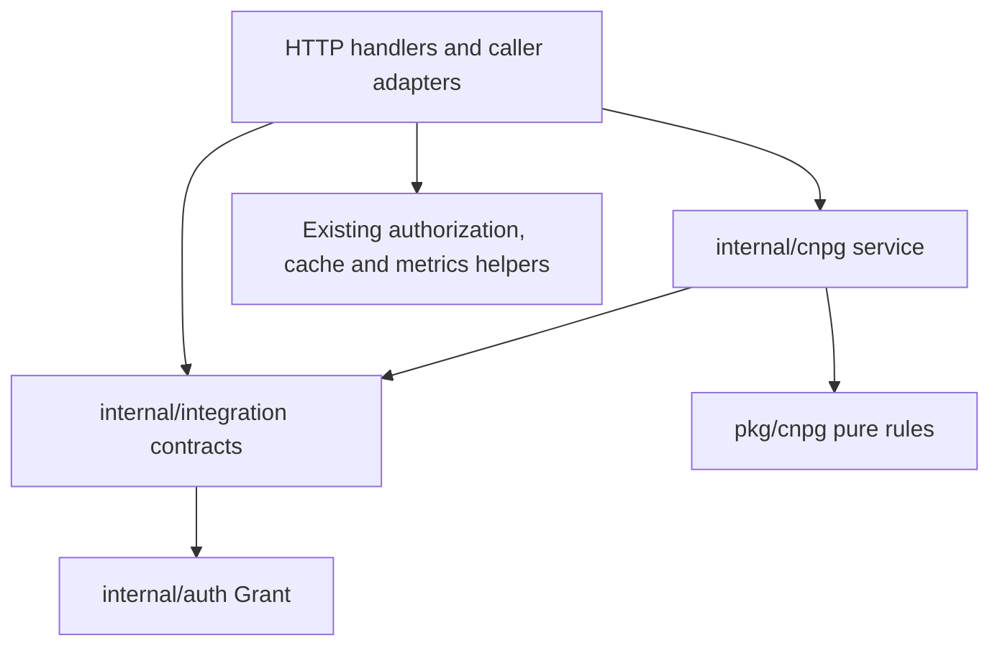

# CNPG service and workspace host boundaries

Status: implemented and validated. Independent subscription cross-review remains blocked by its weekly quota. The original plan follows the implementation record below.

## Implementation record

- `internal/cnpg` owns workspace/catalog assembly, runtime and memoization, storage, HA, recovery, SQL inspection, sessions, operator diagnosis, history, capabilities, action execution, report composition, log interpretation/stream lifecycle, and activity attribution. Operations accept contexts, parsed inputs and explicit dependencies. Runtime parsing, proxy transport, memoization and response types are separate modules.
- `internal/server/cnpg_service.go` binds the caller's authorization, cache, discovery, typed/dynamic/proxy/exec clients and Prometheus client to one cluster snapshot. Read captures share a lock and refuse a context transition; superseded adapters withhold observations and permissions. Write client bundles recheck the reviewed context before execution. HTTP handlers retain decoding, transport framing, serialization and audit logging.
- `internal/integration` contains the existing shared coverage/read/action contracts, conditional patching, cache-scope helpers and bounded fan-out. `internal/podlogs` contains the existing bounded log collector and Pod/container projections used by CNPG, workloads and JobSet. `internal/imageutil` provides the existing explicit image-tag parser to both application and CNPG observations.
- `web/src/integrations` composes app-private resource hosts and workspace routes. Generic detail/drawer/list hosts consume it. Exact API-group identity, exclusive-slot ownership, additive slots and fixed hook ordering are enforced. CNPG and Capacity retain their distinct navigation and scope policies. Workspace screen imports are separate from route metadata to avoid cycles.
- Service tests moved beside their implementation; HTTP contract tests remain in server. An AST boundary test rejects server/router imports, browser HTTP ports and global Kubernetes/Prometheus resolution in the service. Public Go/npm exports and endpoint contracts are unchanged.

The uncertain sidebar data-provider and batched SSE invalidation seams remain documented in the integration guide, as allowed by the approved plan. They need another concrete consumer before choosing a shared shape.

Validation passed: `make tsc`, shared UI type checks, the full app suite (2,295 tests), the shared UI suite (4,572 tests; one existing skip), `make test`, shared Go module tests and `make build` with frontend embedding. Live checks compared the rebuilt binary with the pre-extraction binary on the CNPG demo: 20 API read/refusal contracts, report ZIP contents/coverage, bounded logs/activity and 16 concurrent reads. An isolated browser exercised the workspace, Cluster detail, kind-list takeover and drawer query, and Capacity's cluster-wide posture without Karpenter; no page errors occurred. Visual screenshots were skipped because this extraction preserves rendered behavior. An existing desktop shell test timed out under load and passed both its isolated recheck and the final full suite without changes to its timeout. Independent plan and code review attempts were blocked by the subscription's weekly quota and produced no findings; this is an outstanding review gap.

Extract CNPG orchestration into a request-independent service, then give application resource views a small, typed way to compose integration-owned extensions. Deliver these as several compiling changes. Each step must preserve the current endpoints, permission decisions, evidence coverage, navigation and action binding.

## Evidence and confidence

The source locations below describe the pre-extraction architecture at `8800398ae`; they are historical evidence for the approved plan.

| Certain observation | Evidence |
|---|---|
| Pure CNPG interpretation is already separate from HTTP and permissions. | `pkg/cnpg/backup.go:1`, `pkg/cnpg/instances.go:1` |
| Runtime, storage and operator have typed builders, but those builders still receive HTTP requests and use the server. | `internal/server/cnpg_runtime.go:473`, `internal/server/cnpg_storage.go:203`, `internal/server/cnpg_operator.go:108` |
| The common cached read gate still depends on server permission and cache helpers. | `internal/server/cnpg_reads.go:21` |
| Actions already have a useful context/client-based execution seam; capabilities still depend on HTTP/server methods. | `internal/server/cnpg_actions.go:296`, `internal/server/cnpg_actions.go:760`, `internal/server/cnpg_actions.go:1284` |
| Shared read/action contracts and conditional patching are defined in the server package. Importing them from a new service would create a dependency cycle. | `internal/server/read_source.go:8`, `internal/server/kind_access.go:39`, `internal/server/actions.go:53`, `internal/server/actions.go:228` |
| Runtime memoization separates context, caller identity and Pod UID, with bounded detached reads. | `internal/server/cnpg_runtime.go:805`, `internal/server/cnpg_runtime.go:815` |
| Reports still retain both a server and an HTTP request while composing their reads. | `internal/server/cnpg_report.go:207` |
| A service with a caller authorization adapter already exists elsewhere in Radar. Its permission policy is specific to upgrade scans. | `internal/upgrade/evidence.go:26`, `internal/server/upgrade_readiness_handler.go:101` |
| Generic views import the CNPG adapter for navigation, detail slots and logs. | `web/src/App.tsx:2431`, `web/src/components/workload/WorkloadView.tsx:286`, `web/src/components/workload/WorkloadView.tsx:1209`, `web/src/components/workload/WorkloadView.tsx:1510`, `web/src/components/resources/ResourceDetailDrawer.tsx:36` |
| Other integrations already extend resource detail through renderer wrappers. | `web/src/components/workload/WorkloadView.tsx:181`, `web/src/components/resources/renderers/KarpenterNodePoolRenderer.tsx:1`, `web/src/components/resources/renderers/JobAdmissionRenderers.tsx:1` |
| Workspace routes and context-switch handling have integration-specific branches in App. | `web/src/App.tsx:288`, `web/src/App.tsx:1254` |
| CNPG's resource-list replacement controls both fetching and rendering. Its sidebar also has an integration-specific data hook. | `web/src/components/resources/ResourcesView.tsx:286`, `web/src/components/resources/ResourcesView.tsx:392`, `web/src/components/resources/ResourcesView.tsx:114` |

**Confident recommendations:** the backend dependency direction and the existing resource-detail extension slots are clear enough to implement. Workspace route ownership also has two concrete consumers, CNPG and Capacity. Keep those consumers' existing route parsers and scope policies.

**Defer until there is another concrete consumer:** category-workspace sidebar aggregation, operation tracking, operator diagnosis, and a general-purpose proxy/report framework. Document the places a second integration must revisit. No user decision is required to draft the plan; a new route takeover or public plugin API would be a separate decision.

**Needs-input:** none for the proposed direction. The user authorized implementation; it preserves current product behavior and public interfaces.

## Backend ownership

`internal/cnpg` owns runtime, storage, HA, recovery, history, operator assessment, capabilities, action execution and report composition. It receives `context.Context`, resource identities, parsed options and caller-scoped dependencies. It does not receive browser HTTP requests or response writers, import `internal/server` or chi, or reach for the process-wide Kubernetes singleton. Pod/API HTTP transport can still use `net/http` internally.

`internal/server` owns routes, bounded decoding, response serialization, browser streaming, HTTP error mapping, audit logging and adapting the authenticated caller to existing permission/cache/client helpers. The service's operations use authorized read ports so authorization is also applied when a report calls another service method; endpoint-only gates are insufficient.

`pkg/cnpg` remains the shared pure domain package used by Audit, Issues and the service. Cached-object finding production remains in Issues. Start the orchestration service in `internal/`: its current callers are Radar handlers and report composition. Keep its ports portable, and move a service surface to the public Go module only when a supported consumer actually needs that surface.

The extraction reduces server coupling; it will not remove CNPG's genuine complexity. Runtime, recovery and destructive actions keep separate modules and source-specific result types. Prefer several small operation interfaces over a shared workspace engine with interchangeable permission or certainty policies.

### Dependency seams

Create narrow dependencies alongside the operation that consumes them. Start with runtime's existing Cluster read, instance-Pod inventory and fixed-path proxy read; add storage and operator dependencies as those operations move. Avoid one interface containing every Kubernetes operation.

| Dependency | Responsibility |
|---|---|
| Authorized observations | Return the object/list and its coverage or read-source outcome. Preserve unread, incomplete, missing and empty as distinct results. Delegate permission and cache-scope decisions to existing helpers. |
| Proxy reader | Caller-scoped client, current fixed path/port allowlist, bounded response, scheme handling and error classification. No arbitrary proxy request API. |
| Exec function | Reuse the current context/namespace/Pod/container/argv/stdin seam and output cap. Preserve fixed SQL and psql-variable binding. |
| Metrics reader | Adapt existing Prometheus queries and identity-isolation results. Carry the same ambiguity and partial-coverage metadata. |
| Action clients | Caller-impersonated dynamic/typed clients and exec, using the existing execution seam. Write preflights must read fresh facts directly, not through the observation cache. |
| Clock and memo identity | Explicit time and captured cluster/caller identity. Preserve existing key components, TTLs, timeout behavior and result timestamps. |

Read adapters may capture the server and request internally; their service-facing methods do not expose either. Capture the selected cluster/cache/client identity when preparing an operation rather than resolving a different global context halfway through it. Long-lived service state holds memoization, not a previous caller's clients or grants.

Each operation receives only its dependencies: runtime observations and proxy reads for runtime, additional volume/metrics reads for storage, and fresh write clients for actions. CNPG request/response models move with their slice into `internal/cnpg`, retaining JSON tags and optional fields. The shared leaf package contains existing cross-integration contracts, not CNPG runtime models or orchestration.

Authorizers preserve allowed, denied and non-authoritative permission checks. Preserve the distinction between ordinary cached permission checks and subresource checks. Required grants must be checked before returning a memoized answer. Keep per-kind namespace coverage, including nil versus empty namespace scope and the rules about disclosing denied namespaces. Retain the existing action behavior: an unknown permission check can leave a capability offered, while the impersonated apiserver write is authoritative (`internal/server/actions.go:335`).

### Implementation sequence

1. **Remove the dependency-cycle blockers.** Add `internal/integration/{reads,actions,patch}.go` for the existing `ReadSource`, `KindCoverage`, action envelope/capability, pure capability calculation and version-bound patch helper. Reuse `internal/auth.Grant`. Keep HTTP body decoding, connection handling, authorization adapters and serialization in server. Give service read failures explicit categories such as disconnected, syncing, denied and missing; keep the existing action refusal fields and test their current status/message/code mapping. Do not change wire output as part of the extraction. Temporary internal type aliases can keep intermediate commits compiling and are removed as callers migrate.

2. **Extract runtime as the first complete slice.** Add `internal/cnpg/{ports,types,runtime,runtime_decode,proxy,memo}.go` and `internal/server/cnpg_service.go`. Move runtime parsing, target assessment, bounded proxy reads and memoization from `cnpg_runtime.go`, plus the transport classification it needs from `cnpg_errors.go`. Convert Cluster and Pooler runtime handlers to thin adapters. Reports call the same service operation. Prove this slice works with fake ports and no HTTP test request or live singleton before extending the design.

3. **Move related read orchestration.** Extract storage and HA next, reusing runtime observations. Then move recovery/restore validation, inspection/sessions, history/fleet metrics and operator/status/diagnosis. Source files are the corresponding `internal/server/cnpg_{storage,cluster_ha,recovery,inspect,sessions,history,operator,operator_status,operator_diagnosis}.go`. Move catalog reverse-lookup orchestration from `cnpg_handlers.go`, schedule preview from `cnpg_schedule.go`, and fleet disk assessment from `cnpg_storage.go`. Keep source-specific error/coverage vocabularies. Keep Prometheus query engines in their existing package. Assembly from `cnpg_workspace.go` receives already-authorized per-kind observations and canonical Issues results; it does not become another finding producer.

4. **Move capabilities and actions together.** Extract `cnpg_actions.go`, `cnpg_actions_maintenance.go`, `cnpg_destroy.go` and `cnpg_pooler_actions.go` into service action modules. Preserve the existing per-action binding table and current client injection, rather than introducing a new workflow engine. Capability calculation and submit-time guards use the same facts and blockers. Keep context binding, fresh UID/resourceVersion checks, Pod/backend/PVC identity checks, exact write shapes, preflight order, no automatic retries, partial results and ambiguous outcomes.

5. **Finish reports, logs and activity.** Replace `cnpgReportBuilder`'s server/request fields with operation-scoped reads and the extracted service. Put archive construction, redaction, source selection and CNPG log interpretation in the service; HTTP headers and stream framing stay in server. CNPG logs already use shared workload-log entries/sources from `workload_logs.go`; move the smallest shared protocol/helper subset to an app-level log package if the extraction needs it, after checking existing helpers. Do not copy the merged-log engine or move unrelated workload behavior into CNPG. Preserve interval/restart cursors, cancellation, byte bounds and report error classification.

Each slice retains handler integration tests. Move pure parsers/guards and service-level tests beside their implementation; do not export private helpers merely to keep tests in server. Remove migrated wrappers and aliases before declaring the extraction complete.

## Frontend generalization

### Resource detail and kind-list extension points

Add an app-owned composition root under `web/src/integrations/` with `resourceHosts.tsx` and a small internal contract. It imports integration adapters; generic resource views import this composition root. Keep it private to radar-app and reuse existing k8s-ui `RendererOverrides`, summary/header-action slots and extra-tab types.

The first entries are CNPG and the existing renderer contributions, including Karpenter and batch/Ray. This changes where their existing behavior is composed. It does not introduce automatic Capacity redirects or new tabs.

| Existing host responsibility | Planned ownership |
|---|---|
| Drawer expansion and generic-detail redirect | Resolve the owning adapter by exact resource identity; delegate path/query construction to it. |
| Summary, header actions, extra tabs and Diagnose decoration | Typed contributions using existing detail slots. |
| Integration log view | Optional contribution alongside the existing built-in log strategies, preserving their selection order. |
| Drawer navigation/trail | Optional adapter-owned component. |
| Renderer wrappers | One stable composed `RendererOverrides` object in the app composition root. Existing dispatch still handles curated kinds, collisions and version/spec-shape predicates. |
| Resources kind-list replacement | Separate optional kind-list contribution keyed by API group and resource plural, with a pure `table / wait / view` decision used for both query enabling and rendering. |

Resolve identity through existing group/kind/navigation helpers. A selection uses resource plurals while fetched objects use Kinds; normalize at the boundary. Core group `""` and an unknown group remain distinct. A colliding Kind without a resolved group cannot select an integration-specific destination.

An object may have contributions from several integrations: a core Job can have Kueue admission and batch execution. Additive actions/tabs compose in a declared order. Summary, renderer override, logs, detail destination and kind-list takeover each have an explicit owner; incompatible contributions are rejected in validation/tests rather than resolved by registration order. Existing wrapper components may compose related contributions internally.

Use stable React components for data-bearing contributions. Never call a selected adapter's hook conditionally inside a generic host. Capability loading and support decisions use the existing feature-gating machinery; adapters retain their current supported/unknown/unsupported policies. Registration does not bypass the guards on fetch hooks.

Migrate `App.tsx` expansion, `WorkloadView.tsx` redirect/slots/logs/Diagnose, `ResourceDetailDrawer.tsx` navigation and `ResourcesView.tsx` kind-list ownership. Those host operations should no longer import CNPG implementations directly. The sidebar data hook is a documented exception until its provider composition has another consumer. Renderer dispatch and standard workload actions remain shared through their current interfaces.

### Workspace route ownership

CNPG and Capacity already have separate route parsers (`web/src/components/cnpg/routes.ts` and `web/src/components/capacity/shared.tsx`, consumed by `web/src/components/capacity/CapacityView.tsx:9`). Add a small app-owned workspace table for those two consumers: route-prefix ownership, label/breadcrumb contribution, sidebar ownership, screen component and optional context-switch search policy. Move the corresponding App branches behind that table while retaining each adapter's parser and view logic.

Keep CNPG's resource-category placement and namespace filter, and Capacity's top-level placement and cluster-wide scope. Preserve the current CNPG `ctx` pin on a context switch; do not apply that policy to every workspace. Keep connection/feature gates, navigation customization, route state, basename handling and the radar-app embedding API unchanged. Routes and screens stay explicitly registered in the application; no public plugin loader or universal workspace data model is needed.

Implement the frontend in four compiling steps: move the existing stable renderer-override composition first; migrate detail/navigation/log contributions next; move kind-list ownership together with its query guard; then extract workspace route metadata into a separate module. Keep workspace screen imports separate from the resource-host root so screens can use the app's WorkloadView without creating a composition-root cycle. No integration adapter imports App.

### Document extension points whose shape is still uncertain

Document these in the integration guide now. Add a source comment only when implementing a seam with a non-obvious invariant; avoid repeated TODOs explaining obvious imports.

| Place to revisit | Trigger and constraint |
|---|---|
| `ResourcesView.tsx:114` and `sidebarCategoryWorkspaces` | A second category workspace needs aggregate counts/coverage. Reuse the existing sidebar prop; mount data hooks in integration-owned components and preserve per-kind unread scopes. Capacity's global workspace is not evidence for a common namespace-scoped sidebar provider. |
| `App.tsx:1117` and `App.tsx:1162` | Another integration needs event-driven workspace-query invalidation. Extract change-to-query-key contributions into the existing batching mechanism; preserve its timing and context lifetime, rather than adding another SSE listener. |
| CNPG operation tracker, proxy protocol, report options and operator diagnosis | A second integration needs the same semantics. Extract the demonstrated common part; resource-specific evidence, permission policies and outcomes remain with that integration. |

## Validation and completion criteria

Backend tests must exercise exact permissions/subresources, caller/context/Pod-UID memo separation, stale or partial cache coverage, disconnected/syncing states, proxy/exec bounds and cancellation, report redaction, and action fact binding/partial writes. Preserve existing HTTP response shapes, including null/empty/omitted fields, statuses, refusal codes and source timestamps. Use focused golden fixtures for meaningful wire contracts, not snapshots of every implementation detail.

Frontend tests must cover CNPG/CAPI/core collisions, unknown group, JobSet version dispatch, simultaneous batch/Kueue contributions, all feature-support states, query suppression for kind-list takeover, tab/query/context preservation, drawer history, default log fallback and duplicate exclusive-slot ownership. Exercise OSS and embedded basename navigation using current public interfaces.

For each code slice run the affected tests and required QA; complete the refactor with `make tsc`, shared-package type checks and frontend suites, `make test`, the separate `pkg` Go suite where affected, and `make build`. Consider a focused real CNPG smoke pass for runtime/report/permission behavior and navigation once the demo is available. Visual capture is useful only for any slice that changes rendered behavior.

The final architecture should allow service tests without constructing an HTTP request or server, retain one implementation of each shared CNPG rule and finding, and allow an integration to extend resource views by adding its adapter/registration rather than editing several generic views. Context/caller adaptation and wire serialization remain centralized in server; package dependency direction is enforced by an import-boundary check.

## Original plan review

The draft has been checked against the current call sites for dependency cycles, permission/memo leakage, fresh-write preflights, competing detail contributions, React hook ordering and workspace scope differences. Source anchors and the integration-guide link were verified, and `git diff --check` passed. Visual testing is skipped because this change contains only documentation.

Independent plan review was attempted on the Claude subscription on 2026-10-06 and blocked by its weekly usage limit; no independent findings were produced. The user subsequently authorized implementation. The implementation record above tracks its current state.
