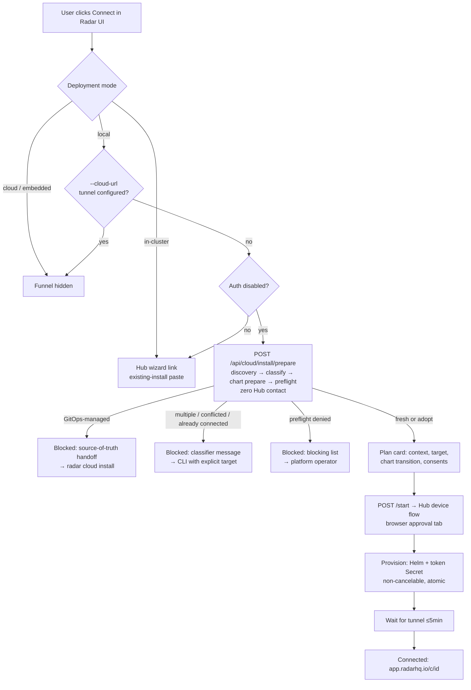
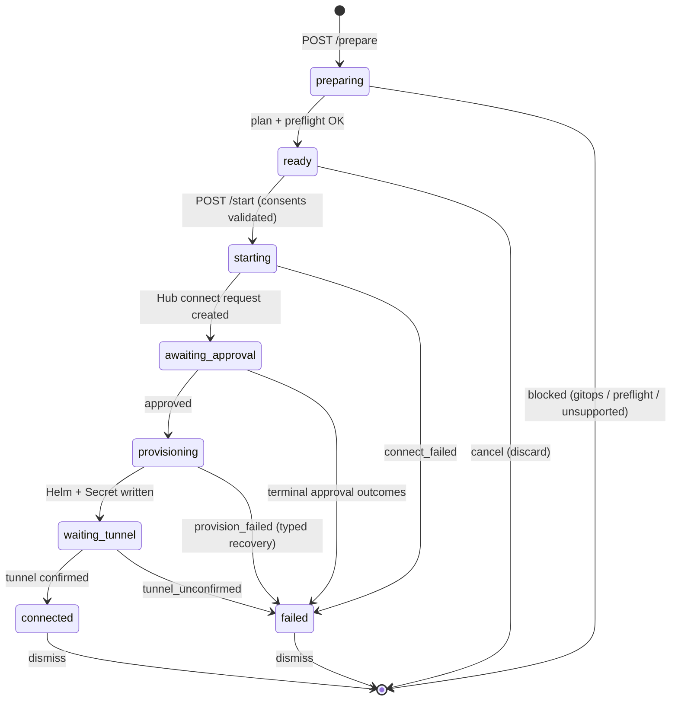

# Cloud Connect — every path from OSS Radar to Radar Cloud

Radar has one connect mechanic — an RFC-8628-style device flow against the Hub
(`POST /api/connect/requests` → browser approval → token minted on the poll
channel) — surfaced through three doors:

1. **The CLI**: `radar cloud install` (the reference implementation; handles
   every scenario including the ones the UI refuses).
2. **The in-product modal** (the Cloud funnel globe in the top bar): runs the
   same flow server-side when — and only when — it can safely act as the
   operator. Everything else routes to a Hub link.
3. **The Hub wizard** (`app.radarhq.io` → Connect a cluster): browser-first
   path; generates the token-Secret + Helm command, including an
   existing-install variant.

This doc maps which scenario lands where and why. The load-bearing principle:
**the privilege boundary decides the execution location.** Radar's UI performs
the install only when the person at the UI already *is* the operator; whenever
identity, credentials, or source-of-truth ownership get involved, the flow
moves to the surface that actually holds them (the terminal or the Hub).

## Scenario matrix

| # | Deployment | Auth | Listener | Existing install | In-product result | Best path |
|---|-----------|------|----------|------------------|-------------------|-----------|
| 1 | local | none | any | none | **Driver lane**: "Connect this cluster" runs the full flow (fresh install) | modal button |
| 2 | local | none | any | native Helm release | **Driver lane**: adoption plan + explicit consent, atomic upgrade w/ verified rollback | modal button |
| 3 | local | none | any | GitOps-managed (Argo/Flux) | **Blocked with explanation** → run `radar cloud install` (values + token-Secret handoff for Git); imperative writes would drift or be reverted | CLI |
| 4 | local | none | any | multiple installs / conflicted Helm state / already-connected | **Blocked with the classifier's message** → CLI with explicit `--namespace`/`--release` | CLI |
| 5 | local | none | **0.0.0.0** | any | **Driver lane, behind an explicit acknowledgement** — `apply`/`exec` are ungated on this listener too, so gating this harder would hold the weaker capability to a higher bar, but the approver may not be the operator and the binding outlives the request | modal button |
| 6 | local | proxy/OIDC | any | any | Driver lane disabled (server's kubeconfig ≠ authenticated user; impersonated driver is future work) → wizard link | wizard / CLI |
| 7a | in-cluster, native Helm | any | any | itself | **Wizard, deep-linked at the real target** (`/install?existing=1&ns=…&release=…`) plus the detected layout shown in-modal. The SA cannot self-grant impersonation RBAC and a successful upgrade restarts the pod serving this UI, so the install itself happens from the Hub | wizard |
| 7b | in-cluster, GitOps-managed | any | any | itself | Names the owning controller and routes to `radar cloud install` — the wizard's imperative command would drift or be reverted | CLI |
| 7c | in-cluster, ambiguous ownership | any | any | itself | Conflicting Helm/GitOps metadata — routes to `radar cloud install`, which refuses rather than guessing (same posture as `ClassifyInstallPlan`) | CLI |
| 7d | in-cluster, undetectable | any | any | itself | Generic wizard link (SA can't read its own Deployment, or the downward-API identity is absent) | wizard |
| 8 | in-cluster, chart-armed (future WS3) | — | — | itself | Zero-command hot-start (chart pre-provisions cloud RBAC + Secret write-back Role) — not built yet | (future) |
| 9 | cloud / embedded / any run with `--cloud-url` | — | — | — | Funnel hidden entirely (already connected — `capabilities.cloudConnect` is absent) | — |
| 10 | any | — | — | self-hosted Hub target, browser-trusted cert | Same flows against `RADAR_HUB_URL` (+ `RADAR_HUB_APP_URL`); CLI: `--hub-url` | any |
| 11 | any | — | — | self-hosted Hub, **self-signed** cert | **Not supported by either installer today** — see below | Hub wizard |

The lane is advertised to the frontend as `capabilities.cloudConnect =
{lane: "driver"|"wizard", appUrl}` — absent entirely on already-tunneled runs
(row 9), which is what hides the funnel; rows 3–4 are discovered at `prepare`
time (classification), not from capabilities.

## Decision flow

## Driver-lane flow states

Failure kinds carry structured recovery guidance (`summary`, `lines`,
`inspect` commands, `clusterUrl`) generated by the same code the CLI prints
(`internal/cloudinstall/recovery.go`) — the two presenters cannot drift.
`retrySafe` distinguishes "nothing was created, just retry" from "a Hub
cluster may exist; follow the guidance first".

| Failure kind | Meaning | Retry-safe |
|---|---|---|
| `connect_failed` | Hub unreachable / rejected the request | before approval: yes |
| `expired` | 15-min approval window lapsed | yes |
| `rejected` | Explicitly rejected on the consent page | yes |
| `pickup_expired` | Approved, but the token-pickup window lapsed | no — pending cluster exists |
| `approval_unknown` | Lost Hub contact; approval may have committed | no — check clusters list |
| `approval_unknown` (cancel) | Canceled; the approval page stays valid until it expires, so a cluster may still appear | no — check the clusters list |
| `canceled_after_approval` | Cancel raced an approval; cluster exists, nothing installed | no |
| `provision_failed` | Helm failed post-approval; adoption rolls back atomically (rollback status included) | no |
| `tunnel_unconfirmed` | Installed, but the agent didn't attach in 5 min | no — agent may still connect |

## Endpoints

All under `/api/cloud/install/*`, registered in `internal/server/server.go`,
implemented in `internal/server/cloud_install.go`:

- `POST /prepare` — discovery → classification → chart prepare →
  exact-manifest preflight. **Zero Hub contact.** Returns a flow (`flowId`,
  `state: ready`, plan summary) or `{state: blocked, blocked}` (nothing
  retained). 409 with current status if a flow is active (single-flight).
- `POST /start {flowId, clusterName, acceptAdoption?, acknowledgeIncompleteDiscovery?, acknowledgeSharedListener?}`
  — creates the Hub connect request, returns `connectUrl`; a manager-owned
  goroutine continues approval → provision → tunnel (surviving modal close,
  navigation, and client disconnects).
- `GET /status` — the state machine for the UI. `Cache-Control: no-store`.
- `POST /cancel {flowId}` — allowed in `ready` (discards), `awaiting_approval`
  and `waiting_tunnel`; refused during `provisioning` (atomic critical
  section). Cancellation preserves the CLI's final-poll semantics, so an
  approval racing the cancel is detected and reported.
- `POST /dismiss {flowId}` — clears a terminal flow.

In-cluster (read-only, no Hub contact, never mutates):

- `GET /api/cloud/connect/self` — what this Radar knows about its own
  installation: `{ownership: helm|gitops|ambiguous|unknown, namespace, release,
  deploymentName, chart, controller?, wizardUrl?}`. Every failure degrades to
  `unknown` + a generic wizard link; a confidently wrong namespace/release
  would deep-link an operator at someone else's release. The pod's own
  Deployment is matched by `MY_DEPLOYMENT_NAME` — "the only Radar-labelled
  Deployment in this namespace" is not proof it is the one serving the
  request. Those downward-API vars ship on every install (they carry no RBAC
  implication); whether Radar may patch itself is answered by a
  SelfSubjectAccessReview against the Role `rbac.selfUpgrade` creates — never
  by an env marker, which Hub's image-only self-upgrade would leave stale.
  The probe re-runs on every tunnel handshake and periodically while a tunnel
  is up; a stable change cycles the connection so enabling `rbac.selfUpgrade`
  (an RBAC-only change that restarts nothing) reaches the Hub within minutes.
  Reads use
  request-scoped clients, so with auth enabled nobody learns about a
  Deployment their own identity cannot read.

## Security model

The endpoints are live only when **all** of these hold (`cloudConnectDriverEnabled`):

- deployment mode is `local` (not in-cluster, not cloud),
- auth is disabled (with auth enabled, the browser identity is not the
  kubeconfig identity — see row 6),
- no `--cloud-url` tunnel is configured.

Anyone who can reach an unauthenticated Radar already wields the operator's
kubeconfig through `/api/resources/apply` and `pods/exec` — strictly more power
than installing a chart — so the lane adds no new authority and is **not**
gated on the listener address: that would hold the weaker capability to a
higher bar than the stronger ones. A non-loopback listener (`--listen-address
0.0.0.0`) instead requires an explicit acknowledgement on the plan card before
the flow can start, because the one thing Connect adds is a durable binding to
a Radar org, and on a shared listener the approver may not be the operator —
that is a decision to make, not a warning to scroll past. Additional
properties:

- Mutating endpoints reject cross-origin browser POSTs via `sameOriginOK`,
  which compares the `Origin` against the authority the client actually used.
  The older `localOriginOK` allowlist would have 403'd the legitimate browser
  on a non-loopback listener — the very case this lane now supports — while
  still admitting a scripted caller that omits the header.
- The `rhc_` cluster token **never appears in any API response or log**; it
  travels goroutine-local from the approval poll into the `radar-cloud-config`
  Secret. A test asserts no wire struct even declares a token field.
- Per-flow clients (typed + dynamic + a standalone Helm client) are bound to a
  copied `rest.Config` at prepare time — switching the app's kubeconfig
  context mid-flow cannot retarget the writes.
- Flow state is in-memory; a Radar restart mid-flow behaves like killing the
  CLI: pre-approval requests expire harmlessly upstream, post-approval crashes
  can leave a pending Hub cluster the org owner can delete.

## Self-hosted hubs

`RADAR_HUB_URL` points the driver lane (and capability links) at a self-hosted
control plane; `RADAR_HUB_APP_URL` overrides the frontend origin when it
differs (default: same origin as `RADAR_HUB_URL`, or the hosted
`app.radarhq.io`). All success/recovery links derive from Hub responses, not
hardcoded origins. The CLI equivalent is `--hub-url`.

**Self-signed hubs are not supported by either installer yet.** The running
agent accepts `--cloud-insecure-skip-verify` / `cloud.insecureSkipVerify`, but
neither the in-product driver nor `radar cloud install` can pass it: the
driver's config carries no TLS option and never sets the chart value, and the
`cloud` subcommands are dispatched before the global flag set is parsed, so the
global flag cannot reach them. A self-signed pilot must use the Hub wizard,
which generates a command the operator can edit. Wiring the option through both
installers is a follow-up.

## Staged rollout

The funnel ships behind a compiled-in percentage
(`cloudFunnelRolloutPercent` in `internal/server/cloud_funnel_rollout.go`,
starting at 10) ramped by releases and deleted at 100. There is deliberately
no remote flag service: Radar makes no network calls it doesn't announce, and
a rollout gate is not a reason to start.

- **Bucketing** hashes a random install ID persisted in
  `~/.radar/settings.json` — minted locally, never transmitted. Same install →
  same verdict across restarts; raising the percentage only ever adds
  installs (monotonic, pinned by test).
- **Out-of-cohort** means `capabilities.cloudConnect` is absent — the same
  hiding mechanism as an already-connected cluster. Nothing else changes; the
  install endpoints keep their own gating.
- **`RADAR_CLOUD_FUNNEL=on|off`** overrides in either direction: force-on for
  demos, docs, or opting a friendly cluster in early (set it via the chart's
  env for in-cluster installs); force-off to opt out permanently.
- **In-cluster pods are excluded from the ramp** (they join at 100): without
  durable storage the bucket would re-roll every restart and the funnel would
  flicker. The driver lane is local-only anyway, so the ramp cohort is the
  population whose feedback matters most.
- **Emergency brake, no release needed:** the Hub refusing
  `POST /api/connect/requests` stops the risky half (device flow +
  provisioning) for every version in the field; the funnel degrades to an
  error card.
- **Measurement is Hub-side only.** Funnel-opened URLs carry
  `utm_source=radar-oss&utm_medium=app&utm_campaign=cloud-modal` plus a
  per-lane `utm_content` (`funnel-cta`, `driver-escape`, `flow-escape`,
  `wizard-deeplink`, `wizard-generic`) — the Hub sees them only when the user
  actually navigates there.

## Related

- `cmd/explorer/cloud_cmd.go` — the CLI driver (`radar cloud install|status|connect`).
- `internal/cloudinstall/` — shared domain layer: discovery, classification
  (`plan.go`), prepare/provision, preflights, GitOps handoff, recovery
  guidance (`recovery.go`).
- `internal/cloud/connect.go` — device-flow client (token pickup semantics).
- radar-hub `docs/OSS-TO-CLOUD-UX.md` — the full product plan (WS3 covers the
  future chart-armed zero-command in-cluster lane).
