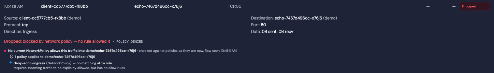
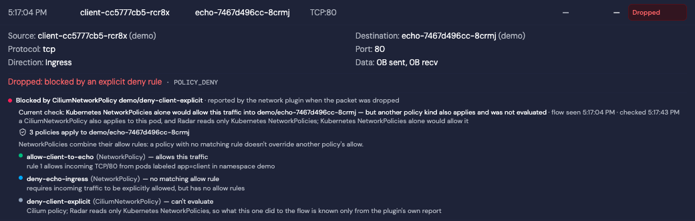
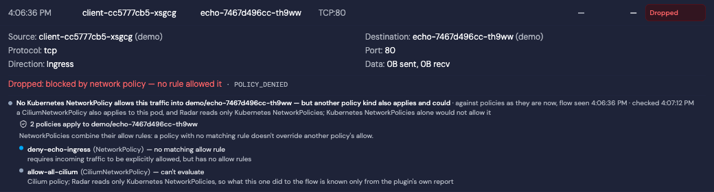
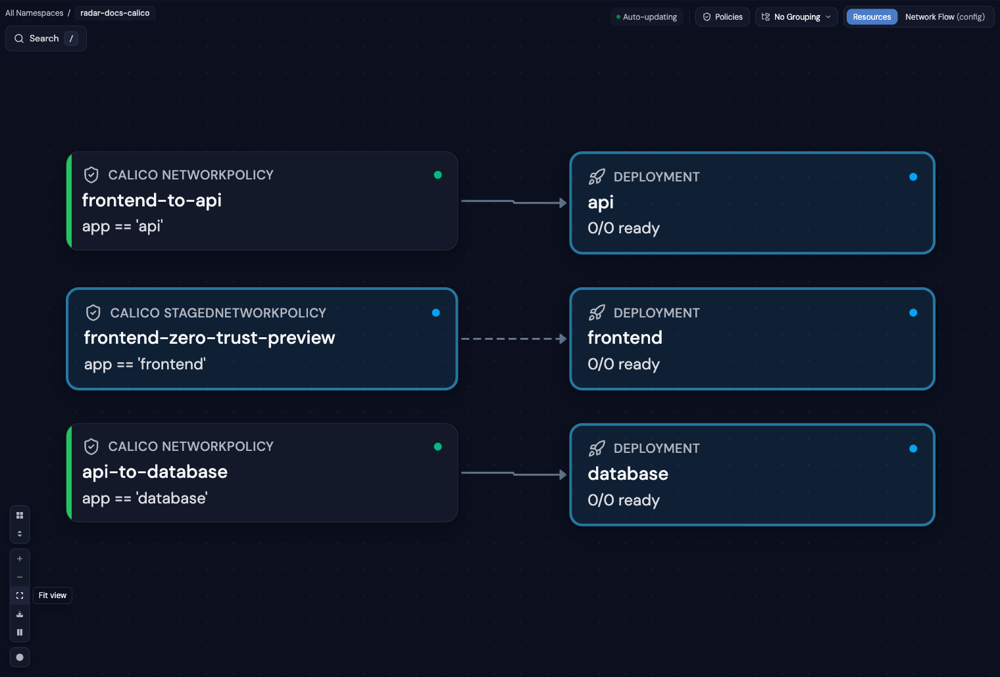
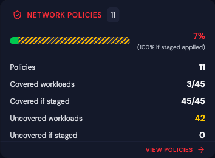
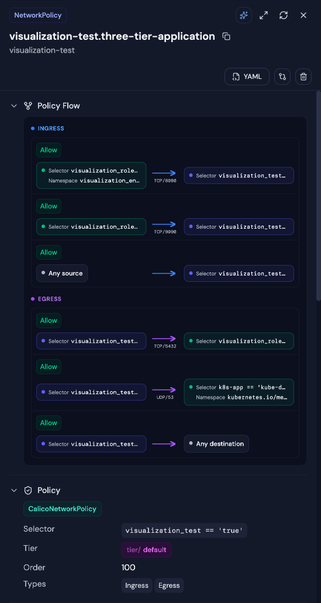
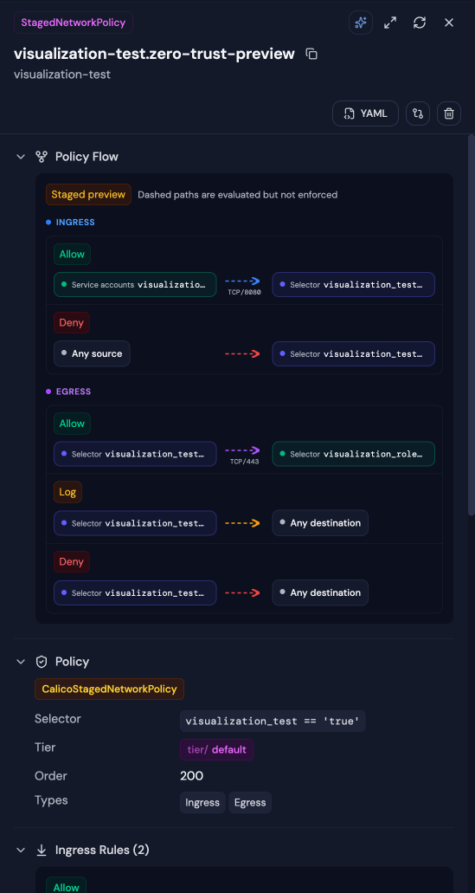

# CRD Integrations

Radar automatically discovers and displays **any** Custom Resource Definition (CRD) in your cluster — no configuration needed. For popular tools, Radar provides dedicated detail views, topology edges, smart table columns, and AI-optimized summaries for seamless integration.

## ConfigMap and Secret reflection (Reflector)

[EmberStack Reflector](https://github.com/emberstack/kubernetes-reflector) copies
core Secrets and ConfigMaps between namespaces using annotations. It needs no CRDs.

**Resource details:** ordinary Secrets and ConfigMaps are unchanged. Mirrors show compact source navigation and edit guidance before their data, after Secret identity and certificate-expiry alerts. Detailed settings follow the data in a collapsible **Reflector** section
showing source/mirror role, automatic versus manual mirrors, reflection permission,
and configured namespace name patterns and label selectors. Visible sources and
mirrors are linked directly. Source section titles show the visible mirror count; expanding shows five mirrors initially, with a control to show all. Automatic creation requires reflection permission;
name patterns and selectors are alternatives within each rule on controller versions
that support selectors. Radar displays these rules without predicting a destination
set or evaluating the controller's regular expressions.

**Recorded copy evidence:** mirrors show `reflected-version` and `reflected-at` when
present. When the source is visible, Radar compares its observed resource version
with the mirror's recorded version. These cached observations can lag reconciliation.
This is metadata evidence, not a content or
health check: metadata-only changes advance source versions, and editing a mirror
can leave its recorded version unchanged. Mirror details and Secret edit confirmation
explain that local changes may persist until a source update overwrites them.

**Configuration checks:** local warnings identify malformed or self-referencing
source declarations, invalid boolean settings, automatic creation without reflection
permission, sources with visible mirrors but disabled reflection, and mirror chains that do not propagate updates as ordinary sources.
These appear in resource details, not as cluster-wide health findings.

**Topology:** when both objects are visible, the mirror's `reflects` annotation
creates a **Reflects to** configuration edge from source to mirror, including mirrors
with a different name. It represents a declaration, not Kubernetes ownership or
successful synchronization. Namespace filters apply. Secret nodes are hidden by
default and require Secret list access when included. The REST resource-detail relationship response also
identifies reflection sources and mirrors explicitly.

**Unused resource checks:** observed consumption of a mirror also counts as use of
its visible same-kind source, including declared chains. Automatic mirrors with
visible sources are exempt when unused, but their existence alone does not prove
source use. Without adequate consumer inventory, a source is unknown rather than
unused; see [audit evidence under partial access](configuration.md#audit-evidence-under-partial-access).

**Agent context (MCP and REST):** `get_resource` and the REST AI resource context expose an optional `resourceContext.reflection` block. It separates `declaredSource` from an authorized observed `source`, includes recorded copy metadata and the authorized source resource version, and lists up to 20 `visibleMirrors` with `truncated` when more authorized mirrors were observed. This lookup spans namespaces in the available cache independently of the resource-context graph. Unreadable endpoints and their versions are withheld; omitted-field reasons describe unavailable cache evidence or denied access. These observations do not prove complete distribution or synchronization health.

**Partial visibility:** unavailable sources are not called missing, and visible mirror
counts are not expected totals. Radar does not diagnose absent mirrors, name conflicts,
controller availability, or synchronization lag. Controller configuration and version
can further restrict eligible namespaces. Inspect controller logs when a declared
relationship is not being reconciled.

| Resource | Group | Topology | Detail View |
|----------|-------|----------|-------------|
| ConfigMap | Core | Source → mirror configuration edge | Reflection settings, visible mirrors, source navigation, copy-version evidence, local configuration warnings |
| Secret | Core | Source → mirror configuration edge when included and authorized | Same metadata-only reflection details; values remain behind existing reveal controls |

---

## Karpenter

[Karpenter](https://karpenter.sh/) is the standard node autoscaler for Kubernetes, replacing Cluster Autoscaler on AWS (EKS), Azure (AKS NAP), and generic clusters.

### What Radar Shows

**Capacity view:** When Radar discovers Karpenter NodePools (and the current identity can list them), a cluster-wide **Capacity** view appears in navigation — a read-only diagnosis surface across four screens:
- **Overview** — fleet KPIs with claim lifecycle detail, a cluster scheduling-capacity bar (scheduled requests vs allocatable, in-flight claim capacity beyond the allocatable edge, pending demand as a not-to-scale count), prioritized operational signals, and the NodePool inventory
- **NodePool detail** — the capacity ledger (configured limit, provisioned, headroom, allocatable, scheduled requests, unallocated, actual usage) plus claim lifecycle, fleet composition, and workload attribution
- **Demand** — pending pods grouped by scheduling signature, each group evaluated against every NodePool's declared constraints with per-predicate evidence
- **Activity** — provisioning, disruption, interruption, and termination episodes classified from Karpenter's exact event vocabulary

Every quantity carries per-value certainty (`= ≥ ≤ ?`): unavailable is never rendered as zero, partial is never rendered as exact, and **scheduling capacity is kept structurally distinct from actual usage** — Karpenter schedules on pod requests, so usage is an efficiency signal, never scheduler headroom. Issues, Pending-pod drawers, and the Home posture card deep-link into the right diagnosis. Full reference: [Capacity documentation](capacity.md).

**Topology:** Full provisioning chain — NodePool → NodeClaim → Node → Pod. See which NodePool owns which NodeClaims, which Nodes they provisioned, and what Pods are running on them. NodePool → NodeClass edges show the provider-specific configuration each pool uses.

  
   <em>Karpenter in Topology View — NodePool → NodeClaim provisioning chain</em>

**NodePool Detail View:**
- Status conditions (Ready)
- Clickable NodeClass reference (EC2NodeClass, AKSNodeClass, or generic)
- Resource limits (CPU, memory)
- Disruption policy and consolidation settings
- Disruption budget reasons, termination grace period, and requirement `minValues`
- Instance requirements (types, zones, architectures)
- Template labels applied to provisioned nodes

  
   <em>NodePool Detail View — Status, related NodeClaims, and full specification</em>

**NodeClaim Detail View:**
- Provisioning timeline with timestamps
- Status conditions (Initialized, Launched, Registered, Ready)
- Instance type, capacity, and zone
- Requirements (instance types, architectures, OS)
- Clickable Node and NodeClass references

**NodeClass Detail View** (EC2NodeClass, AKSNodeClass, etc.):
- AMI selector terms and aliases
- Block device mappings (volume type, size, encryption)
- IAM role configuration
- Subnet and security group discovery tags
- Instance metadata options (IMDS configuration)

**Resource Browser:** Smart columns show status, NodeClass reference, limits, and disruption policy at a glance.

  
   <em>NodePool Resource Browser — Status, NodeClass, limits, and disruption policy at a glance</em>

### Supported CRDs

| CRD | Group | Topology | Detail View | AI Summary |
|-----|-------|----------|-------------|------------|
| NodePool | `karpenter.sh/v1` | Yes | Yes | Yes |
| NodeClaim | `karpenter.sh/v1` | Yes | Yes | Yes |
| EC2NodeClass | `karpenter.k8s.aws/v1` | Yes | Yes | Yes |
| AKSNodeClass | `karpenter.azure.com/v1alpha2` | Yes | Generic | Yes |
| GCENodeClass | `karpenter.k8s.gcp/v1alpha1` | Yes | Generic | Yes |

All provider-specific NodeClass variants are automatically detected and supported.

---

## Cluster API (CAPI)

[Cluster API](https://cluster-api.sigs.k8s.io/) is the Kubernetes sub-project for declarative cluster lifecycle management. Used by platform teams to provision and manage workload clusters.

### What Radar Shows

**Topology:** Full CAPI ownership chain — ClusterClass → Cluster → KubeadmControlPlane → Machine → Node, and Cluster → MachineDeployment → MachineSet → Machine → Node. MachineHealthCheck → Cluster protection edges. Machine → Node edges use status.nodeRef (semantic, not owner-ref).

**Cluster Detail View:**
- Phase, version, cluster class, control plane endpoint
- Control plane and worker replica counts (v1beta2-aware)
- Control plane and infrastructure references (clickable)
- ClusterClass topology section (worker MachineDeployments table)
- "Connect to Cluster" button — auto-connects Radar to the workload cluster
- "Download Kubeconfig" button
- Conditions

**Machine Detail View:**
- Phase, role (Control Plane / Worker), version, provider ID
- Clickable Node reference (via status.nodeRef)
- Addresses table, node info (OS, architecture, kernel, kubelet)
- Bootstrap and infrastructure references

**MachineDeployment Detail View:**
- Phase, replicas (desired/ready/available/up-to-date), strategy
- Version, cluster name
- Machine template references
- Owned machines label hint (copyable)

**KubeadmControlPlane Detail View:**
- Replicas, version, initialized status (v1beta2-aware)
- Machine template with drain/volume detach/deletion timeouts
- Kubeadm config highlights (cert SANs)
- Last remediation info
- Owned machines label hint

**ClusterClass Detail View:**
- Infrastructure, control plane, worker topology tables
- Variables with schema types
- Patches with definitions and enabledIf expressions

**MachineHealthCheck Detail View:**
- Expected/healthy machine counts, remediations allowed
- Label selector display
- Unhealthy conditions tables (v1beta1 + v1beta2 formats)
- Remediation template

**Additional renderers:** MachineSet, MachinePool, MachineDrainRule, KubeadmConfig/Template

**Resource Browser:** Smart columns for all CAPI kinds — phase badges, replica counts, cluster names, roles, versions.

**Topology-controlled badge:** Resources managed by ClusterClass (label `topology.cluster.x-k8s.io/owned`) show a warning banner.

**Fleet topology mode:** Dedicated "Fleet" view filters to CAPI and infrastructure provider resources only, giving a clean cluster-management view without application workload noise. Groups start expanded by default.

**Resource browser** with smart columns per CAPI kind — Provider detection, phase badges, replica counts:

**Cluster detail view** with Connect to Cluster and Download Kubeconfig actions, provider detection, and clickable references to infrastructure resources:

### Infrastructure Provider Renderers

Radar has first-class renderers for **AWS (CAPA)**, **GCP (CAPG)**, and **Azure (CAPZ)** infrastructure provider resources. These surface provider-specific operational data — instance types, scaling config, VPC/subnet topology, managed service addons — that would otherwise be buried in raw YAML.

**AWS EKS control plane** — VPC topology with subnets (Public/Private badges), security groups, EKS addons, IAM roles:

**GCP GKE control plane** — project, location, release channel, and conditions timeline with left-aligned timestamps:

**Managed machine pools**: Instance/VM types, scaling config (autoscaling min/max), capacity type badges (On-Demand/Spot), node management (auto-repair/upgrade), labels and taints.

**Azure AKS**: Location, resource group, SKU tier, network plugin/policy, System/User mode badges, Regular/Spot priority, availability zones.

**Individual machines**: Instance type/state badges, provider IDs, addresses, conditions.

**Templates and cluster stubs**: Lightweight renderers for instance templates (with resolved capacity) and cluster infrastructure stubs (endpoint + failure domains).

### Supported CRDs

| CRD | Group | Topology | Detail View | AI Summary |
|-----|-------|----------|-------------|------------|
| Cluster | `cluster.x-k8s.io` | Yes | Yes | Yes |
| ClusterClass | `cluster.x-k8s.io` | Yes | Yes | Yes |
| Machine | `cluster.x-k8s.io` | Yes | Yes | Yes |
| MachineSet | `cluster.x-k8s.io` | Yes | Yes | Yes |
| MachineDeployment | `cluster.x-k8s.io` | Yes | Yes | Yes |
| MachinePool | `cluster.x-k8s.io` | Yes | Yes | Yes |
| MachineHealthCheck | `cluster.x-k8s.io` | Yes | Yes | Yes |
| MachineDrainRule | `cluster.x-k8s.io` | No | Yes | No |
| KubeadmControlPlane | `controlplane.cluster.x-k8s.io` | Yes | Yes | Yes |
| KubeadmControlPlaneTemplate | `controlplane.cluster.x-k8s.io` | No | Generic | No |
| KubeadmConfig | `bootstrap.cluster.x-k8s.io` | No | Yes | No |
| KubeadmConfigTemplate | `bootstrap.cluster.x-k8s.io` | No | Generic | No |
| AWSManagedControlPlane | `controlplane.cluster.x-k8s.io` | Yes | Yes | No |
| AWSManagedMachinePool | `infrastructure.cluster.x-k8s.io` | Yes | Yes | No |
| AWSMachine | `infrastructure.cluster.x-k8s.io` | Yes | Yes | No |
| AWSMachineTemplate | `infrastructure.cluster.x-k8s.io` | No | Yes | No |
| AWSManagedCluster | `infrastructure.cluster.x-k8s.io` | No | Yes | No |

---

## KEDA

[KEDA](https://keda.sh/) (Kubernetes Event-Driven Autoscaling) is a CNCF graduated project that scales workloads based on external event sources — queues, streams, cron schedules, Prometheus metrics, and 60+ other triggers.

### What Radar Shows

**Topology:** ScaledObject → target workload (Deployment, StatefulSet, or Rollout). See which workloads are managed by KEDA and trace the scaling relationship.

  
   <em>KEDA in Topology View — ScaledObject → Deployment → Pod scaling chain</em>

**ScaledObject Detail View:**
- Status conditions (Ready, Active, Paused, Fallback)
- Target workload reference
- Min/Max/Idle replica configuration
- Polling interval and cooldown period
- Trigger list with type and metadata
- Generated HPA name
- Pause state detection (supports all 3 annotation variants)

  
   <em>ScaledObject Detail View — Status conditions, target workload, triggers, and replica configuration</em>

**ScaledJob Detail View:**
- Status conditions
- Job target reference
- Scaling strategy (default, custom, accurate, eager)
- Success/failure limits
- Trigger list

**TriggerAuthentication Detail View:**
- Pod identity provider and configuration
- Secret references with linked Secret navigation
- Environment variable mappings
- External secret providers (HashiCorp Vault, Azure Key Vault, AWS Secrets Manager)

**Resource Browser:** Smart columns show status, target workload, trigger count, and replica range at a glance.

  
   <em>ScaledObject Resource Browser — Status, target workload, trigger count, and replica range</em>

### Supported CRDs

| CRD | Group | Topology | Detail View | AI Summary |
|-----|-------|----------|-------------|------------|
| ScaledObject | `keda.sh/v1alpha1` | Yes | Yes | Yes |
| ScaledJob | `keda.sh/v1alpha1` | Yes | Yes | Yes |
| TriggerAuthentication | `keda.sh/v1alpha1` | — | Yes | Yes |
| ClusterTriggerAuthentication | `keda.sh/v1alpha1` | — | Yes | Yes |

---

## Vertical Pod Autoscaler (VPA)

[VPA](https://github.com/kubernetes/autoscaler/tree/master/vertical-pod-autoscaler) automatically adjusts CPU and memory requests/limits for pods based on observed usage.

### What Radar Shows

**Topology:** VPA nodes appear in the Resources view with `EdgeUses` edges to target workloads, grouped in the Scalers section alongside HPA and KEDA.

**Detail View:** Target workload, update mode, per-container resource recommendations (target, lower bound, upper bound, uncapped), resource policy, and conditions.

**Problem Detection:** Alerts for unsupported configurations, missing recommendations, and low confidence scores.

### Supported CRDs

| CRD | Group | Topology | Detail View | AI Summary |
|-----|-------|----------|-------------|------------|
| VerticalPodAutoscaler | `autoscaling.k8s.io/v1` | Yes | Yes | — |

---

## Gateway API

[Gateway API](https://gateway-api.sigs.k8s.io/) is the next-generation Kubernetes networking API, replacing Ingress with more expressive routing, traffic splitting, and multi-tenant support.

### What Radar Shows

**Topology:** Full network path — GatewayClass → Gateway → HTTPRoute/GRPCRoute/TCPRoute/TLSRoute → Service → Pod. Visualize how traffic flows from the gateway controller through routes to your backend services.

  
   <em>Gateway API in Topology View — GatewayClass → Gateway → HTTPRoute → Service traffic path</em>

**Gateway Detail View:** Listeners, addresses, attached routes, and status conditions.

**GatewayClass Detail View:** Controller name, description, parameters reference, and status conditions.

**HTTPRoute Detail View:** Rules with path/header matching, backend references, filters, and weights.

**GRPCRoute Detail View:** Service/method matching, backend references, and filters.

### Supported CRDs

| CRD | Group | Topology | Detail View | AI Summary |
|-----|-------|----------|-------------|------------|
| GatewayClass | `gateway.networking.k8s.io/v1` | Yes | Yes | Yes |
| Gateway | `gateway.networking.k8s.io/v1` | Yes | Yes | Yes |
| HTTPRoute | `gateway.networking.k8s.io/v1` | Yes | Yes | Yes |
| GRPCRoute | `gateway.networking.k8s.io/v1` | Yes | Yes | Yes |
| TCPRoute | `gateway.networking.k8s.io/v1alpha2` | Yes | Yes | Yes |
| TLSRoute | `gateway.networking.k8s.io/v1alpha2` | Yes | Yes | Yes |

---

## Traefik

[Traefik](https://traefik.io/) is a modern reverse proxy and ingress controller for Kubernetes, with dynamic configuration, middleware chains, and advanced traffic management via CRDs.

### What Radar Shows

**Topology:** Full Traefik routing path — IngressRoute → Middleware → Service (or TraefikService → Service) with TLS and transport configuration edges. See how traffic flows from entrypoints through middleware chains and weighted/mirroring TraefikServices to backend Kubernetes Services. Both **Resources** and **Traffic** view modes are supported.

**IngressRoute / IngressRouteTCP / IngressRouteUDP Detail View:**
- Entry points and TLS configuration (secret, cert resolver, TLS options/stores)
- Route match expressions with priority and kind badges
- Per-route services with port, weight, and ServersTransport links
- Per-route middleware references with cross-namespace indicators
- Aggregated middleware chain with numbered ordering
- Alert banners for no-route or no-service configurations

**Resource Browser:** Smart columns show entry points, hosts (extracted from match expressions), route summaries, TLS status, and middleware counts. All 10 Traefik kinds have dedicated table columns — Middleware shows type, TraefikService shows type and targets, ServersTransport shows insecure/serverName, TLSOption shows min TLS version.

**Middleware / MiddlewareTCP Detail View:** type-aware rendering — `chain` links its member middlewares, auth middlewares (basicAuth/digestAuth/forwardAuth) show **secret references only, never values**, `errors` shows its service and status mapping, and unknown/plugin types fall back to a key/value view with nested credential keys redacted.

**TraefikService Detail View:** weighted backends with weight bars, mirroring (primary plus mirrors with percentages), and the load-balancing strategy.

**TLSOption Detail View:** minimum/maximum TLS versions, cipher suites, and client-auth configuration.

**ServersTransport / ServersTransportTCP Detail View:** SNI, an `insecureSkipVerify` warning banner, CA/client-cert secret references, and timeouts.

**Secret safety:** inline credentials in a Traefik CRD spec are redacted in the AI/MCP context (`get_resource`) — credential keys and high-confidence secret patterns are masked — and the Middleware detail renderer shows secret *references* only, never values. Reference names (`secretName`, `basicAuth.secret`, `rootCAsSecrets`) are preserved so you can still diagnose a bad reference. The raw YAML view still shows the object as stored in the cluster.

### Cluster Audit checks

Traefik ships no admission webhook or linter, so a typo'd reference is accepted silently and the route or middleware just doesn't do what you wrote. Radar's Cluster Audit catches the common dangling-reference cases as **Reliability** checks:

| Check | What it catches |
|-------|-----------------|
| `traefikRouteMissingService` | An IngressRoute referencing a Service or TraefikService that doesn't exist |
| `traefikRouteMissingMiddleware` | An IngressRoute referencing a Middleware that doesn't exist |
| `traefikChainMissingMiddleware` | A `chain` Middleware listing a member Middleware that doesn't exist |
| `traefikErrorsMissingService` | An `errors` Middleware whose `errors.service` references a Service that doesn't exist |

These checks are **inventory-authoritative**: a "missing X" finding is asserted only when that target kind is served by a cluster-wide synced informer, so a namespace-scoped (RBAC-limited) cache skips the check rather than fabricating a false positive. Matching is group-aware — a `traefik.io` reference is not satisfied by a `traefik.containo.us` object — and cross-namespace references resolve correctly.

### Supported CRDs

| CRD | Group | Topology | Detail View | AI Summary |
|-----|-------|----------|-------------|------------|
| IngressRoute | `traefik.io/v1alpha1` | Yes | Yes | — |
| IngressRouteTCP | `traefik.io/v1alpha1` | Yes | Yes | — |
| IngressRouteUDP | `traefik.io/v1alpha1` | Yes | Yes | — |
| Middleware | `traefik.io/v1alpha1` | Yes | Yes | — |
| MiddlewareTCP | `traefik.io/v1alpha1` | Yes | Yes | — |
| TraefikService | `traefik.io/v1alpha1` | Yes | Yes | — |
| ServersTransport | `traefik.io/v1alpha1` | Yes | Yes | — |
| ServersTransportTCP | `traefik.io/v1alpha1` | Yes | Yes | — |
| TLSOption | `traefik.io/v1alpha1` | Yes | Yes | — |
| TLSStore | `traefik.io/v1alpha1` | Yes | Generic | — |

The legacy `traefik.containo.us` API group (pre-v2.11) is warm-listed alongside `traefik.io` so older clusters don't pay first-list latency.

---

## Contour

[Contour](https://projectcontour.io/) is a Kubernetes ingress controller using Envoy proxy, providing a powerful HTTPProxy CRD with route delegation, weighted routing, TLS termination, and TCP proxying.

### What Radar Shows

**Topology:** Full Contour routing path — HTTPProxy (root) → HTTPProxy (child, via delegation) → Service, with TLS secret configuration edges. Root proxies with `spec.virtualhost` appear as entry points; child proxies referenced via `spec.includes` are connected via delegation edges. Both **Resources** and **Traffic** view modes are supported.

  
   <em>Contour in Topology View — HTTPProxy → Service routing with delegation</em>

**HTTPProxy Detail View:**
- Status banner for invalid or orphaned proxies
- Virtual host FQDN and TLS configuration with clickable Secret links
- Routes with prefix/header conditions and backend services (name, port, weight)
- Delegation includes with cross-namespace indicators and condition prefixes
- TCP proxy services for passthrough configurations
- Status conditions (Valid/Invalid/Orphaned)

**Resource Browser:** Smart columns show FQDN, route count, include count, TLS status (shield icon), and validity status at a glance.

### Supported CRDs

| CRD | Group | Topology | Detail View | AI Summary |
|-----|-------|----------|-------------|------------|
| HTTPProxy | `projectcontour.io/v1` | Yes | Yes | Yes |

---

## cert-manager

[cert-manager](https://cert-manager.io/) automates TLS certificate management — issuing, renewing, and revoking certificates from Let's Encrypt, Vault, Venafi, and other issuers.

### What Radar Shows

**Topology:** Certificate → Issuer/ClusterIssuer edges show which issuer manages each certificate. The full provisioning chain (Certificate → CertificateRequest → Order → Challenge) is connected via owner references.

  
   <em>cert-manager in Topology View — Certificate → CertificateRequest provisioning chain</em>

**Certificate Detail View:**
- Status conditions (Ready) with color-coded expiry warnings
- Validity period with progress bar (green → yellow → red as expiry approaches)
- Subject, DNS names, issuer reference
- Renewal time and last failure

**Dashboard:** Certificate health card showing healthy/warning/critical/expired certificate counts across all namespaces.

**TLS Secret Parsing:** Click any TLS Secret to see the X.509 certificate details — subject, issuer, validity dates, SANs — parsed directly from the secret data.

  
   <em>Certificate Detail View — Validity progress bar, DNS names, issuer reference, and status conditions</em>

  
   <em>Certificate Resource Browser — Ready status, domains, issuer, and expiry date at a glance</em>

### Supported CRDs

| CRD | Group | Topology | Detail View | AI Summary |
|-----|-------|----------|-------------|------------|
| Certificate | `cert-manager.io/v1` | Yes | Yes | — |
| CertificateRequest | `cert-manager.io/v1` | Yes | Yes | — |
| Issuer | `cert-manager.io/v1` | Yes | Yes | — |
| ClusterIssuer | `cert-manager.io/v1` | Yes | Yes | — |
| Order | `acme.cert-manager.io/v1` | Yes | Yes | — |
| Challenge | `acme.cert-manager.io/v1` | Yes | Yes | — |

---

## Prometheus Operator

[Prometheus Operator](https://prometheus-operator.dev/) simplifies Prometheus setup on Kubernetes, providing CRDs for defining monitoring targets, alerting rules, and scrape configurations declaratively.

Looking for CPU, memory, throttling or HTTP request charts? See
[Workload metrics](workload-metrics.md). Those charts read a Prometheus-compatible
backend and do not require Prometheus Operator. This integration page describes
inspection of the Operator's Kubernetes resources and scrape configuration.

### What Radar Shows

**ServiceMonitor Detail View:**
- Status conditions
- Job label and scrape endpoint configuration (port, path, interval, scheme)
- Service selector (matchLabels)
- Namespace selector scope

**PrometheusRule Detail View:**
- Rule group breakdown with per-group rule counts
- Alert rules vs recording rules summary
- Group evaluation intervals

**PodMonitor Detail View:**
- Pod metrics endpoint configuration (port, path, interval, scheme)
- Pod selector (matchLabels)
- Namespace selector scope

**Resource Browser:** Smart columns show status, endpoint count, selectors, and job labels at a glance.

### Supported CRDs

| CRD | Group | Topology | Detail View | AI Summary |
|-----|-------|----------|-------------|------------|
| ServiceMonitor | `monitoring.coreos.com/v1` | Service selection and scrape configuration | Yes | — |
| PodMonitor | `monitoring.coreos.com/v1` | Pod selection and scrape configuration | Yes | — |
| PrometheusRule | `monitoring.coreos.com/v1` | — | Yes | — |
| Alertmanager | `monitoring.coreos.com/v1` | — | Generic | — |

---

## Trivy Operator

[Trivy Operator](https://aquasecurity.github.io/trivy-operator/) continuously scans your cluster for vulnerabilities, misconfigurations, exposed secrets, and license compliance issues.

### What Radar Shows

**VulnerabilityReport Detail View:** Severity breakdown (Critical/High/Medium/Low), affected images, and CVE counts.

**ConfigAuditReport Detail View:** Pass/fail checks with severity levels.

**Resource Browser:** Smart columns show severity counts and scan status at a glance.

### Supported CRDs

| CRD | Group | Topology | Detail View | AI Summary |
|-----|-------|----------|-------------|------------|
| VulnerabilityReport | `aquasecurity.github.io/v1alpha1` | — | Yes | — |
| ConfigAuditReport | `aquasecurity.github.io/v1alpha1` | — | Yes | — |
| ExposedSecretReport | `aquasecurity.github.io/v1alpha1` | — | Yes | — |
| ClusterComplianceReport | `aquasecurity.github.io/v1alpha1` | — | Yes | — |
| SbomReport | `aquasecurity.github.io/v1alpha1` | — | Yes | — |
| RbacAssessmentReport | `aquasecurity.github.io/v1alpha1` | — | Yes | — |
| ClusterRbacAssessmentReport | `aquasecurity.github.io/v1alpha1` | — | Yes | — |
| InfraAssessmentReport | `aquasecurity.github.io/v1alpha1` | — | Yes | — |
| ClusterInfraAssessmentReport | `aquasecurity.github.io/v1alpha1` | — | Yes | — |
| ClusterSbomReport | `aquasecurity.github.io/v1alpha1` | — | Yes | — |

---

## Bitnami Sealed Secrets

[Sealed Secrets](https://sealed-secrets.netlify.app/) encrypts Kubernetes Secrets so they can be safely stored in Git. The controller decrypts them in-cluster at deploy time.

### What Radar Shows

**Topology:** SealedSecret → Secret → workload when Secret metadata is visible, or SealedSecret → workload when Secret reads are restricted. Only SealedSecrets that configure a visible workload are included.

**SealedSecret Detail View:** Encrypted data keys, template metadata, and the target Secret's scope and namespace.

### Supported CRDs

| CRD | Group | Topology | Detail View | AI Summary |
|-----|-------|----------|-------------|------------|
| SealedSecret | `bitnami.com/v1alpha1` | Yes | Yes | — |

---

## GitOps

See the main [README](../README.md#gitops) for the user-facing overview. This section covers integration coverage and capabilities.

### FluxCD

| CRD | Group | Topology | Detail View | AI Summary |
|-----|-------|----------|-------------|------------|
| GitRepository | `source.toolkit.fluxcd.io/v1` | Yes | Yes | — |
| OCIRepository | `source.toolkit.fluxcd.io/v1beta2` | Yes | Yes | — |
| HelmRepository | `source.toolkit.fluxcd.io/v1` | Yes | Yes | — |
| Kustomization | `kustomize.toolkit.fluxcd.io/v1` | Yes | Yes | Yes |
| HelmRelease | `helm.toolkit.fluxcd.io/v2` | Yes | Yes | Yes |
| Alert | `notification.toolkit.fluxcd.io/v1beta3` | — | Yes | — |

**Workflow operations**: Reconcile, Reconcile-with-source (Kustomization/HelmRelease), Suspend/Resume.

**Diagnosis**: Conditions extracted to issues (Ready=False, Stalled=True, Reconciling=True). Per-resource diff and recent events not yet available for Flux (HelmRelease-installed resources don't carry `last-applied-configuration`; tracked in [#601](https://github.com/skyhook-io/radar/issues/601)).

### ArgoCD

| CRD | Group | Topology | Detail View | AI Summary |
|-----|-------|----------|-------------|------------|
| Application | `argoproj.io/v1alpha1` | Yes | Yes | Yes |
| ApplicationSet | `argoproj.io/v1alpha1` | — | Generic | — |
| AppProject | `argoproj.io/v1alpha1` | — | Generic | — |

**Workflow operations**: Sync (with options dialog: prune, dry-run, apply-only, force, replace, server-side apply, sync-options), Refresh, Hard refresh, Terminate, Suspend/Resume auto-sync, Rollback to historical revision, Selective sync of marked resources.

**Diagnosis**:
- **Per-resource field diff** computed from each resource's `kubectl.kubernetes.io/last-applied-configuration` annotation vs live spec — works for any Argo client-side-applied resource without calling the Argo API
- **Recent events** surfaced inline per managed resource (5 most recent, namespace-RBAC-filtered)
- **Stuck-drift-loop detector** — flags `sync=OutOfSync ∧ opPhase=Succeeded ∧ auto-sync on ∧ reconciledAt<30min` with the likely cause (mutating webhook, sibling controller, schema migration)
- **Manual-drift detector** — calls out OutOfSync apps with auto-sync disabled
- **Argo Application conditions** extracted to issues (ComparisonError, OrphanedResourceWarning, etc.) with type-aware severity and per-condition action text
- **Operation-failure parser** recognizes 11 patterns: annotation-too-large, label-too-long, hook failure, admission webhook denial, RBAC, conflict, immutable field, schema migration, connectivity, etc.

**Limitations**:
- SSA-applied resources (`ServerSideApply=true` sync-option) lack the `last-applied-configuration` annotation, so the local diff described above is unavailable for those rows. Configuring the [Argo CD API integration](gitops.md#argo-cd-api-integration-deep-diff) covers them: Radar then asks argocd-server for the Git-rendered desired state and diffs against that, which is canonical rather than annotation-derived. An annotation-free local fallback via `metadata.managedFields` is still tracked in [#601](https://github.com/skyhook-io/radar/issues/601).
- Single-cluster only: Application↔resource edges only render when Radar is connected to the cluster where the managed resources live (not necessarily the cluster running the Argo controller).

---

## Argo Rollouts

[Argo Rollouts](https://argoproj.github.io/rollouts/) provides progressive delivery strategies including blue-green and canary deployments.

| CRD | Group | Topology | Detail View | AI Summary |
|-----|-------|----------|-------------|------------|
| Rollout | `argoproj.io/v1alpha1` | Yes | Yes | Yes |
| AnalysisRun | `argoproj.io/v1alpha1` | Yes | Yes | Yes |
| AnalysisTemplate | `argoproj.io/v1alpha1` | — | Yes | — |
| ClusterAnalysisTemplate | `argoproj.io/v1alpha1` | — | Yes | — |
| Experiment | `argoproj.io/v1alpha1` | — | Yes | — |

### What Radar Shows

**Control surface:** Set image updates one or more regular or init-container images on the Rollout's pod template or supported `workloadRef` target. Radar reads the current images before editing, rejects stale changes instead of overwriting them, and lets the Rollout controller start the resulting canary or blue-green rollout. A paused Rollout saves the template change but does not start rolling out until it is resumed. Promote, Promote full, Skip step, Retry, and Abort are also available on the Rollout detail page, each gated on a live capability probe (`patch rollouts` and `patch rollouts/status` are separate grants). Rollback goes through revision history, with an opt-in "skip canary steps" follow-up for hotfixes.

**Rollout visibility:** Radar keeps serving readiness separate from transient rollout activity. Resource tables, drawers, full workload views, and Applications show the active step, progress, pause, or failure without marking capacity served by the stable revision as unavailable.

**Canary/blueGreen progression:** The Rollout detail page renders a connected step timeline — every canary step in declaration order, with the current step highlighted and, for an analysis step, its live AnalysisRun status shown inline alongside a clickable link to the AnalysisTemplate/ClusterAnalysisTemplate it references. A blueGreen Rollout gets an equivalent derived phase list (preview scaled up → pre/post-promotion analysis → awaiting promotion → active cutover), since blueGreen has no `steps[]` array of its own to render directly.

**ReplicaSet progression:** A ReplicaSets section lists every revision the Rollout owns (newest first), each with its Current/Stable/Rolling-out role badge, image, replica count, and — expandable per revision — its live pods with ready/phase status. Read-only; rollback stays on the existing revision-history dialog. Built entirely from the same `useWorkloadRevisions`/`useWorkloadPods` endpoints already used elsewhere for workload rollback, joined client-side by each pod's own pod-template-hash label — no new backend endpoint needed for this part.

**AnalysisRun history:** Beyond the four "currently active" analysis slots (step / background / pre-promotion / post-promotion), an AnalysisRun History section lists the Rollout's full AnalysisRun history — phase, trigger, and metrics passing/total — via a dedicated `GET /api/rollouts/{ns}/{name}/analysisruns` endpoint gated on listing AnalysisRuns directly (a separate RBAC grant from the Rollout's own `patch` capability).

**AnalysisTemplate / ClusterAnalysisTemplate / Experiment:** Full detail renderers — metric definitions (provider, interval, count, success/failure conditions) for the templates; templates, duration, and per-template replica/analysis status for Experiment. Reached both directly and via the step-timeline/Analysis-section links above.

**Why it's stuck:** `InconclusiveAnalysisRun` names nothing on its own, so Radar resolves the AnalysisRun the controller recorded and surfaces the deciding metric — its success/failure condition, latest measured value, and message. The same verdict reaches AI agents through the Rollout's `issue` field.

**Topology:** Rollout → active AnalysisRun (`uses`), labelled by trigger (step / background / pre-promotion / post-promotion). Only the runs the Rollout's status points at are graphed — historical runs would grow the graph without bound. (The full AnalysisRun history above is a detail-page list, not a topology change — the graph's "only active runs" bound is unchanged.)

**Timeline:** Step index, traffic weights, pause conditions, abort/promote-full, and stable-ReplicaSet moves are all recorded as distinct events; a Rollout sits in `Progressing` for the whole canary, so phase alone would show nothing.

---

## Argo Workflows

[Argo Workflows](https://argoproj.github.io/workflows/) is a container-native workflow engine for orchestrating parallel jobs on Kubernetes.

| CRD | Group | Topology | Detail View | AI Summary |
|-----|-------|----------|-------------|------------|
| Workflow | `argoproj.io/v1alpha1` | — | Yes | — |
| WorkflowTemplate | `argoproj.io/v1alpha1` | — | Yes | — |
| CronWorkflow | `argoproj.io/v1alpha1` | — | Generic | — |

---

## Istio

[Istio](https://istio.io/) is the most widely adopted service mesh, providing traffic management, security (mTLS), and observability for microservices.

### What Radar Shows

**Topology:** Full Istio traffic path — IstioGateway → VirtualService → Service, and DestinationRule → Service configuration edges. See how traffic flows through gateway listeners, virtual service routing rules, and into backend services.

**VirtualService Detail View:**
- HTTP/TCP/TLS routing rules with match conditions
- Destinations with weight distribution bars
- Fault injection and traffic mirroring detection (AlertBanner warnings)
- Retry policies, timeouts, and CORS settings
- Gateway references with clickable links

**DestinationRule Detail View:**
- Target service host with clickable link
- Traffic policy: connection pool (TCP/HTTP limits), load balancer algorithm, outlier detection (ejection settings), TLS mode
- Subset definitions with labels and per-subset traffic policy overrides

**Gateway Detail View (networking.istio.io):**
- Server configurations with port, protocol, and hosts
- TLS settings per server (mode, credential references)
- Workload selector labels

**ServiceEntry Detail View:**
- Hosts, location (MESH_EXTERNAL/MESH_INTERNAL), resolution strategy
- Ports with protocol badges
- Endpoint addresses with port mappings and labels

**PeerAuthentication Detail View:**
- mTLS mode with color-coded badges (STRICT/PERMISSIVE/DISABLE)
- Scope indicator (workload-scoped vs namespace-wide)
- Port-level mTLS overrides

**AuthorizationPolicy Detail View:**
- Action badge (ALLOW/DENY/CUSTOM/AUDIT) with rule breakdown
- Source principals, namespaces, IP blocks
- Operation matching (hosts, ports, methods, paths)
- Deny-all and allow-nothing detection (AlertBanner)

**Resource Browser:** Smart columns show status badges, hosts, gateways, route counts, mTLS modes, actions, and load balancer algorithms at a glance.

### Supported CRDs

| CRD | Group | Topology | Detail View | AI Summary |
|-----|-------|----------|-------------|------------|
| VirtualService | `networking.istio.io/v1` | Yes | Yes | — |
| DestinationRule | `networking.istio.io/v1` | Yes | Yes | — |
| Gateway | `networking.istio.io/v1` | Yes | Yes | — |
| ServiceEntry | `networking.istio.io/v1` | — | Yes | — |
| PeerAuthentication | `security.istio.io/v1` | — | Yes | — |
| AuthorizationPolicy | `security.istio.io/v1` | — | Yes | — |

---

## Velero

[Velero](https://velero.io/) provides backup and restore capabilities for Kubernetes cluster resources and persistent volumes.

### What Radar Shows

**Backup Detail View:**
- Phase with color-coded badge, start/completion timestamps, duration
- Progress bar during in-progress backups (items backed up percentage)
- Scope filters: included/excluded namespaces and resources, label selectors
- Storage location and volume snapshot locations
- Options: TTL, snapshot volumes, default filesystem backup
- Error/warning detection (AlertBanner for failed or partial backups with validation errors)

**Restore Detail View:**
- Phase badge, source backup reference, duration
- Progress bar during in-progress restores
- Scope filters: included/excluded namespaces and resources
- Restore options: PV restoration, existing resource policy
- Error detection (AlertBanner for failed or partial restores)

**Schedule Detail View:**
- Cron schedule (monospace), last backup timestamp
- Pause state detection (AlertBanner when paused)
- Validation failure detection (AlertBanner)
- Backup template: storage location, TTL, namespace/resource filters, snapshot settings

**BackupStorageLocation Detail View:**
- Phase (Available/Unavailable), last validation and sync times
- Provider configuration: bucket, prefix, region, access mode
- Provider-specific config key-value pairs

**VolumeSnapshotLocation Detail View:**
- Provider name and configuration parameters

**Resource Browser:** Smart columns show phase badges, storage location, namespace counts, duration, expiry (with color-coded warnings), and error/warning counts. VolumeSnapshotLocation shows provider and config — deliberately no status column, since the VSL controller never populates `status.phase`.

### Backup failures on the Problems surface

Velero reports every outcome through `status.phase` and has no `status.conditions` on any of its CRDs, so Radar reads phases directly rather than through the generic CRD-condition fallback. These become Issues (`/api/issues`, the Problems surface, MCP `issues`):

| Detection | Trigger | Severity |
|-----------|---------|----------|
| `BackupFailed` | `Backup.status.phase == Failed` | critical |
| `BackupValidationFailed` | `phase == FailedValidation`; message from `status.validationErrors` | critical |
| `BackupPartiallyFailed` | `PartiallyFailed`, `FinalizingPartiallyFailed`, `WaitingForPluginOperationsPartiallyFailed` | warning |
| `RestoreFailed` / `RestoreValidationFailed` / `RestorePartiallyFailed` | the same phases on `Restore` | critical / critical / warning |
| `ScheduleValidationFailed` | `phase == FailedValidation`, or non-empty `status.validationErrors` | critical |
| `BackupStorageLocationUnavailable` | `BSL.status.phase == Unavailable` | critical |
| `BackupRepositoryNotReady` | `BackupRepository.status.phase == NotReady` | warning |
| `VeleroRunStalled` | a `Backup` or `Restore` still in `InProgress`, `WaitingForPluginOperations` or `Finalizing` whose `status.startTimestamp` is older than its `spec.itemOperationTimeout` (Velero's built-in four hours when it declares none). `Deleting` is excluded — its `startTimestamp` belongs to the original run. The message is worded per phase: see the limitation below | warning |

They roll up under three categories, split by what you'd go and look at: `backup_failed` for runs that already have an outcome, `backup_target_unavailable` for the location/repository kinds, and `backup_stalled` for `VeleroRunStalled`. A run with no verdict is not a failed run — it has no error to read, only a controller to check — and calling it one puts "Backup failed" above a message saying it is still in progress.

**Supersession.** Velero retains failed `Backup` objects until their TTL expires, so a raw phase-to-issue mapping would keep one bad night red for days. Backups group by the `velero.io/schedule-name` label; only the newest run that already has an outcome raises an issue (the two `*PartiallyFailed` phases count — the partial failure is a fact even though Velero is still finalizing), a later `Completed` clears the series, and an in-progress run neither clears nor raises. Ad-hoc (unlabelled) backups are their own series, so nothing supersedes them. Restores get no supersession — they are one-off operator actions, not a recurring series.

**A paused Schedule is not an issue.** Pausing is operator intent; the Schedule list and detail view show the state without adding queue noise.

**Namespace attribution.** Issues attribute to the Velero object's own namespace (`velero`, or `kommander` on NKP). They are therefore admin-visible, but *not* visible to a user whose namespace view-filter excludes the Velero namespace — including one scoped only to the namespace whose data was lost. Surfacing a failure against the *protected* namespaces needs the protection-coverage model and is not part of this.

**What is not detected yet.** Every detection above is driven by something Velero wrote — a phase, or in the stalled case a `startTimestamp` measured against the run's own budget. Radar does not yet detect the *absence* of a run: a schedule that quietly stopped firing (controller down, wrong cron, schedule deleted) leaves its last run `Completed`, so no issue is raised even though backups have silently stopped. That needs the schedule cadence modelled against Velero's real controller semantics (a due run is *skipped* while a prior backup is in flight), which is tracked separately. **Treat "no Velero issues" as "nothing Velero recorded looks wrong", not as "backups are healthy."**

### Supported CRDs

| CRD | Group | Topology | Detail View | Issues | AI Summary |
|-----|-------|----------|-------------|--------|------------|
| Backup | `velero.io/v1` | — | Yes | Yes | — |
| Restore | `velero.io/v1` | — | Yes | Yes | — |
| Schedule | `velero.io/v1` | — | Yes | Yes | — |
| BackupStorageLocation | `velero.io/v1` | — | Yes | Yes | — |
| VolumeSnapshotLocation | `velero.io/v1` | — | Yes | — | — |
| BackupRepository | `velero.io/v1` | — | Yes | Yes | — |

**Limitations**:
- **A backup's phase is not its restorability.** A `Completed` backup can sit on an Unavailable storage location or be past its TTL. The BackupStorageLocation page shows stored and restorable counts. Unavailable means it cannot restore now; expired means Velero intends to delete it, so Radar excludes it even if garbage collection has not run yet.
- **Stalled-run detection depends on the phase.** `WaitingForPluginOperations` is measured against Velero's `spec.itemOperationTimeout`. For `InProgress` and `Finalizing`, that duration is only a yardstick because Velero defines no deadline. Radar reports the distinction and elapsed time without guessing at a cause. If the field is absent, Radar uses Velero's built-in four-hour default; a controller-level override is not visible in the resource.
- **Fetching run messages needs a live controller and reachable storage.** Radar creates a `DownloadRequest` and follows Velero's pre-signed object-storage URL. A stopped controller or a URL unreachable from Radar returns an explicit error; configure the storage location's `publicUrl` when needed. Data-mover objects (`DataUpload`/`DataDownload`) and full backup logs remain unavailable.

---

## External Secrets Operator

[External Secrets Operator](https://external-secrets.io/) (ESO) synchronizes secrets from external providers (AWS Secrets Manager, HashiCorp Vault, Azure Key Vault, GCP Secret Manager, and more) into Kubernetes Secrets.

### What Radar Shows

**ExternalSecret Detail View:**
- Sync status badge, last sync time, refresh interval
- Store reference with clickable link and kind indicator
- Secret mappings table (secret key → remote key, property, version)
- Data sources with type badges
- Target secret configuration and creation policies
- Sync failure detection (AlertBanner when Ready condition is False)

**ClusterExternalSecret Detail View:**
- Overview: provisioned vs failed namespace counts
- Namespace selection: explicit list or label selector
- Provisioned namespaces (green badges)
- Failed namespaces with per-namespace error details (AlertBanner)
- ExternalSecret spec: refresh interval, store reference, data/source counts

**SecretStore / ClusterSecretStore Detail View:**
- Provider with color-coded badge (AWS orange, Azure/GCP blue, Vault purple, etc.)
- Provider-specific details: region, vault URL, project ID, authentication method
- Connection status with reason and last transition
- Retry settings
- Readiness detection (AlertBanner when not Ready)

**Resource Browser:** Smart columns show sync status, store reference, provider type, refresh interval, and last sync time.

### Supported CRDs

| CRD | Group | Topology | Detail View | AI Summary |
|-----|-------|----------|-------------|------------|
| ExternalSecret | `external-secrets.io/v1beta1` | — | Yes | — |
| ClusterExternalSecret | `external-secrets.io/v1beta1` | — | Yes | — |
| SecretStore | `external-secrets.io/v1beta1` | — | Yes | — |
| ClusterSecretStore | `external-secrets.io/v1beta1` | — | Yes | — |

---

## Strimzi Kafka connectors

Radar surfaces failure evidence from `KafkaConnector` resources in `kafka.strimzi.io` through Issues, including the API and MCP. A connector can remain `RUNNING` while an individual task is `FAILED`; Radar checks both. Explicit connector/task failures and `NotReady=True` produce one warning per connector, attributed to Strimzi's operator snapshot. Task IDs are bounded; configurations, exception messages and stack traces are not included in the issue.

This requires existing Kubernetes read access to the connector CRs, with no Kafka credentials or additional settings. Connectors managed only through the Connect REST API are outside this coverage. Radar does not connect to Connect or Kafka directly. Radar Cloud's default integration-read role does not add `kafkaconnectors` access because full connector objects can contain credentials; callers need an existing separately authorized read grant.

Missing or malformed observations do not establish health. Radar suppresses these warnings when the observed generation is absent or differs from the resource generation, reconciliation is paused, or the resource is terminating. Matching generations only establishes that Strimzi processed that specification; runtime state can change before the next reconciliation. Intentional `PAUSED`/`STOPPED` states and task-count differences are not treated as failures. Failure onset is unknown because operator condition timestamps do not reliably establish when a task failed.

The source contract is Strimzi's [KafkaConnector status schema](https://strimzi.io/docs/operators/1.2.0/configuring.html#type-KafkaConnectorStatus-reference) and [connector management documentation](https://strimzi.io/docs/operators/1.2.0/deploying.html#con-switching-api-to-kafka-connector-str). Discovery uses the served preferred version; partial-discovery recovery probes `v1` and `v1beta2`.

## CloudNativePG

[CloudNativePG](https://cloudnative-pg.io/) (CNPG) is the Kubernetes operator for PostgreSQL, covering the full lifecycle from bootstrapping to monitoring, with high availability, automated failover, and backup management.

### What Radar Shows

**Cluster Detail View:**
- Phase, instances ready/desired, primary instance, image version
- Instance node distribution (which K8s nodes run each PostgreSQL instance)
- Storage configuration: data size, storage class, WAL storage
- Backup configuration: destination, retention policy, last successful backup, recovery point
- Monitoring: PodMonitor integration, custom query ConfigMaps
- Replication settings (for replica clusters), with per-instance role and timeline ID
- PostgreSQL parameters
- Health detection (AlertBanner for degraded clusters, failover/switchover in progress)
- **WAL archiving failure** — a first-class AlertBanner driven by the `ContinuousArchiving` condition. This is the classic silent CNPG incident: the cluster keeps serving traffic normally while the recovery point stops advancing. The condition proves the last archive attempt failed, so Radar reports "archiving failing since &lt;time&gt; — the recovery point may not be advancing" and deliberately does not claim an exact RPO
- **Last-backup failure** — driven by the `LastBackupSucceeded` condition. CNPG also sets this condition False with reason `BackupStarted` while a backup is merely in flight; Radar ignores that state rather than alerting on every backup run

**Backup Detail View:**
- Phase, backup method, duration, start/stop timestamps
- Cluster reference with clickable link
- Destination path and server name
- Backup target
- Failure detection (AlertBanner with error message)

**ScheduledBackup Detail View:**
- Cron schedule, last/next schedule timestamps
- Suspension detection (AlertBanner when paused)
- Backup configuration: cluster reference, method, owner reference settings

**Pooler Detail View:**
- Type (read-write/read-only) with colored badge, pool mode
- Instances scheduled/desired (not readiness — see below)
- Cluster reference with clickable link
- PgBouncer parameters
- Degraded state detection (AlertBanner when not all instances are scheduled)

Note `Pooler.status.instances` counts pods *trying to be scheduled*, not ready pods — a Pooler whose PgBouncer pods are all Pending still reports the full count. Radar therefore labels the healthy state **Scheduled** rather than Ready; actual readiness lives on the Deployment CNPG generates for the Pooler (same name, same namespace).

**Resource Browser:** Smart columns show status, instance counts (with degraded highlighting), primary instance, image tag, storage size, cluster reference, and schedule expressions.

### Phase classification

Cluster phases are full English sentences (`Cluster is unrecoverable and needs manual intervention`), not enum tokens, and are matched on equality. They are bucketed as healthy / transient / failing / terminal / attention; terminal phases outrank instance counts, so an unrecoverable cluster whose pods happen to still be Ready is still rendered red. An unrecognized phase from a newer CNPG minor surfaces verbatim as unknown rather than being guessed at.

Backup phases are lowercase tokens. `walArchivingFailing` is treated as a cluster-level signal, not an ordinary backup failure — archiving is broken upstream of that Backup, so the whole recovery window is affected.

The taxonomy is defined twice — TypeScript for the badge, Go for the issue detector — and pinned by `TestCNPGPhaseTaxonomyMatchesFrontend`, which fails if the two drift.

### Backup: in-tree vs the barman-cloud plugin

In-tree `spec.backup.barmanObjectStore` is deprecated as of CNPG 1.26. Clusters migrated to the [barman-cloud plugin](https://github.com/cloudnative-pg/plugin-barman-cloud) keep their config in an `ObjectStore` CR (`barmancloud.cnpg.io/v1`), and CNPG stops populating `status.lastSuccessfulBackup` / `firstRecoverabilityPoint` by design. Radar detects the plugin from `spec.plugins[]`, names the ObjectStore and resolved server key, and says so explicitly — rather than rendering an empty backup section that reads identically to "no backups configured".

The `ObjectStore` itself is rendered: destination and credential provider (never the credentials), retention, and `status.serverRecoveryWindow` per PostgreSQL server — `firstRecoverabilityPoint`, `lastSuccessfulBackupTime`, `lastFailedBackupTime`. Note the field names differ from the Cluster's (`lastSuccessfulBackupTime`, not `lastSuccessfulBackup`); reading the Cluster's spelling off an ObjectStore silently yields nothing.

Two states carry the weight. A failure newer than the last success means the window has stopped advancing while its oldest point still ages out under retention — shrinking from both ends, so it is called out rather than left to be inferred from two timestamps. An ObjectStore with an empty `serverRecoveryWindow` is reported as holding nothing restorable rather than as healthy: on the plugin path the Cluster publishes no recovery point of its own, so a green badge here would be the only claim on screen and it would be wrong.

`Backup` and `ScheduledBackup` with `spec.method: plugin` name the plugin and link to the ObjectStore they write into, and suppress the in-tree `destinationPath` / `serverName` rows, which are never populated on that path.

### Declarative objects: Database, Publication, Subscription

CNPG can manage PostgreSQL-side objects from Kubernetes. All three report through `status.applied`, and it has **three** values, not two: `true`, `false` with the operator's message, and absent — meaning not reconciled yet. Absent is rendered as pending rather than failed; treating it as failure condemns every object in its first seconds.

The names in these specs are PostgreSQL names, not Kubernetes names: a Publication `demo-app-pub` declares `dbname: demo_app`, and the Database CR that owns `demo_app` is called `demo-app`. Radar resolves them back to the CRs so the reference is a link rather than a dead string, and falls back to plain text when nothing matches. The Database detail runs the lookup in the other direction, listing what publishes from and subscribes into it — a link the API only models one way.

`databaseReclaimPolicy` (and its publication/subscription twins) decides whether deleting the manifest drops the real object. `delete` is called out as destructive; CNPG defaults to `retain`, and defaulting the other way in the UI would warn about data loss that is not going to happen.

A declared object the operator could not apply raises an **Issue** (`CNPGDeclarativeNotApplied`, warning) carrying the operator's own message. This is the one CNPG failure with no other signal: the CR exists, the cluster is healthy, every count is green, and the database simply is not there. Only `applied: false` raises it — an absent `applied` means not yet reconciled, and reporting that would flag every declarative object for the first seconds of its life.

### Image catalogs

`ImageCatalog` and `ClusterImageCatalog` pin one PostgreSQL image per major version. A Cluster that references one carries **no `spec.imageName` at all**; the resolved image lives in `status.image`, so anything reading spec alone shows a dash where an image is running.

A cluster asking for a major the catalog does not list reports "incomplete or invalid image catalog" and stops — and that is invisible from the cluster side, where the reference looks fine. The catalog page lists the clusters pinned to it and separates out those asking for a version it does not carry.

### Cluster Audit checks

| Check | What it catches |
|-------|-----------------|
| `cnpgNoDeclarativeBackup` | A CNPG Cluster with no ScheduledBackup targeting it |

Deliberately narrow: the absence of a ScheduledBackup does not prove a cluster is unprotected (on-demand Backups, volume snapshots and external schedulers all exist), so the finding asserts only that no schedule is *declared*, at posture severity. All three `spec.method` values — `barmanObjectStore`, `volumeSnapshot` and `plugin` — count as a declared schedule. Suspended schedules count as present, since suspension is deliberate operator intent. The check does not run at all unless a synced cluster-wide ScheduledBackup informer backs the inventory, because absence would otherwise be unprovable.

### Supported CRDs

| CRD | Group | Topology | Detail View | AI Summary |
|-----|-------|----------|-------------|------------|
| Cluster | `postgresql.cnpg.io/v1` | — | Yes | — |
| Backup | `postgresql.cnpg.io/v1` | — | Yes | — |
| ScheduledBackup | `postgresql.cnpg.io/v1` | — | Yes | — |
| Pooler | `postgresql.cnpg.io/v1` | — | Yes | — |
| ObjectStore | `barmancloud.cnpg.io/v1` | — | Yes | — |
| Database | `postgresql.cnpg.io/v1` | — | Yes | — |
| Publication | `postgresql.cnpg.io/v1` | — | Yes | — |
| Subscription | `postgresql.cnpg.io/v1` | — | Yes | — |
| ImageCatalog | `postgresql.cnpg.io/v1` | — | Yes | — |
| ClusterImageCatalog | `postgresql.cnpg.io/v1` | — | Yes | — |

**Limitations**:
- The image-catalog and backup views describe what the cluster reports. A `ScheduledBackup`'s cron is CloudNativePG's six-field form (seconds first) and is shown verbatim rather than translated, because reading it as a five-field expression would state the wrong time.

---

## Crossplane

[Crossplane](https://crossplane.io/) extends Kubernetes with declarative cloud-resource management. Operators define platform APIs (`CompositeResourceDefinition`s + `Composition`s), and provider packages reconcile real cloud resources from `Managed Resource` CRs in any cloud or SaaS. Radar treats every provider as a first-class integration without needing per-provider code — detection is heuristic, based on spec shape.

### What Radar Shows

**Sidebar:** All Crossplane resources land under a single "Crossplane" group, including provider-shipped MR groups (`*.upbound.io`, `*.crossplane.io` subgroups). Provider-Kubernetes and Provider-Helm config groups are first-class.

**Managed Resource Detail View** (the generic MR renderer — works for every provider, including Upbound AWS/GCP/Azure, provider-kubernetes, provider-helm, and any community provider):
- Kind, API group, external-name annotation, deletion + management policies
- Paused banner (`crossplane.io/paused: "true"`) — reconciliation suppressed by operator intent
- Alert banner when `Synced=False` or `Ready=False` with the upstream cloud error verbatim
- Linked `ProviderConfig` and (when this MR is composed) linked parent Composite via owner-ref walk
- Collapsed `spec.forProvider` and `status.atProvider` JSON for deep diagnosis

**Composite / Claim Detail View** — the killer feature:
- Linked Composition and CompositionRevision (when pinned)
- **Composed Resources list** — every entry in `spec.crossplane.resourceRefs` (v2) or `spec.resourceRefs` (v1) rendered as a clickable row with **its own live status badge**, fetched per-row via React Query. Clicking opens the composed resource's drawer.
- Paused banner when `crossplane.io/paused: "true"`
- For v1 Claims: linked bound XR

**Composition Detail View:**
- Mode badge (`Pipeline` violet vs `Resources` neutral)
- Backed by linked XRD
- Pipeline mode: numbered step cards, each with linked Function package, input kind, and expandable raw input
- Resources mode: list of composed-resource templates with patch counts

**XRD Detail View:**
- Generated CR section: kind, plural, group, scope (v2 only — `Cluster` vs `Namespaced` badge)
- Claim names (v1)
- Versions table with `served` / `referenceable` / `deprecated` badges
- Default + enforced Composition links
- Connection-secret keys
- `Established` / `Offered` conditions

**Provider / Function / Configuration Detail View** (shared renderer):
- Package OCI image, pull policy, revision activation policy
- Current revision + identifier
- Linked DeploymentRuntimeConfig (when set)
- Linked package dependencies
- For Configurations: list of installed XRDs/Compositions/Functions from `status.objectRefs`
- Alert banners for `Installed=False` (install failed) or `Healthy=False` (controller unhealthy)

**ProviderConfig Detail View:**
- API group, credentials source (`InjectedIdentity`, `Secret`, etc.)
- "N in use" status badge from `status.users`
- Linked credentials Secret when applicable

**Resource Browser:** MR list shows kind / external name / provider config / status; Provider list shows package, revision, status; Composition list shows mode, composite kind, function count; XRD list shows generated kind and claim kind.

**Topology:** Radar connects a v1 Claim to its bound XR, and an XR to its composed Managed Resources. Edges follow Crossplane's v1 and v2 spec references; only resources Radar already watches and can read are shown.

**Cluster Audit:** New `crossplaneStuck` check flags MRs/XRs/Claims reporting `Ready=False` or `Synced=False` for more than 5 minutes (Medium) or 30 minutes (High). Synced=False takes priority over Ready=False because it usually indicates the actionable problem (bad ProviderConfig, malformed spec, missing IAM). Same severity ramp as `stuckTerminating` for cross-surface consistency. Paused resources are deliberately suppressed.

### v1 vs v2 Path Handling

Crossplane v2 moved several fields under `spec.crossplane.*`. Radar's renderers and detectors check the v2 path first, fall back to v1 — no version detection needed. Fields handled this way:

- `spec.crossplane.providerConfigRef` ↔ `spec.providerConfigRef`
- `spec.crossplane.resourceRefs` ↔ `spec.resourceRefs`
- `spec.crossplane.compositionRef` ↔ `spec.compositionRef`
- `spec.crossplane.compositionRevisionRef` ↔ `spec.compositionRevisionRef`
- `spec.crossplane.managementPolicies` ↔ `spec.managementPolicies`
- `spec.crossplane.deletionPolicy` ↔ `spec.deletionPolicy`

### Detection Heuristic (How Generic Renderers Match)

- **Managed Resource**: presence of `spec.providerConfigRef` (v1 or v2 path)
- **Composite / Claim**: presence of `spec.resourceRefs` (v1 or v2 path) AND not an MR
- **v1 Claim**: also has `spec.resourceRef` (singular, pointing at the bound XR) + `spec.compositionRef`

The set of MR CRD kinds is unbounded — every provider ships its own. Detection by spec shape lets Radar handle providers it has never seen without per-provider code.

### RBAC

The Helm chart's `rbac.crdGroups.crossplane: true` toggle grants read access to:
- `crossplane.io`, `pkg.crossplane.io`, `apiextensions.crossplane.io` (Crossplane core)
- `kubernetes.crossplane.io`, `helm.crossplane.io` (provider-kubernetes + provider-helm — useful in non-cloud installs)

For Upbound provider CRDs (`s3.aws.upbound.io`, `compute.gcp.upbound.io`, etc.), list them in `rbac.additionalCrdGroups` — Kubernetes RBAC has no `apiGroups` wildcards. Alternative: set `rbac.crdGroups.all: true` to grant cluster-wide read on every CRD (simpler, broader).

### Supported CRDs

| CRD | Group | Topology | Detail View | AI Summary |
|-----|-------|----------|-------------|------------|
| Managed Resources (any provider) | `*.upbound.io`, `kubernetes.crossplane.io`, `helm.crossplane.io`, `*.crossplane.io` | Yes | Yes | — |
| Composite Resources (XRs) | user-defined groups | Yes | Yes | — |
| Claims (v1) | user-defined groups | Yes | Yes | — |
| CompositeResourceDefinition | `apiextensions.crossplane.io/v1`, `v2` | — | Yes | — |
| Composition | `apiextensions.crossplane.io/v1` | — | Yes | — |
| CompositionRevision | `apiextensions.crossplane.io/v1` | — | Yes | — |
| Provider | `pkg.crossplane.io/v1` | — | Yes | — |
| Function | `pkg.crossplane.io/v1` | — | Yes | — |
| Configuration | `pkg.crossplane.io/v1` | — | Yes | — |
| ProviderConfig | per-provider group | — | Yes | — |

### Out of Scope

Deferred to a future "full Crossplane" pass:

- `Usage` / `ClusterUsage` rendering (delete-protection visualization)
- Cloud-console deep links from `external-name`
- Provider controller pod link with one-click log access
- Connection-secret link on XRs
- Mutating actions (force-reconcile, pause/unpause via `crossplane.io/paused`, manual sync)
- Composition revision diff view (compare adjacent `CompositionRevision`s)
- Per-XR insights pipeline (drift / events / plan / history surface — same shape as the GitOps detail page)
- Per-provider specialized renderers (e.g. an S3-specific section that calls out bucket policy / versioning) — generic MR renderer covers the daily need; specialize on user demand

---

## Kyverno

[Kyverno](https://kyverno.io/) is a Kubernetes-native policy engine for validation, mutation, generation, and image verification — no new language required, policies are written as Kubernetes resources.

### What Radar Shows

**Policy / ClusterPolicy Detail View:**
- Enforcement badge: what the policy does at admission, not just what `validationFailureAction` reads. Enforce in red, Audit in yellow, and **Background only** (or **Inactive**, when background scanning is off too) in orange for a policy that declares Enforce but is kept out of the admission webhook by `spec.admission: false`
- Configuration: admission and background scanning, webhook timeout, failure policy, schema validation
- Rule type summary (validate/mutate/generate/verifyImages counts)
- Individual rules with type badges and match/exclude indicators
- Auto-generated rules list

**PolicyReport / ClusterPolicyReport Detail View:**
- Visual result bar chart (pass/fail/warn/error/skip proportions)
- Scope and source information
- Individual results with status badges, severity levels, policy/rule names
- Expandable details: message, category, source, affected resources
- Problem detection (AlertBanner for failures or errors)

**Resource Browser:** Smart columns show status (colored by worst outcome), enforcement at admission, rule counts, and pass/fail/warn/error/skip breakdowns.

### The per-policy resource view

A resource page answers "which policies does this break". The policy page answers the other direction: **which resources does this policy cover, and what happens to them**, grouped by rule.

Keep these semantics in mind when reading the results:

- **Report producers share the same fields.** Trivy and Falco can write their own identifiers into `results[].policy`; Radar labels those results by producer instead of presenting them as Kyverno policy outcomes.
- **Status wording follows the rule type.** For example, a mutating rule's `fail` means the mutation was not applied, while a generate rule's `pass` means the resource was generated.
- **Enforcement follows declared operations.** A CREATE-only policy rejects new resources, not updates to existing ones. A resource already failing that rule is grandfathered until it is recreated.

Passing resources are available behind an **all N passing** disclosure. Large subject lists are initially bounded, with a **Load the rest** control when more results are available.

**GlobalContextEntry** gets its own view because a policy referencing an entry that never resolves fails at evaluation time with no obvious cause. Kyverno records success as `status.lastRefreshTime` and records failure as *nothing at all* — no message, no condition, no reason. So the page reports "has refreshed" versus "has never refreshed" (with the entry's age turning the second into a diagnosis) and says outright that Kyverno records no reason, rather than inventing one.

The count of queued work appears **on the policy itself**, above its configuration. The section is silent when a policy has nothing queued, so it stays out of the way for policies that only validate.

**UpdateRequest** is where a generation or mutate-existing operation that silently stopped is diagnosed: the policy may report Ready while the target never appears, with a request sitting in `Pending` as the remaining evidence. Radar handles both Kyverno request shapes and links each request to the trigger resources it records.

**EphemeralReport** holds a background scan's findings before they are folded into a PolicyReport. Kyverno deletes these reports quickly after processing, so an empty list normally means the work completed rather than that reporting is unavailable.

### Supported CRDs

| CRD | Group | Topology | Detail View | AI Summary |
|-----|-------|----------|-------------|------------|
| Policy | `kyverno.io/v1` | — | Yes | — |
| ClusterPolicy | `kyverno.io/v1` | — | Yes | — |
| PolicyReport | `wgpolicyk8s.io/v1alpha2` | — | Yes | Yes |
| ClusterPolicyReport | `wgpolicyk8s.io/v1alpha2` | — | Yes | Yes |
| UpdateRequest | `kyverno.io/v2` | — | Yes | — |
| GlobalContextEntry | `kyverno.io/v2` | — | Yes | — |
| EphemeralReport | `reports.kyverno.io/v1` | — | Yes | — |
| ClusterEphemeralReport | `reports.kyverno.io/v1` | — | Yes | — |

PolicyReport findings are policy posture, not live operational failure, so they are **not** part of the `/api/issues` stream. They surface per-resource: the PolicyReport detail view (above) and the `resourceContext` policy rollup on a resource fetched via `get_resource`. (The cluster audit — `/api/audit` + MCP `get_cluster_audit` — is radar's own static best-practice scanner and does **not** include PolicyReport results.)

**Limitations**:
- Queued work (`UpdateRequest`) is only shown for policies that generate or mutate existing resources, and only while it is in flight — Kyverno deletes these seconds after the work completes, so an empty section is the normal resting state rather than evidence that nothing ran.
- Coverage counts describe the whole cluster within what the caller is authorized to read; per-rule subject lists are capped by the server and additionally follow the namespace view filter. The screen states which number it is showing, but the two are not interchangeable.
- Radar authorizes the `wgpolicyk8s.io` and `openreports.io` report families separately at each subject scope. A grant to read `policyreports` does not imply `clusterpolicyreports`, while a namespace-restricted caller can still see findings for namespaces they may read. Findings from an unreadable family are withheld from both lists and counts, and the number withheld is reported.

---

## Knative

[Knative](https://knative.dev/) extends Kubernetes with serverless capabilities: scale-to-zero, request-driven autoscaling, event-driven architectures, and simplified service deployment.

### What Radar Shows

**Topology:** Full Knative Serving chain — Route → KnativeService → Configuration → Revision → Deployment → Pod. Eventing flow — PingSource → Broker → Trigger → subscriber target. See how traffic is split across revisions, which configurations are active, and how events flow from sources through brokers to triggers.

  
   <em>Knative in Topology View — Serving chain and Eventing flow</em>

**KnativeService Detail View:**
- Status with URL and ingress readiness
- Latest ready and latest created revision links
- Scaling configuration (min/max scale, concurrency, timeout)
- Traffic split across revisions with percentage bars
- Container template (image, ports, env, resources)
- Conditions (Ready, RoutesReady, ConfigurationsReady)

  
   <em>KnativeService Detail View — URL, scaling, traffic splits, and conditions</em>

**Revision Detail View:**
- Container image with tag
- Concurrency model and container concurrency limit
- Timeout and scaling bounds (min/max)
- Traffic percentage (active vs inactive)
- Conditions (Ready, ContainerHealthy, ResourcesAvailable, Active)

**Route Detail View:**
- URL and domain
- Traffic targets with revision names and percentage distribution
- Conditions (Ready, AllTrafficAssigned, IngressReady)

**Configuration Detail View:**
- Latest created and latest ready revision references
- Generation tracking
- Conditions (Ready)

**Broker Detail View:**
- Address (internal URL for event delivery)
- Delivery configuration (dead letter sink, retry, backoff)
- Conditions (Ready, Addressable, FilterReady, IngressReady, TriggerChannelReady)

**Trigger Detail View:**
- Broker reference
- Subscriber target (service, URI, or Kubernetes reference)
- Event filter attributes
- Delivery configuration (dead letter sink)
- Conditions (Ready, BrokerReady, SubscriberResolved, DependencyReady)

**Source Detail Views (PingSource, ApiServerSource, ContainerSource, SinkBinding):**
- Sink target reference
- Source-specific configuration:
  - PingSource: cron schedule, data payload, content type
  - ApiServerSource: API resources watched, event mode, service account
  - ContainerSource: container image and arguments
  - SinkBinding: subject reference (Deployment, Job, etc.)
- Conditions (Ready, Deployed, SinkProvided)

**Networking Detail Views (Ingress, Certificate, ServerlessService):**
- KnativeIngress: ingress class, visibility, TLS hosts, rules with path/host routing
- KnativeCertificate: domain names, DNS names, not-after expiry
- ServerlessService: mode (Proxy/Serve), network status

**Flow Detail Views (Sequence, Parallel):**
- Sequence: ordered list of steps with subscriber references
- Parallel: branches with filter and subscriber configurations
- Reply/channel template settings

**Resource Browser:** Smart columns show status, URLs, latest revisions, traffic splits, schedules, sinks, brokers, subscribers, and filters at a glance.

### Supported CRDs

| CRD | Group | Topology | Detail View | AI Summary |
|-----|-------|----------|-------------|------------|
| Service | `serving.knative.dev/v1` | Yes | Yes | — |
| Configuration | `serving.knative.dev/v1` | Yes | Yes | — |
| Revision | `serving.knative.dev/v1` | Yes | Yes | — |
| Route | `serving.knative.dev/v1` | Yes | Yes | — |
| DomainMapping | `serving.knative.dev/v1beta1` | — | Yes | — |
| Broker | `eventing.knative.dev/v1` | Yes | Yes | — |
| Trigger | `eventing.knative.dev/v1` | Yes | Yes | — |
| EventType | `eventing.knative.dev/v1beta2` | — | Yes | — |
| Channel | `messaging.knative.dev/v1` | — | Yes | — |
| InMemoryChannel | `messaging.knative.dev/v1` | — | Yes | — |
| Subscription | `messaging.knative.dev/v1` | — | Yes | — |
| PingSource | `sources.knative.dev/v1` | Yes | Yes | — |
| ApiServerSource | `sources.knative.dev/v1` | Yes | Yes | — |
| ContainerSource | `sources.knative.dev/v1` | Yes | Yes | — |
| SinkBinding | `sources.knative.dev/v1` | Yes | Yes | — |
| Sequence | `flows.knative.dev/v1` | — | Yes | — |
| Parallel | `flows.knative.dev/v1` | — | Yes | — |
| Ingress | `networking.internal.knative.dev/v1alpha1` | — | Yes | — |
| Certificate | `networking.internal.knative.dev/v1alpha1` | — | Yes | — |
| ServerlessService | `networking.internal.knative.dev/v1alpha1` | — | Yes | — |

## OpenCost and Kubecost

[OpenCost](https://www.opencost.io/) is a CNCF tool for Kubernetes cost monitoring, exposing cloud provider pricing and workload resource allocation as Prometheus metrics.

Radar supports two read-only cost paths. Auto mode keeps OpenCost-compatible metrics from the
already-discovered Prometheus when representative cost data is usable; when those metrics are
absent, it tries the current allocation and asset APIs of a Kubecost 3 Aggregator. Source selection
can also be pinned to `prometheus` or `kubecost` in Settings → Cost, `config.json`, or Helm. When
Auto positively finds neither source, Radar reports that state and retries discovery; it does not
label an absent Prometheus source as active. Settings tests Auto and Kubecost before saving, while an
explicit Prometheus selection remains a saveable preference for installations being configured in
stages.

For Kubecost, Radar auto-discovers only an active Aggregator StatefulSet and its matching Service.
It tries the official named `tcp-api` port 9004 first. When that port rejects unauthenticated access
and no API key is configured, Radar falls back only to the same Service's exact `tcp-api-rbac` port
9008, which Kubecost exposes for internal clients when SAML or OIDC is enabled. An explicitly
configured key is never bypassed this way: a rejected key remains an authentication error.
In-cluster Radar connects through Service DNS; local Radar uses a scoped port-forward to the selected
port. An explicit URL is required for federated agent-only clusters, which have a FinOps Agent but no
local Aggregator. A Service exposing only port 9008 is not auto-discovered; configure that endpoint
explicitly. Radar accepts either a root API URL or one ending in `/model`, can send an optional
service-account key as `X-API-KEY`, and requires an exact cluster ID
to filter a central Aggregator. It detects one literal `CLUSTER_ID` from an active FinOps Agent or
Aggregator; indirect, missing, or conflicting values require an override. Radar binds a cluster-ID
override saved in Settings to the active kubeconfig context. It also binds a saved API key when the
URL is blank and Radar auto-discovers a local Aggregator. Both fail closed after a context switch
until the cluster-specific value is cleared or updated; an explicit central Aggregator URL and its
key may still be shared.

OpenCost-compatible Prometheus data powers current cost and historical charts. Kubecost REST powers
the current namespace summary, workload/application compute allocation, node costs, and the cluster
namespace trend from the allocation history retained by its Aggregator. Workload and application
history remain unavailable for Kubecost. Radar never mixes current data from one source with history
from another.

Cost values contain no reliable per-response currency metadata. When the selected source is tied to
the connected cluster, Radar looks for `currencyCode` in the pricing ConfigMap referenced by an
active OpenCost/Kubecost workload, or literal `DISPLAY_CURRENCY` on an active Kubecost Deployment or
StatefulSet. `DISPLAY_CURRENCY` takes precedence; conflicting or indirect values are treated as
ambiguous. A manually configured Prometheus URL skips cluster inference because it may serve another
cluster, while a selected Kubecost source still uses its connected-cluster workload evidence. If
evidence is unavailable, Radar uses USD. Override the label in Settings → Cost or
`opencostCurrency` (CLI: `--opencost-currency`; Helm: `cost.currency`). Radar labels values but does
not convert them. The Settings currency preference saves independently of the live source action,
so changing its label never requires the source probe to succeed.

### What Radar Shows

**Resource Costs** 

**Dashboard Cost Card:** Cluster hourly cost and projected monthly cost, top 5 most expensive namespaces with a horizontal bar chart. Clicking navigates to the full Cost Insights view.

**Cost Insights View (`/cost`):**
- Header: cluster hourly/monthly cost, efficiency %, idle cost projection
- Resource cost split bar: CPU / Memory / Storage percentage breakdown
- Cost trend chart with 6h/24h/7d range selector and per-namespace hover tooltips for OpenCost or retained Kubecost allocation history
- Namespace breakdown table (sortable by cost, efficiency, CPU/memory split) — click any row to expand per-workload costs on demand
- Node costs table: instance type, region, and hourly/monthly pricing per machine
- Efficiency color coding: green (50%+), amber (25–50%), red (below 25%)

### Prerequisites

One of:

1. OpenCost-compatible cost metrics scraped into Prometheus; or
2. A Kubecost 3 Aggregator in the connected cluster; or
3. An explicit central Kubecost Aggregator URL and cluster ID for a federated agent-only cluster.

Cost data is not CRD-based — no custom resources are required. Cost views appear when either path
returns usable current allocation data. Configure declarative Kubecost access with
`cost.source`, `cost.kubecost.url`, `cost.kubecost.clusterId`, and an optional Secret in the Helm
chart.

---

## Dynamic Resource Allocation (DRA)

[Dynamic Resource Allocation](https://kubernetes.io/docs/concepts/scheduling-eviction/dynamic-resource-allocation/) is Kubernetes' structured device-allocation API (GA in 1.34), replacing opaque extended-resource integers for GPUs and other accelerators. These are built-in `resource.k8s.io` APIs, not CRDs — Radar discovers them automatically when the cluster serves the group.

### What Radar Shows

**ResourceClaim Detail View:** Allocation lifecycle status (Pending → Allocated → reserved), device requests with their DeviceClass (handles v1 `exactly`/`firstAvailable` and v1beta1 request shapes), allocated driver/pool/device results, reserved-for consumers with Pod links, and per-device health conditions when drivers report them. An allocated-but-unreserved claim is flagged — long-lived, it leaks a device.

**Related Resources:** Pods show their ResourceClaims (direct and template-generated); ResourceClaims link back to their DeviceClasses and the Pods holding the reservation.

**Resource Browser:** Claims list with allocation status, device class, allocated driver, and reservation columns. ResourceSlices list the per-node device inventory each driver publishes (driver, pool, node, device count).

### Supported Kinds

| Kind | Group | Topology | Detail View | AI Summary |
|------|-------|----------|-------------|------------|
| ResourceClaim | `resource.k8s.io` (v1, v1beta2) | Relationships | Yes | Yes |
| ResourceClaimTemplate | `resource.k8s.io` (v1, v1beta2) | — | Yes | Yes |
| DeviceClass | `resource.k8s.io` (v1, v1beta2) | Relationships | Yes | Yes |
| ResourceSlice | `resource.k8s.io` (v1, v1beta2) | — | Yes | Yes |

---

## NVIDIA GPU Operator

The [NVIDIA GPU Operator](https://docs.nvidia.com/datacenter/cloud-native/gpu-operator/latest/) manages the GPU software stack (driver, container toolkit, device plugin, DCGM) on Kubernetes.

### What Radar Shows

**ClusterPolicy Detail View:** Operator state (ready / notReady / disabled), enabled components (driver, toolkit, device plugin, DCGM exporter, GFD, MIG manager, …), and MIG strategy. NVIDIA's ClusterPolicy shares its kind name with Kyverno's — Radar disambiguates by API group everywhere.

**NVIDIADriver Detail View:** Driver rollout state, type, version, image/repository, precompiled flag, and node selector.

### Supported CRDs

| CRD | Group | Topology | Detail View | AI Summary |
|-----|-------|----------|-------------|------------|
| ClusterPolicy | `nvidia.com/v1` | — | Yes | Yes |
| NVIDIADriver | `nvidia.com/v1alpha1` | — | Yes | Yes |

---

## Network Policies

[Network Policies](https://kubernetes.io/docs/concepts/services-networking/network-policies/) control pod-to-pod and pod-to-external traffic at the network level. Radar supports standard Kubernetes NetworkPolicy, Cilium policies, and [Calico policies](https://docs.tigera.io/calico/latest/network-policy/), showing which policies exist and which workloads they select, which workloads no policy selects, and - when Hubble reports a policy drop - what the plugin recorded and what Radar can determine from the current Kubernetes NetworkPolicies. Applicable Cilium policies are listed, but their rules are not evaluated.

### Why was this flow dropped?

With Hubble as the traffic source, expand a dropped flow in the Traffic view to see the reason the network plugin reported. For policy drops, Radar also shows the deny policy the plugin named, if any, and checks the current Kubernetes NetworkPolicies against that connection. The panel answers in that order: what the plugin recorded, what current policies say, and what Radar could not check.

Radar reads policies as they are now and says so. The plugin's deny attribution and Radar's current-policy check are separate things, and the panel keeps them apart. When missing information — the pod is gone, the flow record has no direction, you cannot read the peer's namespace — keeps Radar from completing the check, the panel explains why instead of guessing. Applicable Cilium policies are listed, but their rules are not evaluated.

The common case is a default-deny policy with nothing that allows the client. Cilium reports the drop as a policy drop but names no policy, because no rule matched. Radar's own check names the policy that isolates the pod and explains what it does.

  
   <em>Hubble reports POLICY_DENIED without naming a policy. The current check lists deny-echo-ingress and explains that it has no allow rules</em>

When the plugin does name the policy — an explicit Cilium deny rule — that is the headline, shown if you have permission to read that policy. The current Kubernetes NetworkPolicy check appears under it as a note; it may find an allow, no matching allow, or an incomplete result.

  
   <em>Hubble names a Cilium deny policy as the reason for the drop. The current Kubernetes NetworkPolicy check appears below it</em>

Cilium policies can allow or deny traffic on their own terms, alongside Kubernetes ones, and Radar does not evaluate their rules. So when a Cilium policy governs the pod in the flow's direction, Radar states the Kubernetes-only result as a result, lists the Cilium policy as *can't evaluate*, and does not call the connection allowed or denied.

  
   <em>A Cilium policy also applies. Radar shows the Kubernetes-only result and cannot determine the combined result</em>

Each policy row says what it does to this connection in plain words: *allows this traffic*, *no matching allow rule*, or *can't evaluate*. NetworkPolicies combine their allow rules, so a policy with no matching rule does not override another policy's allow; the panel shows this reminder when several policies apply and at least one has no matching allow rule.

Radar runs the current-policy check only when the plugin reports a policy drop. For other drops (an unroutable address, a malformed packet) the panel shows the reported reason and says that Radar checks NetworkPolicies only for policy drops. If the plugin reported no reason, the panel says Radar cannot tell whether a policy was involved. A policy drop over a protocol other than TCP, UDP or SCTP cannot be checked against port rules, and the panel says so.

The panel shows when the flow was seen and when the policies were checked, and refreshes every 30 seconds while the row is open. Policies may have changed since the drop: a current allow does not confirm that a new connection will succeed. What the panel does not do yet: propose the rule that would allow the traffic, or tell you whether a policy changed after the drop.

The panel shows only what you could read yourself: listing policies and reading the pod in that namespace are required, a peer pod or Namespace you cannot read is left unresolved, and a policy name reported by the plugin is withheld when you cannot list policies of that kind. In the Helm chart, the Cloud cluster-read role grants Cilium policy reads under `rbac.crdGroups.cilium` so Radar can identify the Cilium policies that apply; it still does not evaluate their rules.

### What Radar Shows

**Topology:** Kubernetes, Cilium, and Calico policy nodes appear in the topology graph with edges connecting them to the Deployments, StatefulSets, and DaemonSets they protect. Calico matching evaluates workload, namespace, and service-account selectors. Staged Calico policies use dashed edges and preview styling so they are not mistaken for enforced protection; a staged policy whose `stagedAction` is `Delete` or `Ignore` draws no edge at all, because promoting it would remove protection rather than add it.

  
   <em>Calico policy topology — enforced relationships use solid edges; staged previews use dashed edges</em>

**Dashboard Coverage Card:** The home dashboard includes a Network Policy Coverage card showing total policy count, the percentage of workloads covered by at least one enforced policy, and a count of uncovered workloads. When staged Calico policies exist, it separately shows projected coverage if those policies were applied. That projection can be **lower** than today's coverage — a staged deletion removes the protection of the policy it names — and the bar marks the part that would be lost.

  
   <em>Dashboard coverage separates enforced protection from the projected result of applying staged policies</em>

**Policy Flow Diagram:** Each NetworkPolicy detail drawer includes a visual flow diagram showing ingress and egress rules as a directional graph — sources on the left, targets on the right, with ports and protocols labeled. Quickly understand what a policy allows without reading YAML.

  
   <em>Policy Flow Diagram — visual representation of ingress and egress rules</em>

**Standard NetworkPolicy Detail View:**
- Pod selector and namespace selector rules, shown the way Kubernetes applies them: a peer with both selectors is one condition (pods matching X in namespaces matching Y), not two
- Ingress and egress rules with CIDR blocks, ports, port ranges, and protocols
- Policy types as the API server applies them: a policy with no `policyTypes` isolates ingress, and egress only when it has egress rules
- Related resources showing protected workloads

**Cilium Policy Detail View:**
- Endpoint selector targeting
- Ingress/egress rules with allow and deny semantics
- Cilium-specific entity selectors (world, cluster, host)
- CIDR rules, port/protocol specifications
- Related workloads with clickable links

  
   <em>CiliumNetworkPolicy Detail — endpoint selector, ingress deny from world, egress allow to cluster</em>

**Calico Policy Detail View:**
- Flow diagram for ordered ingress and egress rules, including Allow, Deny, Log, and Pass actions
- Workload, namespace, and service-account selectors
- Tier, order, policy types, pre-DNAT, apply-on-forward, and do-not-track settings
- Calico entities, CIDRs, ports, protocols, HTTP matches, and ICMP matches
- Staged action and preview styling for staged policy variants

  
  &nbsp;&nbsp;
  
   <em>Enforced and staged policy flows — staged rules are explicitly marked as evaluated but not enforced</em>

**Calico Infrastructure Detail Views:** IPPool details show CIDR, encapsulation, NAT, block size, assignment mode, and node selectors. HostEndpoints show interface, expected IP addresses, profiles, and a link to the owning Node. Tier details show order and default action, and policies link back to their Tier.

Radar recognizes both `projectcalico.org` and `crd.projectcalico.org`. A cluster
running the Calico API server serves the same stored policies under both, so each
policy appears once, identified by kind, namespace and name. The API group stays
part of resource navigation and authorization — it is what keeps Calico
`NetworkPolicy` distinct from Kubernetes `networking.k8s.io` NetworkPolicy — and
a policy is shown to anyone authorized to list it under **either** group, since
either grant is enough to read it.

### Supported Resources

| Resource | Group | Topology | Detail View | AI Summary |
|----------|-------|----------|-------------|------------|
| NetworkPolicy | `networking.k8s.io/v1` | Yes | Yes | Yes |
| CiliumNetworkPolicy | `cilium.io/v2` | Yes | Yes | Yes |
| CiliumClusterwideNetworkPolicy | `cilium.io/v2` | Yes | Yes | Yes |
| NetworkPolicy | `projectcalico.org/v3`, `crd.projectcalico.org/v1` | Yes | Yes | Yes |
| GlobalNetworkPolicy | `projectcalico.org/v3`, `crd.projectcalico.org/v1` | Yes | Yes | Yes |
| StagedNetworkPolicy | `projectcalico.org/v3`, `crd.projectcalico.org/v1` | Yes (preview) | Yes | Yes |
| StagedGlobalNetworkPolicy | `projectcalico.org/v3`, `crd.projectcalico.org/v1` | Yes (preview) | Yes | Yes |
| StagedKubernetesNetworkPolicy | `projectcalico.org/v3`, `crd.projectcalico.org/v1` | Yes (preview) | Yes | Yes |
| IPPool | `projectcalico.org/v3`, `crd.projectcalico.org/v1` | No | Yes | Yes |
| HostEndpoint | `projectcalico.org/v3`, `crd.projectcalico.org/v1` | No | Yes | Yes |
| Tier | `projectcalico.org/v3`, `crd.projectcalico.org/v1` | No | Yes | Yes |

### Calico Coverage Limits

Radar statically evaluates Calico selectors against workload pod templates and the Namespace and ServiceAccount objects it can read. The result describes declared policy coverage, not live CNI enforcement or packet-level behavior. Missing labels or RBAC-restricted resources can prevent a relationship from being inferred, and staged policies are never included in enforced coverage. The projected "if staged" figure assumes every staged policy is promoted at once; it is a projection of the declared rules, not a simulation of what the data plane would do.

---

## GPU & Batch Ecosystem (basic support)

The baseline for the GPU scheduling, batch, and inference-serving ecosystem is **status badges, smart table columns, status filters, and sidebar grouping** for every kind below. Kueue Workloads, LocalQueues and ClusterQueues also have native detail views for admission evidence, quota accounting and policy. JobSet `v1alpha2` has typed definition and lifecycle detail plus contextual execution drilldown through controller-owned member Jobs, their Pods, logs, and activity. Other kinds use the standard spec/status renderer; selected resources also provide structured REST/MCP context as described below.

These integrations expose resource state and selected admission/execution relationships, not physical GPU accounting. They do not inventory physical devices, distinguish virtual or fractional GPUs such as HAMi, measure GPU utilization, or provide a complete scheduling simulation. JobSet's current CPU/memory observations and Kueue's request-based quota accounting have different meanings and are described separately below.

### Kueue + Cluster Autoscaler

| Resource | Group | Status source |
|----------|-------|---------------|
| ClusterQueue | `kueue.x-k8s.io` (v1beta2, v1beta1) | `Active` condition |
| LocalQueue | `kueue.x-k8s.io` | `Active` condition |
| Workload | `kueue.x-k8s.io` | Admitted / Evicted / Preempted / Finished conditions |
| ResourceFlavor | `kueue.x-k8s.io` | — |
| AdmissionCheck | `kueue.x-k8s.io` | `Active` condition |
| ProvisioningRequest | `autoscaling.x-k8s.io` (v1, v1beta1) | Provisioned / Failed / CapacityRevoked / BookingExpired conditions |

Workload detail shows PodSet counts and controller-evaluated resource requests,
quota reservations and assigned flavors, admission-check states and messages,
and conditions. Links connect submission LocalQueues, reservation ClusterQueues,
ResourceFlavors and AdmissionChecks. Reservation is distinguished from admission;
resource totals are requests, not measured usage.

LocalQueue and ClusterQueue detail distinguish reported state from configured stop
policy, show pending/reserving/admitted counts, and link a LocalQueue to its
ClusterQueue even before a Workload has a reservation. Per-flavor resource rows
join quota reservations and admitted usage; ClusterQueues also show nominal quota,
borrowing/lending limits, namespace eligibility and admission policies. These are
controller-reported quota facts, not measured utilization or available physical
capacity. Both v1beta1 and v1beta2 queue shapes are supported.

AdmissionCheck detail distinguishes controller readiness from a Workload's check
result and links the built-in provisioning configuration. ProvisioningRequest
detail shows native outcomes, reasons, requested Pod counts and PodTemplate
references, without treating provisioning as proof of running Pods. Both supported
AdmissionCheck versions and ProvisioningRequest v1/v1beta1 have native detail.
Workloads with admission checks also list currently retained, controller-owned
ProvisioningRequests from the same namespace and cluster, with explicit lookup
errors and bounded results. Requests may be cleaned up after completion or
eviction; an empty list is not evidence that no request was made. The Workload's
check message remains the primary explanation, and requests are not assigned to
individual checks by parsing their names.

For an exact `kueue.x-k8s.io/v1beta2` Workload, the REST AI resource endpoint
and MCP `get_resource` also project a bounded admission summary into
`resourceContext.scheduling.observations`. The first adapter emits one Kueue
`admission` observation: a controller-neutral `satisfied`, `unsatisfied`,
`held`, or `unknown` decision; the most useful native condition; LocalQueue and
ClusterQueue facts with submission/entitlement roles; AdmissionCheck and
preemption-gate evidence; and affirmative disruption conditions from the
current snapshot. Resource names remain useful facts when RBAC withholds an
optional navigation reference.

`held` requires evidence of an explicit pause: `spec.active=false`, an `OnHold`
condition, or `AdmissionGated` together with the current non-empty
`kueue.x-k8s.io/admission-gated-by` annotation. The overloaded
preemption-gated `AdmissionGated` reason remains `unsatisfied`, as does
`Suspended` by itself: Kueue uses that reason for an inactive ClusterQueue,
which may reflect broken dependencies rather than an intentional stop policy.

Typed Kueue detail retains the controller's `pending` / `quota_reserved` /
`admitted` / `finished` phase, PodsReady and replacement-Pod evidence,
per-PodSet resource-to-ResourceFlavor assignments and usage, requeue state,
and an exact concurrent-admission Parent reference for a Variant. Each
observation carries the Workload's `subjectGeneration`, and projected
conditions retain `observedGeneration`, so consumers can detect stale
controller evidence. The compact projection keeps the first eight PodSets in
name order and up to seven resource assignments per PodSet, prioritizing
extended resources before core resources; explicit truncation flags point
consumers back to the returned raw Workload for the complete status. Normal
unsatisfied admission is scheduling context rather than an operational Issue.
Radar does not infer feature-gate state, queue position, fairness math, Pod
placement, or physical capacity. This is a bounded projection of the returned
Workload's current status, not condition history, queue-wide observation
coverage, or support for other Kueue API versions.

### KubeRay

| Resource | Group | Status source |
|----------|-------|---------------|
| RayCluster | `ray.io/v1` | head/worker readiness, suspension and native runtime detail |
| RayJob | `ray.io/v1` | jobStatus + jobDeploymentStatus |
| RayService | `ray.io/v1` | lifecycle conditions; native serving and revision detail |
| RayCronJob | `ray.io/v1` | suspend |

RayCluster detail separates head readiness from ready, running and desired worker
Pod counts. Worker-group sizing and autoscaling are declared configuration; they
do not imply per-group health. The OSS host provides a bounded Pod list filtered
by the current RayCluster controller UID, with head/group selection and ordinary
Pod/log navigation. Controller-reported counts use Ray labels and may differ from
that owned-Pod list. Missing access, cache warming and recreated roots are explicit;
no RayCluster-wide log stream or lifecycle actions are added.

RayService detail separates proxy readiness, rollout and suspension from active/pending
runtime revisions. It shows native Serve application/deployment states and messages,
with reported target capacity and configured route weights kept distinct from measured
traffic. Missing application snapshots are unreported, including during `NewCluster`
upgrades; they do not establish an outage. Lifecycle badges use controller conditions,
not the deprecated `serviceStatus` field as proof of readiness. Positive readiness and rollout freshness compare
the root observed generation because KubeRay does not restamp unchanged conditions.
Suspension and failure observations remain visible when reconciliation retains an
earlier generation.

The OSS host reads at most the two named RayClusters and shows their directly observed
conditions only after checking their controller owner against the RayService UID.
Unreadable, missing and mismatched children are explicit. Embedded RayCluster status is
not treated as live runtime evidence. Revision links navigate to the exact `ray.io`
resource; this does not add a Ray topology adapter or generated-Service inventory.

For an exact `ray.io/v1` RayService, REST AI detail and MCP `get_resource`
include `resourceContext.serving.rayService` with named active/pending revisions, native
observed generation (compare with `resource.metadata.generation`), requested suspension, declared upgrade strategy, reported percentages, and up to eight name-sorted
Serve application states per revision (with explicit truncation). Readiness,
upgrade/rollback, and suspension conditions remain independent in the existing
`statusSummary`: a healthy active service can coexist with a failing pending revision. Requested suspension is
separate from controller acknowledgement. Embedded RayCluster conditions are
deliberately excluded: changes to them alone
do not trigger RayService status writes. Missing percentages stay absent (normal
for non-incremental upgrades) and explicit zero stays zero. Traffic percentages
represent configured route weights, not measured requests.

The projection follows KubeRay v1.7.0 and performs no child reads. It does not use
deprecated state fallbacks or infer health from cluster names. Ready means proxy
endpoints exist, not that every application is healthy; inspect the native app
states and, when truncated, the full resource. During `NewCluster` upgrades,
KubeRay clears the active application map while reconciling the pending revision;
absence is not proof of an outage. Application messages, deployment
status and the cross-revision endpoint count remain on the resource. Suspension
tears down owned resources; resume creates new clusters.

The [KubeRay controller lane](../scripts/kuberay-demo/README.md)
checks a real healthy active revision and failed pending revision through REST
and MCP; incremental Gateway traffic shifting is outside that lane's proof.

### KServe

| Resource | Group | Status source |
|----------|-------|---------------|
| InferenceService | `serving.kserve.io/v1beta1` | Ready condition + modelStatus.transitionStatus |
| ServingRuntime / ClusterServingRuntime | `serving.kserve.io/v1alpha1` | spec.disabled |
| InferenceGraph | `serving.kserve.io/v1alpha1` | Ready condition |
| TrainedModel | `serving.kserve.io/v1alpha1` | Ready condition |
| LLMInferenceService | `serving.kserve.io` (v1alpha2, v1alpha1) | Ready / aggregate conditions |

### Gateway API Inference Extension

| Resource | Group | Status source |
|----------|-------|---------------|
| InferencePool | `inference.networking.k8s.io/v1` and `inference.networking.x-k8s.io/v1alpha2` | per-parent Accepted + ResolvedRefs |
| InferenceObjective | `llm-d.ai/v1alpha2` and `inference.networking.x-k8s.io/v1alpha2` | Accepted / Ready condition |

### Batch: LeaderWorkerSet, JobSet, Volcano, Kubeflow Training

| Resource | Group | Status source |
|----------|-------|---------------|
| LeaderWorkerSet | `leaderworkerset.x-k8s.io/v1` | Available / Progressing conditions |
| JobSet | `jobset.x-k8s.io/v1alpha2` | Completed / Failed / Suspended conditions |
| Job (Volcano) | `batch.volcano.sh/v1alpha1` | state.phase — disambiguated from batch/v1 Jobs by group |
| Queue (Volcano) | `scheduling.volcano.sh/v1beta1` | state (Open/Closed) |
| PodGroup (Volcano) | `scheduling.volcano.sh/v1beta1` | phase + Unschedulable condition |
| JobFlow / JobTemplate | `flow.volcano.sh/v1alpha1` | state.phase / — |
| Queue (KAI) | `scheduling.run.ai/v2` | Orphan / OverQuota conditions + allocation |
| PodGroup (KAI) | `scheduling.run.ai/v2alpha2` | phase + scheduling conditions |
| PyTorchJob / TFJob | `kubeflow.org/v1` | JobCondition pattern |
| MPIJob | `kubeflow.org` (v1, v2beta1) | JobCondition pattern |
| TrainJob | `trainer.kubeflow.org/v1alpha1` | Complete / Failed / Suspended conditions + active child jobs |

For `jobset.x-k8s.io/v1alpha2` JobSets, REST AI detail and MCP `get_resource`
include `resourceContext.execution`: root lifecycle and outcome, controller evidence,
requested suspension, and JobSet-specific role, child-Job, and recreation counts.
Missing observations remain distinct from zero. Activity does not guarantee running
Pods, and a suspension request does not prove observed suspension or its cause.
Root outcomes require root evidence; child failures alone are not terminal.
Native spec/status remain available. This does not add JobSet `diagnose`, infer
admission causes, or replace the JobSet→Job→Pod ownership chain.

JobSet fullscreen detail also connects the root to exact controller-owned Kueue
Workloads, showing each admission decision, native reason, queues, checks, and
disruption evidence independently of execution. The lookup preserves multiple
records, reports unavailable observations explicitly, and permission-filters
resource links. It does not infer admission from suspension or local Job absence.

JobSet detail also provides controller-owned member Jobs with role, index, group,
and restart-attempt metadata. Select a Job to inspect its Pods and logs, or follow
its backlink to the owning JobSet. Member and Pod lists show their limits explicitly;
missing children do not imply success, and unreadable data is reported as unavailable.
The Overview also composes typed root lifecycle, per-role observations, dependencies,
completion/restart policies, and controller conditions alongside member investigation.
The member comparison table filters roles, names, and states across all retained Jobs,
with current CPU/memory usage and explicit reporting coverage. Whole-JobSet totals
include members outside the displayed window; missing or stale samples are not zeros.
Extended-resource requests are declared demand, not GPU/TPU utilization. Logs can be
scoped to one Job (live) or a role/all current members (bounded snapshots with source
attribution and read failures). Historical goodput and archived logs are not collected.

Volcano Job, the Volcano/KAI Queues and PodGroups, and KAITO Workspaces share kind names with other resources — Radar disambiguates by API group in tables, filters, and status badges.

### Model serving operators: KAITO, NVIDIA NIM, AMD

| Resource | Group | Status source |
|----------|-------|---------------|
| Workspace (KAITO) | `kaito.sh` (v1beta1) | ResourceReady / InferenceReady / WorkspaceSucceeded conditions |
| RAGEngine (KAITO) | `kaito.sh` (v1beta1, v1alpha1) | ResourceReady / ServiceReady conditions |
| NIMService / NIMCache / NIMPipeline | `apps.nvidia.com/v1alpha1` | status.state |
| DeviceConfig (AMD GPU Operator) | `amd.com/v1alpha1` | Ready condition + component DaemonSet rollout counts |

---

## Any Other CRD

Radar automatically discovers and displays **every** CRD installed in your cluster — no configuration or plugins required. Resources appear in the sidebar, can be filtered and searched, and show full YAML with syntax highlighting in the detail drawer. The integrations above add richer presentation, but every CRD is browsable out of the box.
