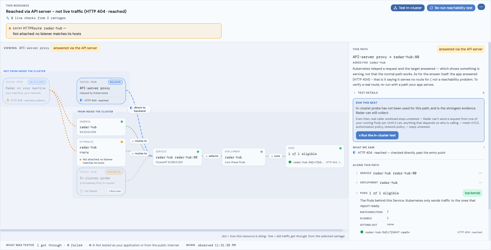
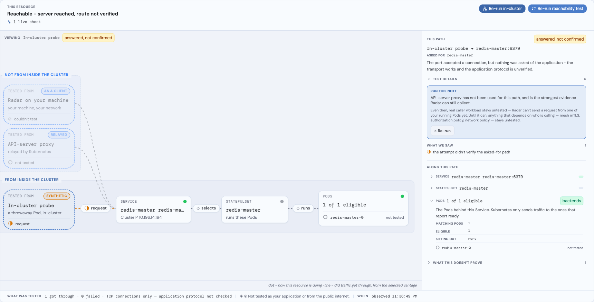
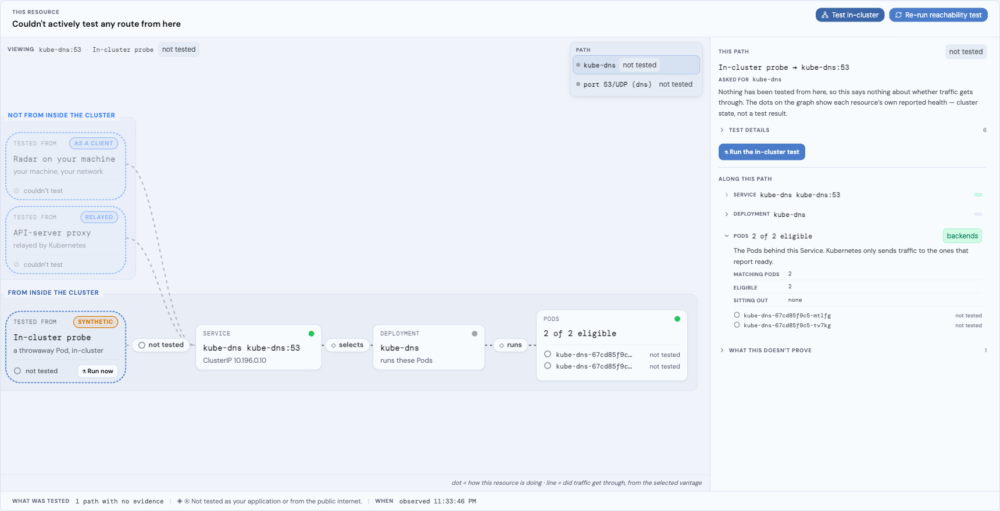
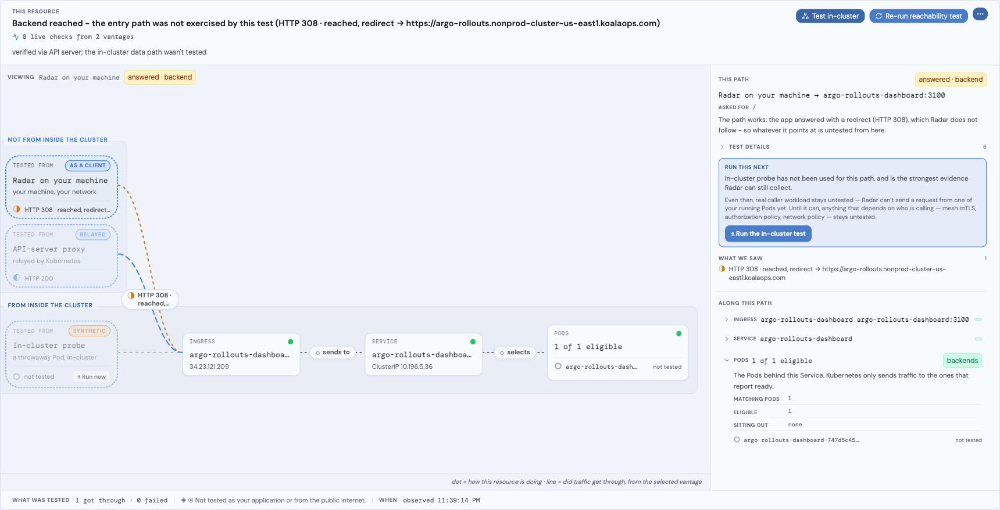

# Reachability - network path diagnosis

The **Reachability** tab in the resource detail view answers one question for a network entry kind:

> *If traffic is sent toward this resource, does it reach a healthy process - and if not, which hop is the first to break?*

Available in Radar **v1.9.1+** (the in-cluster probe test also requires the probe image from v1.9.1+).

Naming note: this is NOT the [AI Diagnose feature](https://radarhq.io/docs/features/diagnose) - Reachability is deterministic path tracing and live probing, no AI involved. The general-purpose MCP `diagnose` tool (whose primary job is workload root-cause bundles: logs, events, crash evidence) returns this reachability trace as its answer when pointed at a network entry kind - see [MCP](#mcp).

The trace has two layers:

1. **Static** - is the path wired correctly in config + current pod state? Pure functions over the in-memory informer cache, no per-call API requests. Always on.
2. **Active reachability test** (optional, one-shot) - send DNS / TCP / TLS / HTTP probes along the declared path and report what came back. HTTP-shaped ports get an HTTP request; explicitly non-HTTP ports stop at TCP rather than sending an unrelated protocol. The proxy probe runs automatically once when the **Diagnose** tab opens (re-runnable via **Run test**); only the in-cluster Job test stays a manual click.

The active layer can escalate the static verdict when probes give clear evidence of a real failure on a hop (every non-skipped probe failed → that hop counts toward broken; over half failed → counts toward degraded). It never softens a static verdict: a critical static finding outranks probe state, and an unverifiable path stays unverifiable.

Probes run from wherever Radar is running - your laptop or inside the cluster - and that vantage changes what they can prove. A vantage-attributable failure can localize the symptom, but the headline stays *unknown* when the real traffic path was not confirmed. Radar would rather say "couldn't confirm from here" than falsely condemn a healthy path.



*One Service, two declared front doors. Each entry is judged on its own - the HTTPRoute here is not attached to any listener - and the verdict names the vantage it speaks from: reached via the API-server relay, which is not the live-traffic path.*

## Mental model

```
   ┌─────────────────────────┐
   │       Upstreams         │   ← parallel hops INTO the subject
   │  Ingress · HTTPRoute    │     (each judged independently)
   └────────────┬────────────┘
                │
   ┌────────────▼────────────┐
   │         Subject          │   ← the resource you opened
   └────────────┬────────────┘
                │
   ┌────────────▼────────────┐
   │       Downstream         │   ← the chain FROM the subject
   │   Service → Pods         │     (the broken hop indexes here)
   └─────────────────────────┘
```

**Upstreams are parallel.** A Service that's reached by both `ingress-a` and `ingress-b` does not become broken when only one of them fails - the other still delivers traffic. The verdict only degrades to *broken* if every upstream is broken, *degraded* if some are.

**Downstream is a chain.** The first critical finding along Downstream is the broken hop, named `brokenAt`. Findings on later hops are still shown but the diagnosis starts at the first failure.

## Supported entry kinds

| Kind | Downstream chain | Upstreams |
|------|------------------|-----------|
| **Service** | Service → selected pods | every Ingress / HTTPRoute / GRPCRoute referencing this Service |
| **Ingress** | Ingress → backend Services → pods of the first backend | none (external entry) |
| **HTTPRoute / GRPCRoute** | Route → backend Services → pods of the first backend | every parent `Gateway` from `parentRefs` |
| **Gateway** | Gateway → attached routes (capped at 20) | none |

Other network surfaces in the topology (Traefik IngressRoute, Istio VirtualService, Knative) are deliberately out of scope today - they would each need their own resolution logic and aren't reached by the same `parentRefs` / `backendRefs` shape.

## What each hop carries

Every hop has:

- A **resource reference** (kind, namespace, name) and an **edge label** (e.g. `HTTPRoute->Service`) so the path reads top-to-bottom in the traffic direction.
- **Findings** - the detections that already exist in the issues pipeline, attached to the hop where the failure is observable. The Phase 0 additions to this pipeline:
  - **`gwroute:backend-port-mismatch`** - an HTTPRoute / GRPCRoute references a Service port that doesn't exist.
  - **Gateway-API route parent conditions** (`Accepted=False`, `ResolvedRefs=False`, `Programmed=False`) - read directly from `status.parents[]` so the controller's own verdict is the source of truth.
- **Meta** - pod counts (`selected` / `ready`), `endpointSource: pod-readiness`, `headless`, and `selectorless` flags so the UI can render the right shape without re-deriving them.

For each finding the trace populates a **kubectl reproducer command** - a one-liner the operator can paste to see the raw state behind the finding. Examples:

```bash
kubectl describe service api -n prod
kubectl get pods -n prod -l app=api
kubectl get httproute api-route -n prod -o jsonpath='{.status.parents}'
```

## Reachability test (active probes)

The proxy-vantage test runs automatically when the tab opens and is re-runnable via **Re-run reachability test**; the **Test in-cluster** button (consent-gated - the dialog names the exact requests the probe pods will send, e.g. "TCP connection to redis-master:6379") runs the probe Job. Each run fires one round of applicable probes. HTTP(S) routes use their declared path; non-HTTP Service ports have no HTTP path and stop at TCP:

| Hop | What runs |
|-----|-----------|
| Ingress / Gateway hostname | DNS → TCP → TLS (if HTTPS) → HTTP |
| Service | Direct TCP to ClusterIP:port in-cluster, followed by HTTP only for an HTTP-shaped port; from a laptop, HTTP via the K8s API server's `/services/{name}:{port}/proxy/` subresource when applicable |
| Pods | Direct TCP to PodIP:port in-cluster, followed by HTTP only for an HTTP-shaped port; from a laptop, HTTP via `/pods/{name}/proxy/` when applicable for up to 3 sampled ready pods; the remaining pods get a "sampled N of M" skip row |
| HTTPRoute / GRPCRoute | Skipped - routes have no own routable address; reachability is the upstream Gateway + downstream Service |

Each row reports outcome (`ok` / `fail` / `skipped`), latency, the path it traversed (`pod-to-pod path` or `via Kubernetes API`), and an HTTP status detail when available. The total budget is 3 seconds; per-hop runs in parallel within that envelope. Probes are an action, not a polling state; the button fires once, results land, the next static refetch replaces them.

**Vantage is a first-class concept in the UI.** A reachability result is meaningless without knowing where the request came from, so the tab is built around two explicit selections: WHICH path (the **PATH** picker on the graph - one row per declared route, with per-port protocol labels like `port 53/UDP (dns)` when a Service declares dual-protocol or non-HTTP ports) and FROM WHICH vantage (selectable capsules on the graph: *Radar on your machine* dialling as a client, the *API-server proxy* relay, and the *in-cluster probe*). Selecting a vantage genuinely re-routes the graph and re-scopes the verdict, the edges, and the inspector - a laptop's success is never painted onto the in-cluster lane. Vantages Radar cannot use (a real caller workload, a genuine external client) stay visible as stated gaps rather than being hidden, so synthetic evidence never looks complete.

Every claim on the page carries its evidence: the verdict band states the live-check volume ("8 live checks from 2 vantages", with the DNS/TCP/TLS/HTTP breakdown on hover), a skipped route states WHY it was skipped from the exact vantage that skipped it, and node dots show each resource's own health - cluster state, never a test result (edges carry the test truth).



*A non-HTTP Service (Redis on 6379) after an in-cluster test: the throwaway Pod connected over TCP, and the coverage line states the ceiling of that proof - "TCP connections only - application protocol not checked".*



*kube-dns declares TCP and UDP on the same number. Each is its own declared path: the TCP route is testable, and the UDP one stays a stated gap rather than being folded away.*



*A front-door subject. Radar dials the declared hostname from your machine (DNS, TCP, TLS, then HTTP) - here a 308 redirect - while the headline stays honest that a backend-only confirmation does not exercise the entry path.*

## Security model

Relayed and Job-based probes are bounded by Kubernetes RBAC, but they do not always use the same namespace:

| Probe path | Namespace | Required permission |
|---|---|---|
| API-server relay | Namespace of the Service or Pod being proxied | `get services/proxy` and/or `get pods/proxy` |
| In-cluster probe Job | Namespace of the resource being diagnosed | `create jobs`, `list pods`, and `get pods/log` |

With [authentication](authentication.md) enabled, Radar uses the signed-in user's identity. Without authentication, Kubernetes-authorized probes use Radar's own client identity: your kubeconfig identity locally, or Radar's ServiceAccount when it runs in-cluster. The API server enforces relay permissions at request time; Radar preflights all three Job permissions before creating anything. If impersonation is unavailable, the relay is skipped rather than falling back to Radar's ServiceAccount. A proxy denial can mark that route *unreachable via the API server*, but the headline stays *unknown* because the real path was not confirmed.

The UI asks before the first in-cluster run for a cluster and names the requests it will send (unless that consent was previously remembered). MCP has no dialog: callers must explicitly pass `in_cluster: true`, and the same RBAC preflight applies. Radar Cloud also requires org role Member or higher.

The active Kubernetes identity authorizes Job creation, but network and mesh policy see the probe pod, not that identity. The Job runs in the diagnosed resource's namespace; its pod uses that namespace's default ServiceAccount identity but mounts no ServiceAccount token. Each run creates at most five Jobs; their containers run non-root with a read-only filesystem, all capabilities dropped, a 25-second deadline, no retries, and a 60-second TTL backstop.

The default Helm chart grants neither proxy-subresource access nor Job creation, so those probe paths stay unavailable unless the relevant identity receives the permissions above. Radar running in-cluster can still dial directly from its own pod. The full `/mcp` endpoint also exposes RBAC-bounded write tools; `/mcp-readonly` excludes `apply_resource`, `patch_resource`, and the `manage_*` tools while retaining `diagnose`. On `/mcp-readonly`, the `in_cluster` argument is not exposed and schema validation rejects it.

### Agent boundary

`/mcp-readonly` gives agents typed tools with fixed schemas, not a kubeconfig or shell. With authentication enabled, Kubernetes operations are bounded by the signed-in user's RBAC: direct cluster operations run under impersonation, while cache-backed reads apply per-user authorization checks. Without authentication, operations use Radar's own Kubernetes identity. The typed tool surface independently limits which operations the agent can request.

## What it deliberately does NOT do

- **No EndpointSlice reads.** The endpoint signal is pod-readiness; the trace marks this with `endpointSource: pod-readiness` so the approximation is honest.
- **NetworkPolicy is predicted, never enforced by us.** Radar statically evaluates the *caller-independent* ingress rules of core NetworkPolicies that select the subject's pods. When no rule admits the path's port it surfaces a "a cluster network rule would block traffic to these pods" **WARNING prediction**; when a rule allows the port only from specific sources it surfaces a source-restricted **advisory** (Radar can't tell from its own vantage whether *your* caller is allowed); an egress-only policy becomes an outbound **note**. This is always a PREDICTION, not a verdict - the CNI is the only authority on enforcement (some plugins write the NetworkPolicy object but enforce nothing), so the live in-cluster probe confirms the would-block or downgrades it when real traffic got through. We do not model CNI-specific enforcement behavior.
- **No external-path probing** for Service type LoadBalancer / NodePort - the external path requires modelling cloud LB state honestly and is intentionally out of scope today. (ExternalName **is** probed: Radar DNS-resolves and HTTP-reaches the alias host from its own vantage, marked *indirect* - a reach from Radar's network is not proof of in-cluster reachability.)
- **No new CRDs.** Everything reads from the same informer cache the rest of Radar uses.

These are not gaps to fix soon - they are the line that keeps the feature trustworthy in clusters Radar cannot fully see.

## Limits - when an active probe can fail on healthy traffic

A probe reports what *Radar's vantage* observed. Real traffic can flow fine while a probe fails, for reasons that have nothing to do with the workload:

- **Service mesh mTLS (Istio / Linkerd / Consul).** A mesh with strict mTLS rejects any connection without a valid mesh client certificate. A probe from your laptop (or any caller outside the mesh) has no such cert, so the TLS/HTTP layer fails even though sidecar-to-sidecar traffic is healthy. Recognize it: the pods carry a mesh sidecar (`istio-proxy`, `linkerd-proxy`) or mesh labels (`istio.io/rev`, `linkerd.io/inject`). Trust real in-mesh traffic over an out-of-mesh probe.
- **NetworkPolicy.** A policy can allow real workload-to-workload traffic while blocking Radar's API-server-proxy identity (or the reverse). A failed probe next to healthy config is often this. The trace statically predicts a would-block from the caller-independent ingress rules, but the CNI is the only enforcement authority - so the prediction is confirmed or downgraded only by the live in-cluster probe.
- **DNS split-horizon.** A probe resolves hostnames from *your* vantage, not the cluster's. An internal name that resolves inside the cluster may not resolve (or may resolve differently) from your laptop; those probes skip with a reason rather than failing.
- **API-server relay limits.** The relay may be denied or unable to dial an internal-only address. That result describes the relay vantage, not the workload's real traffic path.

When config is healthy but a probe fails, suspect the vantage before the workload. Run the **in-cluster** test (or `diagnose(in_cluster: true)`) to probe from the real dataplane, where mesh certs and in-cluster DNS apply.

## Verdict semantics

The verdict is a **coverage claim over the intended routes** - what was actually tested, not what the config implies. It judges ONLY the intended traffic route: an API-server-proxy probe can *localize* a failure but never *sets* the headline - only a real-traffic (data-path) result does. Each tested route carries an **outcome** and a **confidence**:

| Outcome | Meaning |
|---------|---------|
| **verified** | real HTTP 2xx - the route works |
| **reached** | reached (3xx/4xx, or transport-only TCP/TLS) - the server answered, but the route itself isn't confirmed |
| **server-error** | reached, but the backend returned 5xx |
| **unreachable** | transport failure - nothing answered |
| **not-tested** | no probe could run for this route (it was skipped) |

| Confidence | Meaning |
|------------|---------|
| **real** | tested the way real traffic flows (direct dial / in-cluster data path) - can set the verdict |
| **indirect** | reached only via the API-server proxy - annotates a route, **never** a confident green |

The route outcomes roll up to the verdict:

| Verdict | When |
|---------|------|
| **healthy** | every tested intended route was reachable over **real** traffic |
| **degraded** | reached-but-erroring (5xx), or some routes failed, or an intentional scale-to-0 (benign - reads amber, never red) |
| **broken** | a genuine `unreachable` on the intended route |
| **unknown** | nothing could be actively tested, OR the route was reachable **only** via the API-server proxy (the real path was never confirmed) - never a confident green. Also when the subject isn't in the cache, RBAC denies the namespace, the relevant API isn't installed, or the cache hasn't synced. |

A real-traffic `reached` non-2xx (e.g. a 404) reads as healthy **coverage** with a qualified headline - *"server reached, route not verified"*: the network path is reachable, but the route itself isn't confirmed.

`verdict` is therefore a **coarse rollup**, not a promise of a verified 2xx. `healthy` means "no failing route was found" - it can include routes that were only *reached* (a 3xx/4xx, or a transport-only TCP/TLS connection) rather than verified, and can reflect a static-config-only assessment (`probe=false`) or partial coverage. Agents (and the MCP `diagnose` tool's `verdict` field) that need certainty must read each route's `outcome` (verified vs reached vs not-tested) and `confidence` (real vs indirect) plus the `headline` / `diagnosis` text before keying an action on `verdict` alone.

The UI shows the verdict at the top of the panel with a one-sentence reason. Treat *unknown* as a pause-and-investigate signal - it means the trace can't honestly answer the question, not that everything is fine.

## MCP

The general-purpose `diagnose` MCP tool - primarily a workload root-cause tool (logs, Warning events, crash evidence in one call) - returns the reachability trace for network entry kinds instead of the pod-log fan-out it does for workloads. An agent that calls `diagnose(kind=service, ...)` gets the path-shaped answer in one call, along with `relatedIssues` for raw-issue follow-up. Pass `probe: true` to add the active reachability test from Radar's vantage. Pass `in_cluster: true` to run the probe from inside the cluster - Radar creates up to 5 short-lived, self-destructing probe pods (one per intended route) under the active Kubernetes identity's RBAC to test the real dataplane the API-server-proxy vantage can't reach (e.g. to confirm a route that came back `indirect`). This is the only mutating `diagnose` option; it needs `create jobs`, `list pods`, and `get pods/log`, and falls back to a copyable command when any permission is missing.

## In-cluster probe image

The in-cluster test runs a short-lived Job whose container executes `radar probe`. Radar resolves which image that Job uses, most-trusted first:

1. **Explicit override** - `--reachability-image` flag / `reachabilityImage` config. Always wins.
2. **Self-read** - radar's OWN running pod image, read from `MY_POD_NAME` / `MY_POD_NAMESPACE` (downward API) using radar's service account. The honest default: the probe runs the *same* image as radar, so it's automatically correct for private registries, mirrors, and digest-pinned deploys.
3. **`RADAR_IMAGE` env** - the Helm chart sets this to radar's deployed image; a no-RBAC fallback for when self-read can't run.
4. **Version-matched published image** - `ghcr.io/skyhook-io/radar:<version>`, where `<version>` is radar's own build version.

The image must ship the radar binary at `/radar` (the Job runs `["/radar","probe",...]`) - every official radar image does.

By deploy shape:
- **Standalone (Helm chart):** self-read or the chart's `RADAR_IMAGE` resolves radar's deployed image. Nothing to configure.
- **Cloud agent (`--cloud-url`):** radar runs in-cluster as its own image; self-read resolves it. Nothing to configure.
- **Embedded in another app:** embedding only the *frontend* library (e.g. Radar Hub) is unaffected - the backend is still a real radar image. If radar's *backend* is wrapped inside a non-radar image, self-read returns that host image, which only works if it ships `/radar` with the `probe` subcommand; otherwise set `--reachability-image` / `RADAR_IMAGE` to a published radar image. If neither is valid the probe pod fails honestly (a clear "couldn't start" status + a copyable command), never a wrong result.

**Local development:** a `-dirty` local build's version isn't a published tag, so the default (#4) won't exist. Build a probe image from your code and load it into kind:

```
make kind-load-probe                       # builds radar-probe:dev and kind-loads it
radar --reachability-image radar-probe:dev ...
```

## Performance

**Static trace:**

- No per-call API requests; pure functions over the in-memory informer cache
- Linear in path length + selector match counts, which are bounded by the cache contents
- Target <100ms typical, <300ms on a 200-pod namespace
- Five-second polling from the UI while the Reachability tab is open; data is cached client-side so retabbing within the drawer is instant

**Active reachability test:**

- Budgeted at 3 seconds total; per-hop probes run in parallel within that envelope
- Each layer respects a strict per-call timeout (DNS 250ms, TCP 700ms, TLS 1s, HTTP 1s) so a single dead hop can't starve the rest
- Triggered by an explicit operator click; no polling, no sticky on-state
