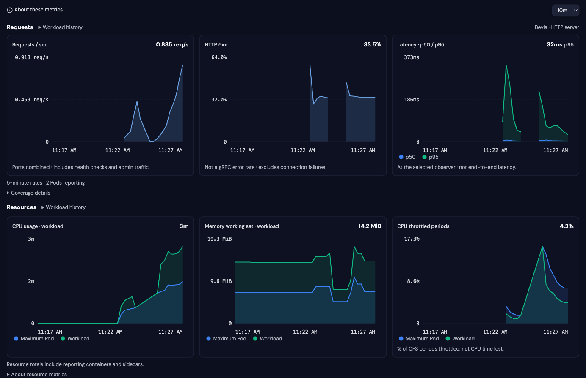
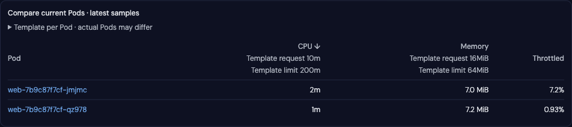
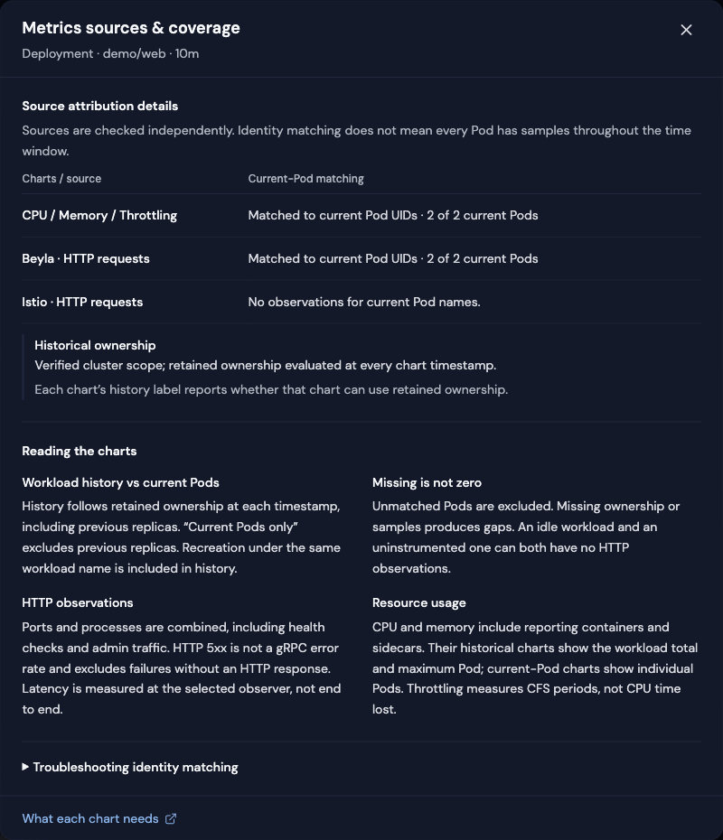

# Workload metrics

See whether a workload is handling traffic, failing requests, slowing down or
running short of resources, without building a dashboard from scratch. Radar's
Metrics tab combines HTTP request rate, errors and latency with CPU, memory and
CPU throttling for Deployments, StatefulSets and DaemonSets.

Radar reads your existing Prometheus-compatible backend. It does not install a
collector, require Prometheus Operator, or replace a general-purpose dashboarding
tool. Resource charts work without HTTP instrumentation; request charts appear
when a supported Beyla or Istio source has usable observations.

<p align="center">
  
  <br /><em>Demo workload with deliberate HTTP errors. Resource charts compare the workload with the highest single-Pod value at each point; each chart identifies its population.</em>
</p>

## Open and use the charts

1. Open a Deployment, StatefulSet or DaemonSet and select **Metrics**. In
   **Applications**, select one of those workloads, then open its Metrics tab.
   These are the selected workload's charts, not a sum across the whole app.
2. Choose a time window. The selection stays in the URL through reloads, tab
   changes and returning from a Pod drilldown. Missing or invalid values use one hour.
3. If both HTTP observers are available, choose **Istio** or **Beyla** beside
   Requests. Istio is the default when both have data. Radar never adds their
   observations together; the choice does not force other workloads to use it.
4. Read the population label beside each section. **Workload history** includes
   retained previous Pods. **Current Pods only** excludes previous replicas.
   Gaps and unavailable data are not measured zeros.
5. Scroll to **Compare current Pods · latest samples** to find an outlier, sort by
   CPU, memory or throttling, and open a Pod for investigation.

<p align="center">
  
  <br /><em>Compare the latest samples for current Pods. Template per Pod is a configuration reference, not the measured or historical capacity of every replica.</em>
</p>

## What needs to be installed?

| What you already have | What it can provide |
|---|---|
| Metrics Server only | Existing basic live CPU/memory views, not the historical Prometheus charts described here |
| Prometheus-compatible backend scraping kubelet/cAdvisor | CPU, memory and throttling when the required counters and identity labels are retained |
| kube-state-metrics (KSM), or supported ownership recording rules, in that backend | Workload history across rollouts and deleted Pods, when cluster scope can be established |
| Beyla HTTP server metrics in that backend | Request rate, HTTP 5xx and p50/p95 latency with the required Pod labels and classic histogram buckets |
| Istio destination-sidecar metrics in that backend | The same HTTP charts, with the required scrape labels and verified cluster scope |

These are data prerequisites, not guarantees from an installed chart's name.
Prometheus, Mimir, VictoriaMetrics and Thanos can expose a compatible query API;
collector configuration, labels, retention and histogram format determine which
panels work. See [what each chart needs](#what-each-chart-needs) for exact series
and [live-tested coverage](#live-tested-coverage) for tested configurations.

Radar discovers common in-cluster query Services and checks workload identity
automatically. Hosted URLs, authentication and tenant headers still require
configuration. **Configure metrics** opens Metrics settings in standalone Radar;
embedded views direct users to their operator. **Discover Prometheus** retries
discovery. Connecting a backend does not install missing instrumentation.

If you switch between clusters locally, first read
[local multi-cluster settings](#local-multi-cluster-settings): a manually configured
backend and its headers are not saved separately for each cluster.

## What the observations mean

| Panel | Interpretation | Limits |
|---|---|---|
| Requests/sec | Rolling counter rate, summed within one observer | Not a request count or an end-to-end user transaction rate |
| HTTP 5xx | Percentage of that observer's requests with HTTP 5xx responses | Not gRPC/application success; status 0 (no HTTP response) is not counted as 5xx; idle traffic has no defined percentage; incomplete status labels withhold affected samples |
| p50 / p95 | Quantiles of aggregated histogram buckets, in seconds | Approximations; missing/partial bucket coverage or mismatched bucket populations withhold affected samples |
| CPU throttled periods | Workload-wide throttled periods / total periods, plus maximum Pod percentage | Weighted by periods, not an average of Pod percentages; not CPU time lost; missing counters are unavailable |
| Compare current Pods | CPU, memory working set and throttling, sortable descending | Missing/stale/gap samples show a dash, not zero |

## Understand coverage and missing charts

Important scope and data-quality notices stay beside the affected charts.
**About these metrics** opens the **Metrics sources & coverage** dialog for the
selected workload and time window. It explains current-Pod matching for each
source, historical ownership, chart definitions and optional troubleshooting.

<p align="center">
  
  <br /><em>Matching evidence is separate from historical coverage. An absent optional observer does not invalidate another source's charts.</em>
</p>

| What you see | What it means / where to look |
|---|---|
| No usable HTTP metrics in this window | The workload may be idle, uninstrumented or unmatched. Expand the source explanation; CPU and memory can still be useful. |
| Current Pods only | Radar has usable current-Pod observations but cannot serve workload history for that family. Previous replicas are excluded. |
| Gaps, partial coverage or stale samples | Some observations are missing, incomplete or old. Read the notice beside that chart; do not interpret a gap as zero. |
| Basic CPU / memory · identity unverified | A collapsed, older name-matched fallback. It does not prove Pod or cluster identity and is not a verified workload total. |
| Prometheus not connected | Retry discovery or check the configured URL, network access, authentication and tenant. A reachable backend can still lack the required series. |

Network/storage remain separately visible and name-based. Template settings
beside current-Pod comparison can differ from actual Pods after injection or
rollout; omitted values do not mean zero requests or unlimited capacity.

## Local multi-cluster settings

**Manual Prometheus settings are Radar-wide today, not per-cluster profiles.**
The configured URL, HTTP headers (including credentials and tenant headers) and
environment-variable header mappings persist in the local config. Switching
Kubernetes context keeps the manually selected backend and headers.

With no manual URL or headers, Radar rediscovers a backend in the selected cluster.
With a manual backend, select the appropriate URL and headers in Metrics settings
when changing clusters. When changing endpoints, explicitly replace or clear
saved headers; a URL-only change to a different server is rejected while headers
are configured. Same-server URL edits retain headers. Headers require an explicit
URL and are never sent to auto-discovered candidates or across HTTP redirects to
another origin. When the URL or headers come from startup flags, or headers use
configuration-file environment references, update that startup configuration and
restart before switching servers; clearing headers in Settings does not remove those sources.

The new workload charts invalidate identity evidence on connection changes and
recheck it. Optional scope assertions are discarded on context, endpoint or
credential changes, including automatic failover to a different metrics service,
service port or backend path. Reconnecting to the same discovered service through
a new local port-forward preserves the assertion. Those safeguards do **not** implement per-cluster connection
profiles or retrofit identity checks onto older name-based charts.

See [integration settings when switching clusters](configuration.md#integration-settings-when-switching-clusters).
In-cluster Radar has no context switcher; provision its backend and credentials for
that installation. This guide does not certify every Radar Cloud transport or
managed-service authentication path.

## Which workloads benefit?

The resource panels apply to service processes and background workers alike.
HTTP request panels are conditional on observed metrics, not declared container
ports, Services, or Ingresses. Radar does not scan application ports to generate RED
(request rate, errors, duration) data.

| Workload | Current behavior |
|---|---|
| HTTP server with no `containerPort` declarations | Can show RED if the supported collector actually observes and exports its HTTP traffic. Missing declarations do not gate these panels. |
| No inbound HTTP traffic or usable request series | No large empty RED grid: a compact status message or disclosure remains, followed by any available resource panels. Missing series are not a measured zero. |
| Several HTTP ports/processes in the selected Pods | Matching server observations within the selected source are aggregated across them. There is no port/Service/route selector. Error percentage uses the combined numerator and denominator; latency uses combined histogram buckets, not an average of per-port percentiles. |
| Mixed HTTP and other protocols | Only the supported HTTP observations enter these panels. Their rate is not total activity across protocols. |
| Queue-pulling worker | CPU, memory, throttling, restarts and existing resource views remain useful. Queue depth, consumer lag, work completion, retries and processing duration are not implemented by these HTTP panels. |
| Worker with only an HTTP health/admin endpoint | Its HTTP traffic can appear. That is health/admin traffic, not evidence of queue-processing throughput or success. |

Radar does not universally exclude health checks, metrics scrapes or admin routes.
If the exporter includes them, the workload aggregate can include them. Multiple
ports do not themselves mean duplicate scrapes, but multiple observation jobs or
known HA populations can trigger the ambiguity guard. Incompatible histogram
populations can withhold latency while request rate remains useful. A future
port/route breakdown requires labels the source actually retains; Kubernetes port
declarations cannot recover dimensions already aggregated away by the exporter.

## What each chart needs

All new panels require a reachable Prometheus-compatible query API, workload-read
and namespace Pod-list access. Historical charts need verified/asserted cluster
scope and retained ownership. The labeled current-only fallback needs verified
source identity or an operator assertion. KSM means **kube-state-metrics**;
it exports Kubernetes object state, not application request telemetry.

| Chart/data | Required metric data | Identity / interpretation |
|---|---|---|
| Historical membership | `kube_pod_owner`, plus `kube_replicaset_owner` for Deployments; or `namespace_workload_pod:kube_pod_owner:relabel` | Exact cluster, namespace, kind and name; ownership evaluated at each timestamp, including deleted Pods. |
| CPU usage | `container_cpu_usage_seconds_total` | cAdvisor namespace/Pod/container labels and scoped ownership; total and maximum Pod, in cores. Current-only fallback uses UID in `id`, or verified partition / override. |
| Memory working set | `container_memory_working_set_bytes` | Same identity contract; total and maximum Pod, in bytes. |
| CPU throttled periods | `container_cpu_cfs_throttled_periods_total` and `container_cpu_cfs_periods_total` | Both counters must describe the same population. Missing CFS metrics mean unavailable, not zero throttling. |
| Beyla HTTP requests/sec | `http_server_request_duration_seconds_count` | `k8s_namespace_name`, `k8s_pod_name`, attributable identity and a resolved job. Direct UID path uses `k8s_pod_uid`. |
| Beyla HTTP 5xx | The same count, split by `http_response_status_code` | Needs usable status coverage. Idle traffic does not have a defined error percentage. |
| Beyla p50/p95 | `http_server_request_duration_seconds_bucket` with `le`, including `+Inf`, plus the count above | Classic histogram buckets must cover the request population; seconds. |
| Istio HTTP requests / 5xx | `istio_requests_total`, including `response_code` for errors | `reporter="destination"`, `request_protocol="http"`, destination workload namespace and scrape `namespace`/`pod`; verified partition or override. |
| Istio p50/p95 | `istio_request_duration_milliseconds_bucket` with `le`, `_count`, plus the request counter | Full label populations must match; `_count` and `+Inf` must agree per population. Counter values may lead histogram updates. Radar converts milliseconds to seconds. |
| Reporting Pods | Matching request rate series | Distinct observed Pods, not the number selected from Kubernetes; idle/new Pods can explain a shortfall. |
| Pod comparison | CPU/memory/throttling metrics above | Separate bounded queries for current Pods, using UID attribution or verified partition / override. Not used to reconstruct history. |
| Request/limit overlays | Current Kubernetes container resource settings | Only on current-only per-Pod charts, not historical aggregates. Unlimited containers suppress the whole-Pod limit line. |
| Existing restart lane | `kube_pod_container_status_restarts_total` | KSM; existing name-based scope, not the new UID attribution path. |
| Existing network / filesystem I/O | `container_network_receive_bytes_total`, `container_network_transmit_bytes_total`; `container_fs_reads_bytes_total` and `container_fs_writes_bytes_total` | Existing namespace + exact selected Pod-name matching. These are traffic/I/O rates, not PVC capacity or application requests. |

Metrics Server alone does not provide this historical Prometheus data. A
Prometheus installation scraping kubelet/cAdvisor can support resource panels
without Beyla or Istio. KSM can supply inventory for fallback attribution, but does
not create missing cAdvisor counters or HTTP histograms. Retention, scrape gaps,
collector filters and relabeling still determine which panels are available.

## What Radar discovers automatically

There are three separate steps; success at one does not imply success at the next:

1. **Find a query endpoint.** At cluster startup/reconnect, probe known Service
   locations and ranked dynamic candidates. These include common Prometheus and
   VictoriaMetrics installations; dynamic discovery recognizes query services
   such as Thanos Query. Radar tries direct connectivity and, from a laptop,
   Kubernetes port-forwarding when needed and permitted. A manual URL overrides
   discovery. Hosted endpoints, tenants and credentials are not guessed. Configured
   HTTP headers require an explicit URL so credentials do not reach discovered
   candidates. One selected backend supplies these panels; Radar does not combine
   data across every Prometheus it finds.
2. **Establish scope and membership.** On opening Metrics, independently probe KSM
   name/UID anchors for cluster scope, even when sources already match by UID.
   Compare raw/recorded ownership coverage over the range. Current attribution
   runs separately for comparison/fallback. Historical Beyla queries accept custom
   jobs, checking observation populations throughout the range; automatic matching
   does not require a job name containing `beyla`.
3. **Query usable observations.** Fetch the time window and check counter, status,
   histogram and observation-population coverage. Reachability and identity are
   not guarantees that a requested chart has usable data.

Radar does not install Prometheus, enable kubelet scraping, configure
ServiceMonitors/PodMonitors, deploy Beyla/sidecars, repair missing resource labels,
or infer worker semantics from HTTP health endpoints.

## Automatic attribution

Radar checks each source independently when the workload Metrics tab opens. No
scope flag is needed when the evidence is sufficient:

- Beyla: match application `k8s_pod_name` and `k8s_pod_uid` to current Kubernetes Pods.
- cAdvisor: match Pod name and an exact Pod UID segment in the `id` cgroup path
  (cgroupfs or systemd). CPU, memory and throttling are checked independently.
- Otherwise, use `kube_pod_info` name/UID pairs to establish a unique one- or
  two-label cluster partition, then require those same labels on the source.
  Recognized labels are `cluster`, `cluster_name`, `k8s_cluster_name`,
  `kubernetes_cluster`, and `cluster_id`. Istio uses this path, not a guessed UID.

Unlabeled KSM inventory alone does not prove a single-cluster backend. Missing
identity, conflicting populations, partial query responses and ambiguous scrape
jobs leave only the affected source unavailable. Matching does not install
anything or require new Kubernetes permissions. Known HA labels (`replica`,
`prometheus_replica`, `__replica__`) with multiple values are rejected; backends
using other replica labels must deduplicate upstream. No arbitrary label stripping
is attempted.

Current-Pod evidence probes run asynchronously with an eight-second deadline after shared
Prometheus discovery finishes (discovery has its own 60-second bound), two active workloads
at most, a bounded 128-entry memo and a 30-second per-workload churn guard.
Evidence is bounded to 1,024 identities per metric family, 256 KSM rows and a
4 MiB response. Positive results expire after five minutes and refresh ahead of
expiry; negative results retry after 30 seconds. A purely negative explanation
remains visible while the same identity/connection is rechecked; expired positive
trust is never extended. During Pod churn, unexpired
evidence is retained only for unchanged name/UID pairs while replacement Pods
are checked. Its original expiry is not extended. Connection changes invalidate
all attribution and their old churn timers. Sources covering a subset report partial coverage.

Historical partition proof has a separate connection-wide five-minute positive
cache and one coalesced probe per connection generation. Proof from an authorized
namespace can be reused; charts still query only their own authorized namespace.
At zero Pods, bounded anchors can come from other Pods in that same namespace.
A cold connection with no anchors and no assertion cannot establish scope.
UID joins inside a store cannot prove which cluster Radar is connected to.
The UI points to operator configuration in **About these metrics** when this prevents history.

Current UID-filtered charts exclude previous incarnations of same-name Pods.
Historical charts describe the logical cluster/namespace/kind/name workload,
including recreation under that name, not workload-UID lifetimes. Network/storage
and other existing surfaces keep their previous query behavior. Template overlays
are current per-Pod settings, not historical capacity.

## Optional operator override

If automatic matching cannot establish identity, an operator can explicitly
assert the backend's scope. These assertions take precedence over probing.

For a backend dedicated to the connected Kubernetes cluster:

```sh
radar --prometheus-url http://localhost:9090 --prometheus-single-cluster
```

For a shared store with an exact cluster label on its metrics:

```sh
radar --prometheus-url https://metrics.example.com --prometheus-cluster-label cluster=production
```

Repeat `--prometheus-cluster-label` for additional exact label constraints. The
matchers are combined with AND, not OR. An empty value is rejected because it
would also match series without that label. A tenant header alone does not prove
single-cluster isolation. Use existing `--prometheus-header-from-env` for credentials.

These assertions are process-local, apply to the startup Kubernetes connection,
and are not saved to the config file. Changing context, endpoint or headers discards
the assertion and returns to automatic matching. Restart to supply a fresh assertion. Existing resource
charts retain their existing query behavior; this is not a retrofit of cluster
isolation onto every metrics API.

Helm installations can provision the assertion with
`traffic.prometheusSingleCluster: true` or `traffic.prometheusClusterLabels`,
and optionally `traffic.beylaJobSelector`. Defaults do not assert trust. Use a
chart and Radar image version containing this feature together; adding these
arguments to an older image is not supported. In-cluster OSS and Radar Cloud
viewers should ask their installation's operator to update Helm/GitOps settings,
not try to configure a private scope for their own charts.

Desktop supports automatic matching, but its separate flag parser and Settings
do not expose these overrides. If an explicit assertion is required, use the
standalone CLI. These flags have no `config.json` keys or environment-variable
equivalents. See [configuration by run mode](configuration.md#workload-metrics-overrides-by-run-mode).

Normal startup reinitialization and unchanged settings saves preserve the assertion.
Changing the Kubernetes endpoint/auth configuration under the same context name
discards it too. New resource queries require cAdvisor container identity labels;
they do not use the older charts' container-label-free fallback.
Reconstructing a kubeconfig `proxy-url` callback on laptop reconnect also discards
the assertion conservatively. The UI reports this loss; restart to reassert it.
Explicit assertions are labeled in the UI and do not bypass the request charts'
per-evaluation checks for multiple known replica/job populations.

## Historical scope and query limits

Historical queries join metrics with retained ownership at each timestamp. They
do not enumerate today's Pod names; query size does not grow with replica count.
CPU/memory/throttling return workload total (weighted ratio for throttling) and
maximum Pod, not stacked. Reporting counts have no denominator of today's replicas
or all owned Pods: neither proves instrumentation completeness. The separate
current comparison/fallback remains capped at 100 Pods; it never samples a claimed
historical total. Charts have about 360 evaluations, three concurrent chart queries
and a 25-second request deadline. Timestamps align to the evaluation step. Raw
HTTP route, method and peer labels are not returned.

Workload range queries and attribution probes use POST form bodies and a 16,000-byte decoded query
limit. Current-only name/UID queries can reach it before 100 Pods, especially
Istio's repeated histogram checks. Historical joins avoid replica-dependent growth
but retain backend evaluation cost and deadline/response/query bounds. A failed
historical query is an error, not permission to silently change scope. Independent
current-Pod comparison and explicitly current-only HTTP observations remain usable
when the ownership lookup fails. While current attribution is pending, comparison
shows a matching-in-progress state and refreshes every three seconds.

When identity-checked CPU/memory charts cannot be served, the existing basic charts
remain in a collapsed **Basic CPU / memory · identity unverified** section
(the label lists only the affected charts). They do not establish Pod UID,
historical workload membership, or cluster identity; matching names in a shared
backend may include another cluster. They never substitute for a verified workload
total. Network/storage retain this same older name-matched contract independently.
HTTP error and coverage ratios are calculated from matching timestamps in the
returned counters; histogram quantiles remain calculated by the metrics backend.
Warnings or `isPartial: true` withhold the response; informational annotations
alone do not. Unknown HA label conventions still require upstream deduplication.

### Why the population and query bounds exist

Current Pods are enumerated for identity anchors, comparison and explicit fallback,
not historical aggregation. Their 100-Pod cap bounds evidence and rows; it is not a
Prometheus limit. Historical aggregation covers the full matched population in
the backend. Latency combines buckets before deriving quantiles; averaging Pod
p95s would be incorrect. Unknown HA labels require upstream deduplication, and
large-backend performance is not proven by the small lab.

### Historical Pods and existing resource queries

Raw KSM and standard recording rules share one ownership contract. Radar selects
the strategy reaching the earliest observation in the requested range, then the
one covering more timestamps; raw wins equal coverage. One strategy is used per
response, not a union or current-Pod fill. This handles newly installed rules and
unequal retention but cannot recover unretained data. Rightsizing reuses the same
ownership builder without changing its scope contract.

Istio history needs ownership too: native names do not distinguish Kubernetes kind,
and today's lack of a collision cannot prove past uniqueness. Historical queries
also select native destination workload name/namespace. Missing ownership names
the KSM prerequisite; waypoint mapping remains unsupported.

When ownership stops reporting after deletion, that Pod leaves the aggregate even
if its final rate window still has samples. Earlier retained points remain
queryable after rollout/zero if historical cluster scope can be established.
Where history has no usable samples but current identity does, the affected family
can show **current Pods only**, visibly labeled, never spliced into historical gaps.
Current means still present and owned, not only Ready.

The existing network, filesystem and restart queries use exact current Pod names
and namespace, not fuzzy workload-name prefixes. They still lack the new UID and
verified cluster-partition matching: a same-name Pod in a shared store or a prior
incarnation can affect historical values. They are separate context, not proof of
the new panels' population. Network/storage stay in the lower, explicitly labeled
section for this release. Extending identity checks requires probing each metric
family; CPU's usable `id`/container labels cannot be assumed on Pod-network or
filesystem series.

### Unsupported sources and formats, in plain language

- **Ingress metrics:** observations made by a reverse proxy before requests reach
  application Pods. They can be useful without Beyla/mesh, but describe routed
  traffic and proxy failures, not every request or task handled by the workload.
  No ingress-controller metric adapter is included here.
- **Native-only histograms:** another Prometheus representation of latency data,
  stored in histogram samples instead of separate `_bucket{le=...}` series. The
  current latency queries use classic buckets. A backend can support PromQL yet
  lack the classic series these charts need. Separate counters, where present,
  can still support rate/errors; a native-only Beyla histogram may also lack the
  `_count` series the current request adapter expects. Native support must cover
  discovery, count extraction, quantiles and population checks together.
- **Istio waypoints:** shared proxies used in ambient mesh. The scraped proxy Pod
  is not the application Pod whose traffic it observes. The current destination
  sidecar mapping cannot be reused by simply accepting another reporter value.

See the upstream [Prometheus histogram query documentation](https://prometheus.io/docs/prometheus/latest/querying/functions/#histogram_quantile),
[Istio metrics reference](https://istio.io/latest/docs/reference/config/metrics/),
and [Beyla attribute configuration](https://grafana.com/docs/beyla/latest/configure/metrics-traces-attributes/).
These explain upstream capabilities; Radar's narrower supported mappings are
listed above and verified in [live-tested coverage](#live-tested-coverage).

## Request sources

- **Istio destination sidecars:** `istio_requests_total` and
  `istio_request_duration_milliseconds_bucket`, `reporter="destination"`,
  `request_protocol="http"`. Requires scrape `namespace` and `pod` labels identifying
  the destination Pod, as well as `destination_workload_namespace`. This avoids
  attributing metrics solely from a workload name, which has no kind or UID.
  Waypoint reporters cannot use this mapping and are not currently included.
- **Beyla HTTP server:** `http_server_request_duration_seconds_count` and `_bucket`,
  with `k8s_namespace_name` and `k8s_pod_name`. Automatic attribution discovers an
  exact job from matching identities, including custom job names. With an explicit
  scope override, the current-Pod path uses its Beyla/Alloy job discriminator;
  `--beyla-job-selector` accepts one exact or regex `job` matcher.
  For workload metrics that override is paired with a verified scope assertion;
  historical queries otherwise consider matching HTTP-server jobs across the
  range and withhold ambiguous observation populations instead of picking a job
  from today's Pods.
  For example, `--beyla-job-selector 'job="primary-beyla"'` selects one observer
  when paired with an appropriate scope flag. The pre-existing Live Traffic
  integration also accepts wider matcher fragments; those are not supported by
  the workload adapter. The flag alone does not filter automatic workload
  attribution. Do not assert an unverified cluster scope just to select a job.
  Application-only Beyla works without network metrics: verified with
  direct exposition in kind and EKS nonprod (Beyla 3.32.0). Default OTLP-to-Alloy
  conversion was also tested and lacks Pod attributes on the request series;
  that pipeline is not supported by this adapter.

When both sources have data, Istio is the default. The selector changes observers;
their rates are never added together. One source failing does not turn the other's
successful data into an error or fabricate a zero. Sources with only historical
rate evaluations are marked stale. This is evaluation freshness, not a guarantee
about the scrape timestamp of every underlying counter.

## Workload metrics HTTP API

`GET /api/prometheus/workload/{kind}/{namespace}/{name}?range=1h&source=beyla`
returns the curated workload dashboard. It does not accept arbitrary PromQL,
backend URLs, credentials or cluster-scope overrides from chart requests.

| Input | Contract |
|---|---|
| `kind` | Deployment, StatefulSet or DaemonSet; other workload kinds return 400. |
| `namespace`, `name` | The workload identity. In auth-enabled mode, the caller must be allowed to get that workload kind and list Pods in its namespace. |
| `range` | `10m`, `30m`, `1h`, `3h`, `6h`, `12h`, `24h`, `48h`, `7d`, `14d`. Omitted or unrecognized values use `1h`. |
| `source` | `beyla` or `istio`; omitted/empty selects automatically, preferring usable Istio rates. An explicit valid source is honored even if unavailable; any other value returns 400. |

The response describes both data and coverage:

| Field | Meaning |
|---|---|
| `state`, `reason` | Overall collection status. A 200 response or `available` here does **not** guarantee every chart has usable data. |
| `panels` | Chart results: `requests` (requests/s), `errors` (HTTP 5xx percent), `p50`/`p95` (seconds), `cpu` (cores), `memory` (bytes), `throttling` (percent), and `observedPods` (coverage helper, Pods). Keys can be absent when a prerequisite is unavailable. |
| `panels[key].state`, `.reason`, `.unit`, `.series` | Inspect each panel independently. Missing/nonfinite point values serialize as `null`, not zero. Series expose only chart-level labels such as Pod or aggregation, not raw metric labels. |
| `comparison` | Current-Pod CPU/memory/throttling panels, independent of historical-chart availability. |
| `history` | Per-family membership (`cpu`, `memory`, `throttling`, `requests`): `workload-history`, `current-pods`, or `unavailable`, with an optional reason. This describes whose samples can be included, not whether a panel has data. |
| `pods`, `podsTotal` | Selected current Pods and total current Pods respectively; not historical replica counts. Current-Pod selection is bounded to 100. |
| `start`, `end`, `stepSeconds`, `rateWindowSeconds` | Unix-second window bounds, evaluation spacing and rolling rate window. Radar selects the step, bounds evaluations and aligns the end to the step. Use these values rather than assuming the requested range's default step. |
| `source`, `sources` | Selected HTTP observer and candidate source status. Source status reflects rate collection before later histogram/status/population checks; inspect individual panels for final validity. |
| `attribution` | Human-readable source evidence, with reserved `scope` and `history` entries for operator assertion and historical ownership. |
| `scopeNotice` | Human-readable notice when a previous explicit assertion was cleared. It does not mean automatic matching has failed. |

Panel states are `available`, `partial`, `stale`, `unavailable`, `error`, and
`detecting`. `partial` can mean missing coverage; `stale` means only older usable
evaluations remain. `unavailable` is not measured zero, and `error` is not absence
of instrumentation. `detecting` means identity matching is in progress.
Top-level state summarizes collection and does not aggregate all panel states.

An early identity-detection response can have empty panel/history/comparison
maps and sources, with numeric fields serialized as zero. Read `state` first:
those zeros are not a measured zero-Pod result or an epoch-zero query window.
`reason`, `scopeNotice`, source labels and attribution text are display copy,
not stable machine-readable reason codes.

HTTP errors use `{"error":"..."}`. A 403 can mean either the caller lacks the
required workload/Pod permissions, or Radar's own cache cannot cover the Pod
and controller data in that namespace. The latter needs an operator to check
Radar's Kubernetes permissions and configured namespace scope, not necessarily
change the viewer's permissions. A 503 means the connection/client/cache is not ready; a
502 can indicate workload-Pod resolution failed. A 409 means the metrics
connection changed during collection: retry against the new connection.
Upstream query failures are generally reported in panel or collection state,
not as HTTP errors; backend authentication failures are distinct from Radar's
Kubernetes authorization gate.

## Live-tested coverage

Validation on 2026-09-13–14 exercised the following combinations. A successful
query endpoint does not imply that every chart has the necessary metrics.
These checks cover specific versions and collection configurations, not every
installation of a backend or a measured percentage of Kubernetes users.

The fleet matrix originally validated current-Pod attribution. Historical
ownership was additionally validated in the repeatable kind lab: Beyla and Istio
retained identical CPU, memory, throttling, request, error and latency values at
fixed timestamps after rollout/deletion and scale-to-zero. This is not a
retroactive history certification of every cloud row. Historical resource and RED
charts were also rechecked on the GKE VictoriaMetrics/Istio fixture and two EKS
Mimir/Beyla workloads without scope assertions. The GKE fixture produced positive
requests, approximately 25% injected 5xx responses, and defined p50/p95; its worker
and Redis retained resource charts without fabricated HTTP charts. Cloud workloads
were not rolled or scaled for this check. A real-Prometheus fixture
verifies aggregate totals for 128 Pods; the live lab itself remains small.

| Backend and collection | Resource panels | HTTP panels | Setup / qualification |
|---|---|---|---|
| EKS, Prometheus 3.14 + cAdvisor + Beyla 3.32 | CPU, memory, throttling | Requests, 5xx, p50/p95, reporting Pods | Existing workloads; automatic endpoint discovery and Pod UID attribution |
| GKE, OpenCost Prometheus 2.54 | CPU, memory, throttling | No HTTP source | Deployments and a Redis StatefulSet; automatic UID attribution |
| EKS, Prometheus 2.47 | CPU, memory | No HTTP source | Throttling metrics absent from the tested store |
| Shared Mimir with three clusters | CPU, memory | Not certified | Explicit central-store URL; current Pod UID attribution without a scope assertion |
| EKS, Mimir 3.2 + Alloy Prometheus remote-write + Beyla 3.32 | CPU, memory, throttling | Requests, 5xx, p50/p95, reporting Pods | Explicit URL, Basic auth and tenant header; automatic UID attribution |
| GKE, VictoriaMetrics 1.151 + cAdvisor/KSM + Istio 1.30 sidecars | CPU, memory, throttling | Requests, 5xx, p50/p95, reporting Pods | Identity labels preserved; KSM-backed cluster attribution; explicit VM endpoint selection; retested with the current histogram guard |
| kind, Prometheus 3.5 + Beyla 3.32 | No cAdvisor scrape | Requests, 5xx, p50/p95, reporting Pods | Two replicas and two HTTP ports; controlled nonzero errors |
| kind, Istio 1.30 official Prometheus sample | CPU, memory, throttling | Requests/5xx with scope assertion; latency incomplete | Sample lacks a provable automatic Istio cluster partition |
| kind repeatable lab, Prometheus 3.5 + cAdvisor/KSM + Beyla 3.25 and Istio 1.30 sidecars | CPU, memory, throttling | Requests, 5xx, p50/p95, reporting Pods for each observer | Two replicas/ports each; automatic attribution; resource-only worker, Redis StatefulSet and DaemonSet also pass |

Non-HTTP workers and Redis correctly retain resource panels when available,
without an empty HTTP chart grid. A network-only VictoriaMetrics store correctly
has no workload observations. Authenticated Mimir rejects missing/wrong
credentials and a missing required tenant in gateway-level checks, not browser
tests of Radar's auth error state. A separate unhealthy Mimir store
failed real queries despite having Ready Pods; readiness is not query health.

### Configuration and remaining gaps

- The tested VictoriaMetrics Kubernetes chart (0.92.1) drops cAdvisor `id` and KSM
  `uid` by default. Preserve those fields for direct UID / KSM-backed attribution.
  The successful VM test used that explicit configuration; it is not a stock-default
  OOTB claim. Copying every GKE node label also exceeded VM's label-per-series
  limit in the lab; collector label filtering was needed to prevent dropped data.
- The baseline Istio latency gap came from comparing independently updated
  request counters and histograms. Latency now matches their complete label
  populations and validates each histogram count against its `+Inf` bucket;
  it does not require the separate request counter to have advanced equally.
  Missing populations, mismatched bucket layouts and duplicate jobs/replicas
  still withhold affected samples. Histograms can briefly trail request counters.
- Explicitly configured endpoints can return an empty `up` vector and still
  connect; filtered remote-write stores do not have to retain scrape metadata.
  Automatic discovery still skips empty candidates. Connected means the query
  API answered, not that the selected tenant contains this workload's data.
  Authentication, backend query errors and invalid query responses have distinct
  diagnostics. HTTP 405 explains that workload queries require POST through proxies.
- Live checks primarily used one or two replicas, including a single-node
  DaemonSet. Large workloads, HA duplicate populations and adversarial cross-cluster name
  collisions are not live-certified by this matrix. Separate query tests
  cover several identity/duplicate cases; that is not equivalent to a fleet test.
- These runs used local Radar with Kubernetes port-forward access. They do not
  certify Radar Cloud transport, managed-service authentication or every in-cluster
  deployment path. A full browser sweep was not repeated for each backend.

The [repeatable workload demo](../scripts/workload-metrics-demo/README.md) adds
an isolated kind baseline with Prometheus, Beyla, cAdvisor/KSM, Istio sidecars,
finite error-producing traffic and assertions on actual Radar chart responses.
Its checks distinguish resource/HTTP families and include a DaemonSet. The
unlabeled official Istio sample row records an earlier baseline, not a retroactive
success; the fresh kind and VM rows exercise the current histogram guard.

Ingress observers, native-only histograms,
ambient/waypoint mapping, gRPC and queue-worker semantics remain outside this
slice. Existing network/filesystem/restart charts have separate identity limits
described in [Historical Pods and existing resource queries](#historical-pods-and-existing-resource-queries).
See [what each chart needs](#what-each-chart-needs) before
treating backend compatibility as automatic chart availability.

## Reproduce the validation

The [workload metrics demo](../scripts/workload-metrics-demo/README.md) documents
the isolated fixtures, numerical tests and commands used to check these
configurations. Screenshots in this guide replay one recorded demo response
through Radar's UI; they are illustrations, not an additional live-backend test.
